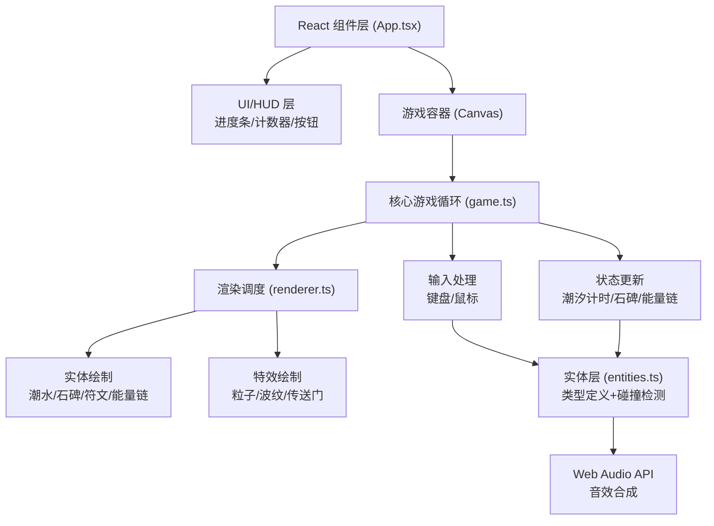
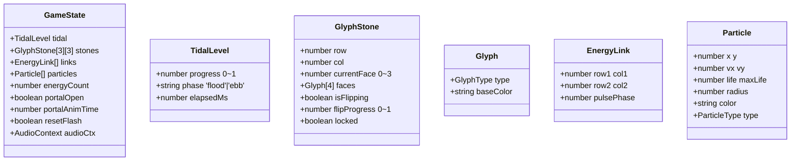

## 1. 架构设计

## 2. 技术说明

- **前端框架**：React@18 + ReactDOM@18
- **开发语言**：TypeScript@5（严格模式 strict:true，ESNext目标）
- **构建工具**：Vite@5 + @vitejs/plugin-react，支持路径别名@/→src/与polyfill
- **渲染引擎**：Canvas 2D Context（游戏实体+流体特效）+ CSS 3D Transform（石碑透视）
- **音频**：原生 Web Audio API（OscillatorNode方波合成石头摩擦音）
- **无后端**：纯前端单页应用，状态全部内存管理

## 3. 路由定义
| 路由 | 用途 |
|------|------|
| / | 游戏主页面（单页应用，无其他路由） |

## 6. 数据模型

### 6.1 数据模型定义

### 6.2 核心常量定义
- 潮汐周期：涨潮30000ms，退潮10000ms
- 可操作阈值：水位 < 0.5
- 石碑尺寸：120×160px，网格间距20px
- 翻转动画：800ms，easeInOutCubic缓动
- 能量链胜利阈值：6条
- 帧率目标：60FPS
- 粒子上限：100个
