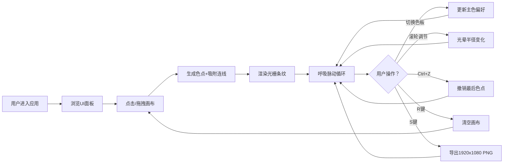

## 1. 产品概述

光栅幻色卡是一款基于Canvas 2D的交互式色彩采样与渐变动图生成Web应用，解决传统颜色选择器缺乏动态视觉反馈和创意探索的问题。用户可通过点击/拖拽生成色点，色点间自动形成发光光栅条纹，配合呼吸脉动效果创造沉浸式视觉体验。

- 核心价值：为设计师、艺术创作者提供直观、动态、富有创造力的色彩探索工具
- 目标用户：UI/UX设计师、数字艺术家、创意爱好者
- 差异化：光栅条纹+呼吸脉动+光晕扩散的有机组合，支持高分辨率导出

## 2. 核心功能

### 2.1 功能模块

1. **主画布区域**：色点交互、光栅渲染、动态脉动效果
2. **控制面板**：色板选择、操作提示、快捷键说明
3. **导出系统**：1920x1080 PNG导出，保留当前帧状态
4. **编辑功能**：撤销（Ctrl+Z）、重置（R键）、滚轮调节光晕

### 2.2 页面详情

| 页面名称 | 模块名称 | 功能描述 |
|-----------|-------------|---------------------|
| 主应用页 | 画布容器 | 16:9比例自适应画布，最大1200x800px，响应式适配 |
| 主应用页 | 色点生成 | 点击/拖拽生成，200ms节流，半径8-12px随机，吸附最近连线 |
| 主应用页 | 光栅条纹 | 10条彩色条纹/带，4px宽，HSL线性插值，0.5px羽化边缘 |
| 主应用页 | 呼吸脉动 | 中心向外圆形波前扩散，3-5秒随机周期，亮度0.7-1.0循环 |
| 主应用页 | 光晕扩散 | 半径10-15px，透明度0.4-0.8随机，滚轮可全局调节5-20px |
| 主应用页 | 色板选择 | 16色色板（暖6+冷6+中性4），2行8列，点击选中主色 |
| 主应用页 | 导出功能 | S键导出PNG，1920x1080分辨率，纯黑背景 |
| 主应用页 | 撤销重置 | Ctrl+Z撤销最后色点，R键清空画布 |

## 3. 核心流程

用户进入应用 → 浏览操作提示 → 点击/拖拽画布生成色点 → 色点间自动形成光栅 → 观察呼吸脉动效果 → 可选：点击色板切换主色 → 可选：滚轮调节光晕 → 可选：撤销/重置 → S键导出PNG

## 4. 用户界面设计

### 4.1 设计风格

- **主色调**：深紫 #2D1B4E（背景基调）、暗金 #C9A96E（强调色）、琥珀 #E8B84B（渐变终点）
- **背景色**：应用背景 #111116，画布纯黑 #000000
- **面板样式**：半透明磨砂玻璃 rgba(255,255,255,0.08)，backdrop-filter: blur(10px)
- **按钮样式**：暗金→琥珀渐变，圆角8px，悬停上浮3px（0.3s ease-out），点击scale(0.95)
- **色板样式**：30x30px色块，圆角8px，选中显示2px白色边框
- **字体**：现代无衬线字体，标题使用具有几何美感的展示字体

### 4.2 页面设计

| 区域 | 模块 | UI元素 | 样式要点 |
|-----------|-------------|-------------|-------------|
| 中心 | 画布容器 | 画框+Canvas | 16:9固定比例，max 1200x800，居中，圆角12px |
| 顶部/侧边 | 操作提示 | 快捷键卡片 | 磨砂玻璃面板，小图标+文字，间距均匀 |
| 底部/侧边 | 色板预览 | 16色块网格 | 2行8列，色块悬停轻微放大，选中高亮 |
| 全局 | 动画效果 | 过渡/悬浮 | 微交互流畅，画布内动态呼吸效果 |

### 4.3 响应式设计

- **桌面端（≥768px）**：画布居中，面板环绕四周（上下/左右），操作提示和色板分离
- **移动端（<768px）**：画布100%宽度，16:9高度自适应；面板变为底部固定悬浮条（高60px，顶部圆角20px），色板可横向滑动

### 4.4 视觉细节

- 画布边缘添加柔和内阴影，营造沉浸感
- 色板区域与画布间留有充足呼吸空间（≥24px）
- 快捷键图标使用Lucide图标库，与暗金配色协调
