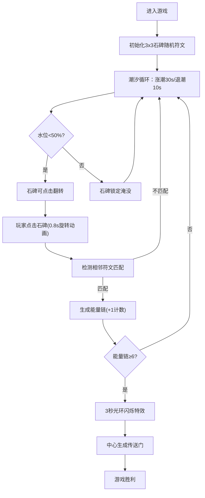

## 1. 产品概述

「潮汐碑文·遗迹解谜」是一款2D浏览器解谜游戏，玩家在潮汐涨落的海底遗迹中翻转刻有古代符号的石碑，利用符文对齐形成能量链来解锁传送门。目标用户为独立游戏爱好者和解谜玩家，产品价值在于结合潮汐机制与符文对齐的独特解谜玩法，配合精致的视觉特效营造深海探索氛围。

## 2. 核心功能

### 2.1 功能模块
1. **游戏主界面**：3x3石碑网格、潮汐进度条、能量计数器、操作按钮
2. **潮汐系统**：30秒涨潮/10秒退潮周期，动态水位影响石碑可操作性
3. **石碑交互**：点击翻转、3D旋转动画、4种符文展示、水纹与呼吸光晕
4. **能量链系统**：相邻符文匹配检测、发光连线、能量累加、胜利判定
5. **特效系统**：粒子、水波、传送门光晕、闪烁动画、Web Audio音效

### 2.2 页面详情
| 页面名称 | 模块名称 | 功能描述 |
|----------|----------|----------|
| 游戏主界面 | 潮汐进度条 | 顶部展示潮汐周期，颜色从浅蓝到深蓝渐变，实时显示水位百分比 |
| 游戏主界面 | 石碑网格区 | 3x3石碑矩阵，3D透视效果，支持点击翻转，淹没时锁定并显示水纹 |
| 游戏主界面 | 能量计数器 | 右上角显示已连接能量链数量，达到6条触发胜利 |
| 游戏主界面 | 操作按钮区 | 重置按钮(R键)、游戏说明按钮，发光边框动画 |
| 游戏主界面 | 传送门区域 | 胜利时中心出现传送门，配合径向模糊与光环粒子特效 |

## 3. 核心流程

玩家进入游戏 → 观察潮汐状态（低潮可操作） → 点击石碑翻转符文 → 检测相邻符文是否匹配 → 匹配成功生成能量链 → 累计6条能量链 → 触发胜利特效 → 传送门开启 → 游戏通关

## 4. 用户界面设计

### 4.1 设计风格
- **主色调**：深海蓝(#0D1B2A)背景，海底地面(#1B2838)，半透明青(#4DB6AC)栅格
- **强调色**：潮汐条浅蓝#4FC3F7→深蓝#1A237E，能量链金黄#FFD54F，传送门淡紫#CE93D8
- **符文颜色**：低潮冷蓝紫系，高潮暖橙红系，随水位动态插值
- **按钮风格**：发光边框，悬停时发光强度翻倍，圆角设计
- **字体**：标题用Cinzel装饰性衬线营造古迹感，正文用Noto Sans SC
- **布局**：固定800x600视口居中，四周放射性黑暗渐变，石碑区perspective(500px) rotateX(15deg)透视

### 4.2 页面设计概览
| 页面名称 | 模块名称 | UI元素 |
|----------|----------|--------|
| 游戏主界面 | 潮汐进度条 | 顶部600x20px圆角条，发光脉动，颜色渐变，文字百分比 |
| 游戏主界面 | 石碑网格 | 9块石碑，3D透视倾斜，符文居中发光，淹没时40%亮度+正弦水纹 |
| 游戏主界面 | 能量计数器 | 右上角圆角卡片，数字+能量链图标，增加时弹跳动画 |
| 游戏主界面 | 底部按钮 | 重置/说明按钮，发光边框，hover效果，说明弹窗带遮罩 |
| 游戏主界面 | 胜利特效 | 光环粒子旋转扩散，传送门径向渐变，屏幕边缘blur(3px) |

### 4.3 响应性
桌面优先设计，固定800x600视口居中显示，外容器自适应屏幕高度垂直居中，移动端缩小至屏幕宽度。
