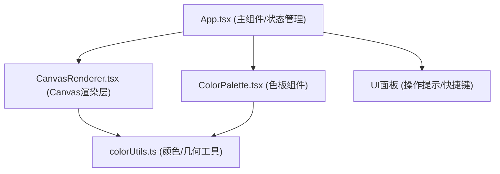

## 1. 架构设计

纯前端单页应用，采用分层架构：UI组件层 → 状态管理层 → 工具函数层 → Canvas渲染层



## 2. 技术说明

- **前端框架**：React 18 + TypeScript（严格模式，target ES2020）
- **构建工具**：Vite（@vitejs/plugin-react）
- **渲染引擎**：Canvas 2D API（requestAnimationFrame驱动）
- **状态管理**：React Hooks（useState + useRef，避免不必要重渲染）
- **样式方案**：CSS Modules + 内联样式（Canvas内用Canvas API）
- **图标库**：lucide-react

## 3. 路由定义

| 路由 | 用途 |
|-------|---------|
| / | 主应用页面（唯一页面） |

## 4. 核心数据模型

### 4.1 TypeScript类型定义

```typescript
interface SamplePoint {
  id: string;
  x: number;
  y: number;
  color: string;       // HEX or RGB string
  radius: number;      // 8-12px 随机
  glowOpacity: number; // 0.4-0.8 随机
  createdAt: number;
}

interface PulseState {
  waveRadius: number;  // 当前波前半径
  cycleDuration: number; // 3000-5000ms
  cycleStart: number;  // 本轮开始时间戳
  brightness: number;  // 0.7-1.0
}

interface ThemePalette {
  warm: string[];    // 6色
  cool: string[];    // 6色
  neutral: string[]; // 4色
}
```

## 5. 文件结构

```
auto17/
├── package.json
├── vite.config.js
├── tsconfig.json
├── index.html
└── src/
    ├── App.tsx                    # 主应用组件，状态管理，UI布局
    ├── main.tsx                   # React入口
    ├── index.css                  # 全局样式
    ├── components/
    │   ├── CanvasRenderer.tsx     # Canvas渲染核心组件
    │   └── ColorPalette.tsx       # 色板选择组件
    └── utils/
        └── colorUtils.ts          # 颜色工具函数
```

## 6. 性能优化策略

### 6.1 渲染优化

- **分层渲染**：静态光栅条纹和光晕可缓存至离屏Canvas，每帧仅叠加亮度脉冲效果
- **局部更新**：色点位置不变时，仅更新亮度参数；新增/删除色点时触发全量重绘标记
- **节流控制**：拖拽生成色点采用200ms节流，避免过度生成
- **帧率监控**：requestAnimationFrame循环中记录耗时，必要时降级重绘策略

### 6.2 内存优化

- 色点数量上限50个，超出时提示用户
- useRef存储Canvas上下文和动画帧ID，避免闭包捕获问题
- 组件卸载时cancelAnimationFrame，防止内存泄漏

### 6.3 导出性能

- 导出时临时创建1920x1080离屏Canvas，将渲染逻辑按比例缩放重绘一次，使用toBlob异步生成PNG
