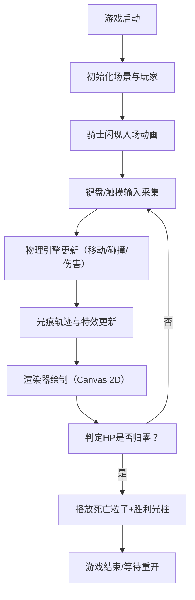

## 1. 产品概述
「幻影骑士·光痕对决」是一款双人本地对战的2D格斗游戏，玩家控制由发光光痕构成的骑士在黑暗竞技场中对决，通过快速移动、连击和格挡击倒对方，每一次攻击都在身后拖出绚丽的彩色光痕轨迹，交织形成战斗画卷。

- 目标用户：独立游戏爱好者、双人对战玩家
- 产品价值：打造视觉效果惊艳、操作流畅的浏览器端格斗体验，充分展示光痕粒子特效与爽快打击感

## 2. 核心功能

### 2.1 用户角色
| 角色 | 说明 | 核心权限 |
|------|------|----------|
| 玩家1 | 使用键盘WASD+JK控制的本地玩家 | 移动、攻击、格挡 |
| 玩家2 | 使用方向键+12控制的本地玩家 | 移动、攻击、格挡 |

### 2.2 功能模块
1. **核心战斗系统**：双人本地对战、移动/攻击/格挡、伤害计算与弹飞机制
2. **光痕轨迹系统**：骑士身后光痕粒子路径、攻击高亮、格挡中断、渐隐动画、交叉混合效果
3. **连击与终结技系统**：连击计数、光爆终结技、连击重置机制
4. **生命值与胜负系统**：HP条、死亡粒子特效、胜利光柱
5. **竞技场背景系统**：深色渐变背景、动态流动网格、脉冲光点
6. **视觉特效系统**：屏幕震动、闪现入场、缓动动画、发光边框
7. **控制系统**：键盘控制、触摸虚拟摇杆与技能按钮
8. **音频系统**：Web Audio API生成打击与格挡音效

### 2.3 页面详情
| 页面名称 | 模块名称 | 功能描述 |
|-----------|-------------|---------------------|
| 游戏主页 | 游戏信息区 | 显示双方连击计数、游戏标题、HP条 |
| 游戏主页 | 画布区域 | 1000x600px Canvas，居中显示，响应式缩放，最小800x500 |
| 游戏主页 | 控制说明 | 显示键盘/触摸操作指引 |
| 游戏主页 | 触摸控制区 | 虚拟摇杆、攻击按钮、格挡按钮（移动端） |

## 3. 核心流程

### 游戏主流程
游戏加载 → 初始化场景（骑士闪现入场）→ 等待玩家操作 → 物理检测（移动/碰撞/攻击判定）→ 渲染（光痕/特效/UI）→ 循环运行 → 一方HP归零 → 播放胜负特效 → 结束或重开

## 4. 用户界面设计

### 4.1 设计风格
- **主色调**：深色系背景 #0A0A1A，深紫#1A0033到深蓝#001133渐变
- **强调色**：玩家1青色#00FFFF，玩家2洋红#FF00FF
- **HP渐变**：绿色（满血）→ 黄色（中血）→ 红色（残血）
- **发光边框**：5px宽，颜色根据领先者光痕色动态变化
- **字体**：赛博朋克风格无衬线字体，标题大号加粗，UI数字等宽字体
- **整体氛围**：霓虹发光、深色科幻竞技场

### 4.2 页面设计概述
| 页面名称 | 模块名称 | UI元素 |
|-----------|-------------|-------------|
| 游戏主页 | 顶部信息栏 | 游戏标题（发光霓虹字）、左右连击计数器（彩色数字） |
| 游戏主页 | Canvas画布 | 1000x600px居中、5px发光边框、响应式缩放 |
| 游戏主页 | 生命值条 | 左右两侧半透明竖条、绿→红渐变、玩家标签 |
| 游戏主页 | 触摸控制 | 左下角虚拟摇杆（圆形）、右下角攻击/格挡按钮（发光圆钮） |
| 游戏主页 | 操作指引 | 画布下方键位说明（WASD/JK 与 ↑↓←→/12） |

### 4.3 响应式
- Desktop-first设计，画布固定逻辑尺寸1000x600px
- 画布随窗口大小等比缩放，最小限制800x500px
- 移动端自动显示虚拟摇杆与技能按钮
- UI文本随画布缩放保持比例

### 4.4 视觉特效
- **开场**：骑士从左右两侧闪现入场，带拖尾光效
- **攻击**：光痕宽度翻倍+高亮，命中瞬间屏幕震动0.1秒（±5px随机偏移）
- **格挡**：轨迹中断150ms，格挡成功攻击方僵直300ms
- **光爆**：半径0→150px扩散光环，持续500ms
- **死亡**：碎裂成彩色粒子，1秒消散
- **胜利**：垂直向上光柱，持续2秒
- **网格**：每帧移动2px，交叉点脉冲光点，颜色青→洋红渐变循环
