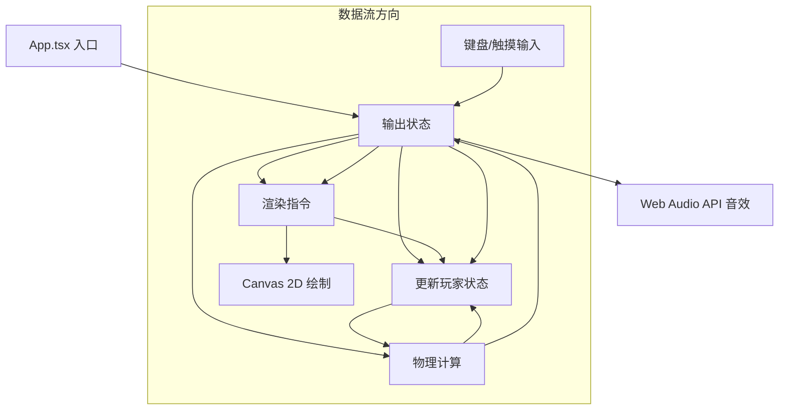

## 1. 架构设计



## 2. 技术描述

### 前端技术栈
- **框架**: React 18 + TypeScript
- **构建工具**: Vite 5 + @vitejs/plugin-react
- **渲染**: Canvas 2D API（高性能粒子与路径绘制）
- **音效**: Web Audio API（程序化生成打击/格挡音效）
- **状态管理**: React Hooks (useState, useRef, useEffect)
- **游戏循环**: requestAnimationFrame + 时间戳增量

### 文件调用关系与数据流

| 文件 | 职责 | 调用方 | 被调用方 | 输出数据 |
|------|------|--------|----------|----------|
| `App.tsx` | 应用入口，布局容器 | 浏览器 | `Game.tsx` | 无 |
| `Game.tsx` | 核心循环，状态协调，输入采集，帧率控制 | `App.tsx` | `Player.ts`, `PhysicsEngine.ts`, `Renderer.ts` | 渲染帧指令 |
| `Player.ts` | 玩家实体：位置/HP/连击/状态，移动/攻击/格挡方法 | `Game.tsx`, `PhysicsEngine.ts`, `Renderer.ts` | 无 | 玩家状态快照 |
| `PhysicsEngine.ts` | 碰撞检测、攻击判定、伤害计算、弹飞物理 | `Game.tsx` | `Player.ts` | 攻击命中事件、伤害值 |
| `Renderer.ts` | Canvas绘制：光痕路径、骑士、特效、HP条、背景网格 | `Game.tsx` | 无 | Canvas像素输出 |

## 3. 核心数据结构

### 3.1 玩家状态 (Player)
```typescript
interface PlayerState {
  id: 1 | 2;
  x: number;           // 世界坐标X
  y: number;           // 世界坐标Y
  vx: number;          // X方向速度
  vy: number;          // Y方向速度
  hp: number;          // 生命值 0-150
  maxHp: number;       // 最大生命值 150
  facing: 1 | -1;      // 朝向 1右 -1左
  
  isAttacking: boolean;
  attackTimer: number; // 攻击持续毫秒
  isBlocking: boolean;
  stunTimer: number;   // 僵直剩余毫秒
  
  comboCount: number;  // 连击计数
  lastHitTime: number; // 上次命中时间戳
  
  trail: TrailPoint[]; // 光痕轨迹点数组
  color: string;       // 光痕主色 #00FFFF 或 #FF00FF
  
  isDead: boolean;
  deathParticles: Particle[];
  isWinner: boolean;
  victoryTimer: number;
  
  spawnAnim: number;   // 入场动画进度 0-1
}

interface TrailPoint {
  x: number;
  y: number;
  timestamp: number;   // 生成时间戳
  width: number;       // 轨迹宽度
  isAttacking: boolean;// 攻击时高亮
}

interface Particle {
  x: number;
  y: number;
  vx: number;
  vy: number;
  life: number;        // 剩余生命毫秒
  maxLife: number;
  color: string;
  size: number;
}
```

### 3.2 游戏全局状态 (GameState)
```typescript
interface GameState {
  players: [PlayerState, PlayerState];
  lightBursts: LightBurst[];   // 光爆特效
  screenShake: number;         // 屏幕震动剩余毫秒
  gridOffset: number;          // 网格滚动偏移量
  frameCount: number;
  elapsedTime: number;
  running: boolean;
}

interface LightBurst {
  x: number;
  y: number;
  radius: number;
  maxRadius: number;      // 150
  life: number;           // 500ms
  color: string;
  appliedDamage: boolean; // 是否已计算额外伤害
}
```

### 3.3 输入映射
```typescript
// 玩家1
// W/A/S/D = 上/左/下/右 移动
// J = 攻击
// K = 格挡

// 玩家2
// ArrowUp/Down/Left/Right = 移动
// 1 (Numpad/主键盘) = 攻击
// 2 (Numpad/主键盘) = 格挡
```

## 4. 模块设计规范

### 4.1 Player.ts 玩家实体
- **构造**: `new Player(id, spawnX, spawnY, color)`
- **方法**:
  - `update(dt: number)`: 每帧更新（物理积分、计时器递减、轨迹清理）
  - `move(dx: number, dy: number)`: 接受输入方向向量，施加速度
  - `attack()`: 触发攻击（设置isAttacking + attackTimer=300ms）
  - `block()`: 触发格挡（设置isBlocking）
  - `releaseBlock()`: 取消格挡
  - `takeHit(damage: number, knockback: number, sourceX: number)`: 扣血+弹飞
  - `applyStun(ms: number)`: 僵直
  - `incrementCombo()`: 连击+1，返回是否触发光爆（>=3）
  - `resetCombo()`: 连击清零
  - `cleanTrail(now: number, maxAge: number)`: 清理超过maxAge的轨迹点，保持≤1000点

### 4.2 PhysicsEngine.ts 物理引擎
- **方法**:
  - `update(players: [Player, Player], dt: number, now: number)`: 每帧主更新
  - `checkAttackHit(attacker: Player, defender: Player): HitResult`: 判定攻击是否命中
  - `resolveHit(attacker: Player, defender: Player, hit: HitResult, now: number)`: 处理命中/格挡
  - `resolvePlayerCollision(p1: Player, p2: Player)`: 防止玩家重叠
  - `resolveBoundaryCollision(player: Player, worldW: number, worldH: number)`: 边界约束
  - `applyKnockback(target: Player, sourceX: number, force: number)`: 弹飞物理

```typescript
interface HitResult {
  hit: boolean;
  blocked: boolean;
  distance: number;
}
```

**攻击判定规则**:
- 攻击范围：攻击者前方 80px 宽、50px 高的矩形
- 命中条件：defender中心矩形与攻击范围重叠
- 格挡判定：defender.isBlocking == true 且 面朝攻击者 → blocked=true
- 命中伤害：15 HP，弹飞力 8
- 光爆伤害：30 HP，弹飞力 16
- 格挡反击：攻击者僵直 300ms

### 4.3 Renderer.ts 渲染器
- **构造**: `new Renderer(canvas: HTMLCanvasElement, worldW: number, worldH: number)`
- **方法**:
  - `render(state: GameState, now: number)`: 主渲染入口
  - `drawBackground(state: GameState, ctx: CanvasRenderingContext2D)`: 渐变背景+流动网格+脉冲光点
  - `drawTrail(player: Player, ctx: CanvasRenderingContext2D, now: number)`: 光痕路径（Canvas Path + 线性透明度渐变）
  - `drawKnight(player: Player, ctx: CanvasRenderingContext2D, now: number)`: 骑士本体（发光几何图形）
  - `drawLightBursts(bursts: LightBurst[], ctx: CanvasRenderingContext2D)`: 光爆光环
  - `drawDeathParticles(player: Player, ctx: CanvasRenderingContext2D)`: 死亡粒子
  - `drawVictoryBeam(player: Player, ctx: CanvasRenderingContext2D, now: number)`: 胜利光柱
  - `drawHPBars(players: [Player, Player], ctx: CanvasRenderingContext2D)`: 左右HP竖条
  - `drawComboCounts(players: [Player, Player], ctx: CanvasRenderingContext2D)`: 连击计数
  - `drawTrailIntersectionEffect(p1: Player, p2: Player, ctx: CanvasRenderingContext2D)`: 光痕交叉闪烁

**光痕渲染**:
- 遍历trail点，按时间戳计算alpha = 0.7 * (1 - age/3000)
- lineWidth：普通3px，攻击期间6px
- 使用 lineCap/lineJoin: round
- shadowColor: player.color, shadowBlur: 15
- 渐隐：尾端alpha插值

## 5. 性能优化策略

| 优化点 | 措施 |
|--------|------|
| FPS稳定 | requestAnimationFrame + 固定dt=16.67ms的时间步长累加器 |
| 光痕粒子上限 | Player.trail数组 ≤1000点，超出shift()最早段；仅保留30秒内数据 |
| Canvas渲染 | 离屏路径缓存；批量绘制相同样式元素 |
| 重绘区域 | 全屏重绘（1000x600像素），但避免不必要的阴影计算 |
| 内存 | 粒子/trail按时间戳主动回收；避免对象频繁new，使用对象池模式 |

## 6. 音效生成 (Web Audio API)

```typescript
// 打击音：方波 200Hz → 50Hz 快速下滑 + 白噪声短促爆破 100ms
// 格挡音：正弦波 800Hz → 1200Hz 上滑 80ms + 金属质感
// 光爆音：多振荡器叠加 100Hz-2kHz 扫频 500ms + 指数音量包络
```
