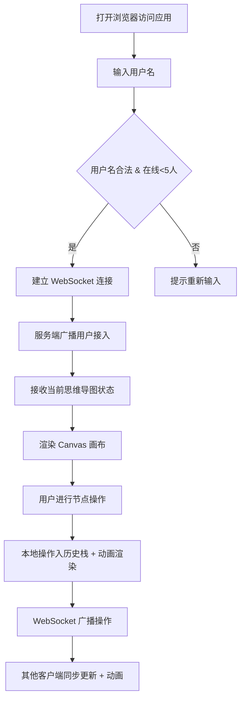

# 多人协作思维导图 Web 应用 PRD

## 1. 产品概述

多人协作思维导图 Web 应用是一款支持多用户实时协同编辑的全栈工具，解决传统思维导图工具无法多人实时同步、节点变化缺乏平滑动画反馈以及历史修改不可追溯的核心痛点。

- **核心价值**：提供多人实时协作体验，通过弹性动画和直观的视觉反馈，让团队头脑风暴和知识梳理过程更加高效流畅
- **目标用户**：产品团队、设计团队、项目组、学生小组等需要协同进行头脑风暴和知识组织的群体
- **使用场景**：需求分析、项目规划、知识图谱构建、会议记录、教学演示等

## 2. 核心功能

### 2.1 用户角色

| 角色 | 接入方式 | 核心权限 |
|------|---------|---------|
| 协作者 | 输入用户名接入（最多5人同时在线） | 添加/删除/编辑节点、拖拽调整结构、撤销/重做操作、导出/导入数据 |

### 2.2 功能模块

1. **思维导图画布**：节点渲染、连线绘制、Canvas 2D 离屏优化、平移缩放
2. **节点编辑**：双击添加子节点、Delete 删除、双击编辑文本、拖拽重组层级、50px 吸附效果
3. **实时协作同步**：WebSocket 广播、在线用户列表、协作光标跟随（≥30fps）、最后编辑者头像
4. **操作历史**：独立操作栈（50步）、Ctrl+Z 撤销、Ctrl+Shift+Z 重做、淡入淡出动画
5. **数据管理**：JSON 导出（节点层级/位置/文本/颜色）、JSON 导入（依次弹出动画）
6. **工具栏**：导出/导入/清空按钮、在线用户显示、用户名输入框

### 2.3 页面详情

| 页面名称 | 模块名称 | 功能描述 |
|---------|---------|---------|
| 主画布页面 | 思维导图画布 | Canvas 2D 渲染节点卡片和贝塞尔曲线连线，支持鼠标拖拽平移（长按空白）、滚轮缩放（0.5x~2.0x）、悬停放大（1.05倍）、阴影加深（2px→6px） |
| 主画布页面 | 节点交互系统 | 双击空白区添加子节点、选中后 Delete 删除、拖拽节点重组（50px 吸附父节点，300ms 动画）、双击文本编辑（限50字）、弹性物理动画（spring physics）移动 |
| 主画布页面 | 协作光标系统 | 显示其他用户半透明光标（6px半径，随机色）+ 用户名标签，鼠标移动实时广播（≥30fps），无明显滞后 |
| 主画布页面 | 节点身份标识 | 每个节点右下角显示最后编辑者头像（首字母缩写 + 随机配色圆形徽章） |
| 主画布页面 | 操作历史系统 | 每个用户独立维护操作栈（最多50步），Ctrl+Z 撤销（透明度动画 200ms）、Ctrl+Shift+Z 重做 |
| 顶部工具栏 | 用户信息面板 | 用户名输入框、当前在线用户列表展示（最多5人，头像+名称） |
| 顶部工具栏 | 数据操作按钮 | 导出 JSON 按钮（含完整节点数据）、导入 JSON 按钮（从中心向外依次弹出，间隔100ms）、清空画布按钮 |

## 3. 核心流程

### 3.1 用户接入与协作流程

用户打开应用 → 输入用户名（自动校验重复，最多5人）→ 进入画布 → 看到当前思维导图状态 → 进行节点操作（添加/删除/编辑/拖拽）→ 操作通过 WebSocket 实时广播 → 其他用户画布同步更新（带弹性动画）→ 光标位置实时同步显示

### 3.2 节点拖拽吸附流程

用户按下节点 → 拖拽移动 → 实时计算与其他节点距离 → 检测最近潜在父节点（50px范围内）→ 显示吸附提示 → 释放鼠标 → 弹性动画吸附到父节点位置（300ms）→ 更新层级关系 → 广播结构变化

### 3.3 导出导入流程

**导出**：点击导出按钮 → 序列化节点数据（含层级、位置、文本、颜色、编辑者）→ 生成 JSON Blob → 触发浏览器下载

**导入**：选择 JSON 文件 → 解析数据 → 校验格式合法性 → 清空当前画布 → 从中心位置依次弹出节点（间隔100ms，向外扩散）→ 恢复层级连线 → 广播新状态

## 4. 用户界面设计

### 4.1 设计风格

- **主色调**：深灰蓝背景 `#2C3E50`，营造专业沉静的协作氛围
- **节点边框层级配色**：
  - 根节点：红色 `#E74C3C`（高辨识度，核心突出）
  - 第1层：蓝色 `#3498DB`（清爽，主干分支）
  - 第2层：绿色 `#2ECC71`（生机，次级分支）
  - 第3层：橙色 `#F39C12`（温暖，细节分支）
- **连线**：二次贝塞尔曲线，线宽 2px，颜色 `#95A5A6`，透明度 0.7
- **节点卡片**：圆角 8px 矩形，宽度自适应内容（最小80px，最大200px），内部白色/浅灰填充
- **悬停效果**：节点放大 1.05 倍，阴影从 2px 加深到 6px，采用高斯模糊阴影
- **字体**：使用现代无衬线字体，清晰可读，节点文本支持换行显示
- **光标**：半透明圆点（6px半径，随机用户色），右侧带用户名标签（白色背景+圆角+黑色文字）
- **头像徽章**：圆形，直径约18px，背景为用户专属随机色，白色首字母文字

### 4.2 页面设计概览

| 页面名称 | 模块名称 | UI 元素与风格 |
|---------|---------|-------------|
| 主画布页面 | 背景层 | 深灰蓝 `#2C3E50` 纯色，可选细微网格点辅助对齐，左右各10px安全边距 |
| 主画布页面 | 节点渲染层 | Canvas 2D 绘制，圆角矩形卡片 + 层级色边框 + 阴影，右下角圆形编辑者徽章，悬停时 scale(1.05) + 阴影加深 |
| 主画布页面 | 连线层 | Canvas 2D 二次贝塞尔曲线，从节点边缘中点连接到子节点，弯曲自然，随节点移动平滑更新 |
| 主画布页面 | 协作光标层 | Canvas 2D 绘制半透明圆点 + DOM 浮层用户名标签（避免频繁重绘），跟随移动流畅无卡顿 |
| 主画布页面 | 文本编辑层 | 双击节点时激活 contenteditable 输入框（DOM 元素覆盖 Canvas），50字计数提示，Enter 保存 / Esc 取消 |
| 顶部工具栏 | 左侧用户区 | 用户名输入框（聚焦样式）+ 在线用户头像列表（横向排列，悬停显示完整名称） |
| 顶部工具栏 | 右侧操作区 | 三个按钮：导出（下载图标）、导入（上传图标+文件选择）、清空（垃圾桶图标），按钮为浅灰背景圆角，悬停时变深 |

### 4.3 响应式与分辨率适配

- **设计策略**：桌面端优先，保证 1920×1080 和 1440×900 两种主流分辨率完整显示
- **画布适配**：Canvas 尺寸自适应窗口，通过 CSS 设置 100vw × 100vh，内部坐标系通过 devicePixelRatio 处理高清屏
- **工具栏**：固定在顶部，高度约 56px，使用 flex 布局，左右内容两端对齐
- **安全边距**：画布左右两侧各预留 10px，避免节点贴边无法完全显示
- **缩放范围**：滚轮缩放限制在 0.5 倍到 2.0 倍之间，防止过度缩放丢失上下文

### 4.4 动画系统

| 动画类型 | 参数 | 触发场景 |
|---------|------|---------|
| 弹性移动（Spring Physics） | 阻尼系数 0.85，刚度 0.2，每帧更新位置 | 节点拖拽结束、协作者同步节点位置变化 |
| 吸附动画 | 持续 300ms，缓动函数 ease-out-cubic | 节点拖拽释放后吸附到最近父节点 |
| 撤销/重做淡入淡出 | 透明度 0↔1，持续 200ms | Ctrl+Z / Ctrl+Shift+Z 操作时 |
| 导入弹出动画 | 从中心向外扩散，节点间隔 100ms，scale(0→1) 弹簧弹出 | JSON 文件导入后渲染节点 |
| 悬停微交互 | scale(1→1.05)，阴影 2px→6px，持续 150ms | 鼠标悬停节点卡片时 |
| 连线弯曲过渡 | 每帧重绘贝塞尔曲线控制点，跟随节点坐标 | 节点移动过程中 |
