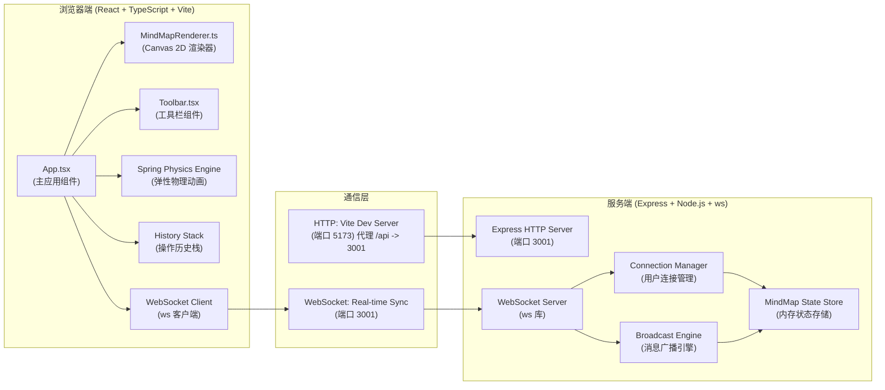
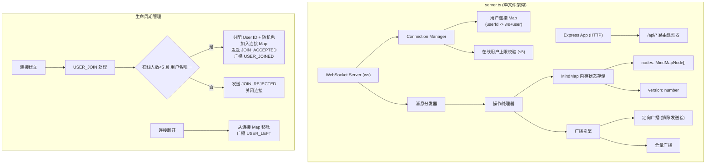
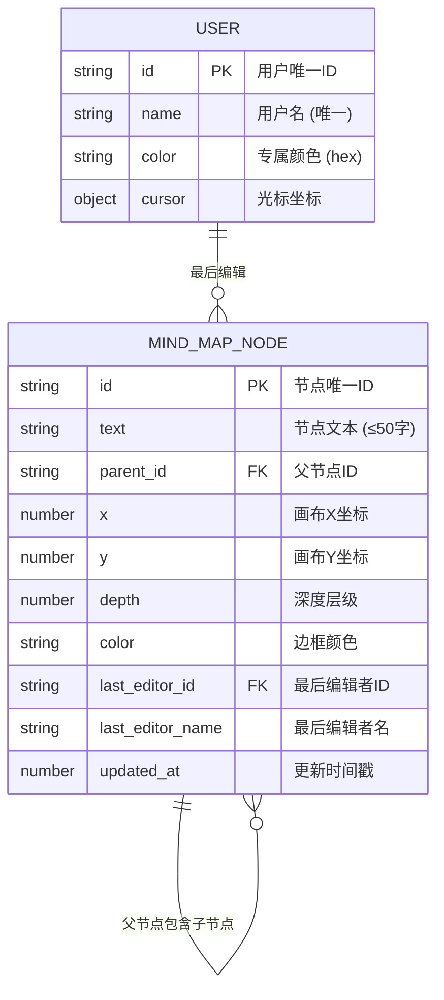

# 多人协作思维导图 Web 应用 技术架构文档

## 1. 架构设计



## 2. 技术栈说明

| 层级 | 技术选型 | 版本 | 用途说明 |
|------|---------|------|---------|
| 前端框架 | React | 18.x | UI 组件化开发，管理应用状态和生命周期 |
| 前端语言 | TypeScript | 5.x | 静态类型检查，提升代码可维护性和健壮性 |
| 构建工具 | Vite | 5.x | 极速开发服务器，HMR 热更新，构建生产包 |
| 前端渲染 | Canvas 2D API | - | 高性能节点与连线绘制，离屏缓存优化 |
| 前端插件 | @vitejs/plugin-react | 4.x | Vite 的 React JSX 转换支持 |
| 后端框架 | Express | 4.x | HTTP 服务器，提供 API 接口和静态资源 |
| 实时通信 | ws | 8.x | 轻量级 WebSocket 实现，用于节点操作和光标同步 |
| 后端类型 | @types/express | 4.x | Express 的 TypeScript 类型定义 |
| 后端类型 | @types/ws | 8.x | ws 库的 TypeScript 类型定义 |
| 构建语言 | TypeScript (ts-node) | 5.x | 服务端 TS 运行时支持 |

**初始化方式**：手动创建 package.json 与所有配置文件，通过 `npm install && npm run dev` 一键启动前后端（Vite 前端 + Express/WS 后端）。

## 3. 路由定义

### 3.1 前端路由

| 路由路径 | 页面组件 | 功能用途 |
|---------|---------|---------|
| `/` | `App.tsx` | 主页面：包含工具栏 + Canvas 思维导图画布 |

本应用为单页应用（SPA），无多页面路由切换，所有交互在同一画布内完成。

### 3.2 后端 HTTP API

| 方法 | 路由 | 功能用途 | 请求/响应格式 |
|------|------|---------|-------------|
| GET | `/api/health` | 服务端健康检查 | 响应：`{ status: 'ok', timestamp: number }` |
| GET | `/api/mindmap` | 获取当前思维导图完整状态 | 响应：`MindMapState` JSON |
| POST | `/api/mindmap/reset` | 重置思维导图为空状态（仅根节点） | 响应：`{ success: boolean }` |

## 4. WebSocket 协议与 API 定义

### 4.1 消息类型定义

```typescript
// ========== 基础数据模型 ==========

interface User {
  id: string;           // 用户唯一ID (UUID)
  name: string;         // 用户名
  color: string;        // 用户专属颜色 (hex)
  cursor: { x: number; y: number } | null; // 光标位置 (画布坐标系)
}

interface MindMapNode {
  id: string;                    // 节点唯一ID
  text: string;                  // 节点文本内容 (最多50字)
  parentId: string | null;       // 父节点ID (根节点为null)
  x: number;                     // 画布X坐标
  y: number;                     // 画布Y坐标
  depth: number;                 // 深度层级 (根节点=0)
  color: string;                 // 节点边框颜色 (根据depth自动分配)
  lastEditorId: string;          // 最后编辑者用户ID
  lastEditorName: string;        // 最后编辑者用户名
  updatedAt: number;             // 最后更新时间戳
  // 运行时动画属性 (不持久化到JSON)
  anim?: {
    targetX?: number;
    targetY?: number;
    velocityX?: number;
    velocityY?: number;
    opacity?: number;            // 0~1, 用于撤销/重做淡入淡出
    scale?: number;              // 用于导入弹出动画
  };
}

interface MindMapState {
  nodes: MindMapNode[];
  version: number;               // 状态版本号, 用于冲突检测
}

interface HistoryAction {
  type: 'ADD' | 'DELETE' | 'MOVE' | 'EDIT_TEXT' | 'REPARENT';
  timestamp: number;
  before: Partial<MindMapNode> | MindMapNode[];
  after: Partial<MindMapNode> | MindMapNode[];
}

// ========== WebSocket 消息类型 ==========

type WSMessage =
  // 客户端 -> 服务端
  | { type: 'USER_JOIN';        payload: { name: string } }
  | { type: 'CURSOR_MOVE';      payload: { x: number; y: number } }
  | { type: 'NODE_ADD';         payload: { node: MindMapNode } }
  | { type: 'NODE_DELETE';      payload: { nodeId: string } }
  | { type: 'NODE_MOVE';        payload: { nodeId: string; x: number; y: number } }
  | { type: 'NODE_EDIT';        payload: { nodeId: string; text: string } }
  | { type: 'NODE_REPARENT';    payload: { nodeId: string; newParentId: string; newX: number; newY: number; newDepth: number } }
  | { type: 'MINIMAP_RESET';    payload: {} }
  | { type: 'MINIMAP_IMPORT';   payload: { state: MindMapState } }

  // 服务端 -> 客户端
  | { type: 'JOIN_ACCEPTED';    payload: { userId: string; users: User[]; state: MindMapState } }
  | { type: 'JOIN_REJECTED';    payload: { reason: string } }
  | { type: 'USER_LIST';        payload: { users: User[] } }
  | { type: 'USER_JOINED';      payload: { user: User } }
  | { type: 'USER_LEFT';        payload: { userId: string } }
  | { type: 'CURSOR_UPDATED';   payload: { userId: string; cursor: { x: number; y: number } } }
  | { type: 'STATE_UPDATED';    payload: { state: MindMapState } }
  | { type: 'NODE_EVENT';       payload: { event: WSMessage; fromUserId: string } };
```

### 4.2 WebSocket 消息广播策略

| 消息类型 | 广播范围 | 触发时机 |
|---------|---------|---------|
| `USER_JOINED` | 所有在线用户 | 新用户成功加入 |
| `USER_LEFT` | 所有在线用户 | 用户断开连接 |
| `USER_LIST` | 所有在线用户 | 用户列表变化后推送全量列表 |
| `CURSOR_UPDATED` | 除发送者外的所有用户 | 用户鼠标移动（节流 33ms，即 30fps） |
| `NODE_EVENT` | 除发送者外的所有用户 | 节点增删改/移动/重组时，透传原始操作 |
| `STATE_UPDATED` | 所有用户 | 服务端状态版本号变更（兜底同步） |

## 5. 服务端架构图



## 6. 数据模型

### 6.1 数据模型 ER 图



### 6.2 核心数据结构说明（服务端内存存储）

```typescript
// ===== 服务端内存状态 =====
interface ServerState {
  users: Map<string, User>;           // 所有在线用户
  sockets: Map<string, WebSocket>;    // 用户ID -> WebSocket
  mindmap: {
    nodes: MindMapNode[];
    version: number;
  };
}

// 初始思维导图状态（新建时）
const initialMindMap = (): MindMapState => ({
  nodes: [
    {
      id: 'root-' + Date.now(),
      text: '中心主题',
      parentId: null,
      x: 0,
      y: 0,
      depth: 0,
      color: '#E74C3C',
      lastEditorId: 'system',
      lastEditorName: '系统',
      updatedAt: Date.now(),
    },
  ],
  version: 1,
});

// ===== 前端运行时状态 =====
interface ClientState {
  nodes: MindMapNode[];
  users: User[];
  currentUser: User | null;
  selectedNodeId: string | null;
  hoveredNodeId: string | null;
  editingNodeId: string | null;
  history: {
    undoStack: HistoryAction[];    // 最多 50 步
    redoStack: HistoryAction[];
  };
  viewport: {
    offsetX: number;               // 画布平移 X
    offsetY: number;               // 画布平移 Y
    scale: number;                 // 缩放比例 0.5~2.0
  };
  drag: {
    isDragging: boolean;
    draggedNodeId: string | null;
    isPanning: boolean;
    lastMouseX: number;
    lastMouseY: number;
    startX: number;
    startY: number;
  };
}
```

## 7. Canvas 渲染架构

### 7.1 MindMapRenderer 类设计

```typescript
class MindMapRenderer {
  private canvas: HTMLCanvasElement;
  private ctx: CanvasRenderingContext2D;
  private offscreenCanvas: HTMLCanvasElement;  // 离屏缓存
  private offscreenCtx: CanvasRenderingContext2D;
  private needsFullRedraw: boolean = true;
  
  // 深度 -> 边框颜色映射
  public static readonly DEPTH_COLORS = [
    '#E74C3C',  // 0 根节点
    '#3498DB',  // 1
    '#2ECC71',  // 2
    '#F39C12',  // 3
    '#9B59B6',  // 4+ 兜底紫色
  ];
  
  // 核心方法
  constructor(canvas: HTMLCanvasElement) {}
  public render(state: ClientState, deltaTime: number): void {}   // 每帧调用
  public resize(width: number, height: number): void {}
  public getNodeAtPoint(x: number, y: number, viewport: Viewport): MindMapNode | null {}
  public getClosestParentNode(nodeId: string, x: number, y: number, threshold: number): MindMapNode | null {}
  public measureNodeWidth(text: string): number {}  // 计算节点宽度
  
  // 私有绘制方法
  private drawBackground(ctx: CanvasRenderingContext2D): void {}
  private drawConnections(ctx: CanvasRenderingContext2D, nodes: MindMapNode[]): void {}
  private drawNode(ctx: CanvasRenderingContext2D, node: MindMapNode, hovered: boolean, selected: boolean): void {}
  private drawCursors(ctx: CanvasRenderingContext2D, users: User[], excludeId: string): void {}
  private updateSpringAnimations(nodes: MindMapNode[], deltaTime: number): void {}
}
```

### 7.2 渲染管线与性能优化策略

1. **分层渲染**：背景层 → 连线层 → 节点层 → 光标层，使用脏矩形标记减少重绘
2. **离屏缓存**：静态元素（背景网格）缓存到 OffscreenCanvas，仅视口变化时重绘
3. **requestAnimationFrame 循环**：统一驱动动画更新（spring physics）+ Canvas 重绘，目标 60fps
4. **文本宽度预计算**：使用 `ctx.measureText()` 计算节点宽度，限制 min 80 / max 200
5. **光标节流**：本地发送 30fps，接收端使用线性插值平滑到 60fps

## 8. 项目文件结构

```
auto172/
├── package.json              # 前后端统一依赖与脚本
├── index.html                # Vite 入口 HTML
├── tsconfig.json             # TS 配置 (strict, target ES2020)
├── vite.config.js            # Vite 配置 (代理 /api -> 3001)
├── server.ts                 # Express + WebSocket 服务端
└── src/
    ├── App.tsx               # React 主应用 (状态管理、事件绑定)
    ├── Toolbar.tsx           # 工具栏组件 (用户列表、导入导出清空)
    └── MindMapRenderer.ts    # Canvas 2D 渲染器类
```
