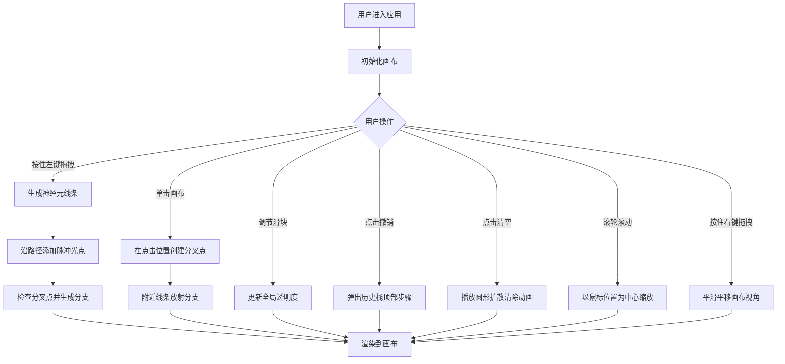

## 1. 产品概述

透明生物·神经元绘制 Web应用，解决传统绘图工具无法表现半透明细胞结构动态交织的问题。用户通过鼠标在画布上绘制半透明发光神经元，模拟神经网络的动态可视化效果。

- 主要用途：科研可视化、艺术创作、生物教学演示
- 目标用户：研究人员、艺术家、教育工作者、生物学爱好者
- 产品价值：提供直观、沉浸式的神经网络交互式绘制体验，呈现半透明动态交织的视觉效果

## 2. 核心功能

### 2.1 用户角色
| 角色 | 注册方式 | 核心权限 |
|------|---------|---------|
| 普通用户 | 无需注册 | 使用全部绘制功能、保存图像、导出创作 |

### 2.2 功能模块
1. **主画布页面**：画布绘制区、左侧工具栏、控制面板
2. **神经元绘制模块**：鼠标拖拽绘制、脉冲光点模拟、树突分叉生成
3. **视觉效果模块**：多层透明度叠加、突触闪烁、发光效果
4. **交互控制模块**：撤销/清空、缩放平移、全局透明度调节

### 2.3 页面详情
| 页面名称 | 模块名称 | 功能描述 |
|---------|---------|---------|
| 主画布页面 | 画布区域 | 占据页面核心，10px暗灰色边框，承载所有绘制内容 |
| 主画布页面 | 左侧工具栏 | 垂直排列（移动端底部水平），包含透明度滑块、撤销按钮、清空按钮 |
| 主画布页面 | 神经元绘制 | 按住左键拖拽生成渐变发光线条，单击生成树突分叉点 |
| 主画布页面 | 脉冲动画 | 神经元内部光点沿路径流动，模拟神经脉冲传播 |
| 主画布页面 | 突触效果 | 线条交叉区域透明度叠加，随机闪烁模拟突触连接 |
| 主画布页面 | 撤销清空 | 撤销最近绘制步骤，圆形扩散动画清空画布 |
| 主画布页面 | 缩放平移 | 滚轮缩放（跟随鼠标），右键拖拽平移画布 |

## 3. 核心流程

## 4. 用户界面设计

### 4.1 设计风格
- **主色调**：深蓝黑底色 #0B0E14，画布底色 #0A0A0A
- **强调色**：神经元渐变 #66FF66 → #00CCFF，互补色（色相旋转180°）
- **控件色**：边框发光 #33FF99，悬停光晕 #66FFCC，文本 #88FF88
- **按钮样式**：半透明发光边框（1px，透明度0.5），悬停时外发光扩散，点击时透明度变化反馈
- **字体**：按钮/文本使用 'Courier New', monospace，等宽字体12px
- **布局风格**：极暗色科技感主题，画布核心 + 左侧工具栏，四周留白形成深度感

### 4.2 页面设计概要
| 页面名称 | 模块名称 | UI元素 |
|---------|---------|---------|
| 主画布页面 | 画布区域 | 10px边框 #1A1A2E，底色 #0A0A0A，Canvas 2D渲染 |
| 主画布页面 | 工具栏 | 垂直排列，8px间距，半透明发光控件 |
| 主画布页面 | 透明度滑块 | 导轨 #2A3A4A，圆形手柄#33FF99（12px），拖动时数值提示 |
| 主画布页面 | 按钮 | 1px边框#33FF99（透明度0.5），悬停发光光晕扩散0.3s，点击透明度动画0.15s |

### 4.3 响应式设计
- **桌面端（≥768px）**：左侧垂直工具栏，画布占据核心区域
- **移动端（<768px）**：工具栏移至底部水平排列，按钮宽度自适应
- **触摸优化**：支持触控绘制、双指缩放、双击撤销

### 4.4 性能目标
- 同时100条神经元线路（每条50个路径点）+ 30个分叉点
- 渲染帧率 ≥ 55FPS
- 缩放平移流畅无卡顿
- 视觉反馈延迟 ≤ 16ms
