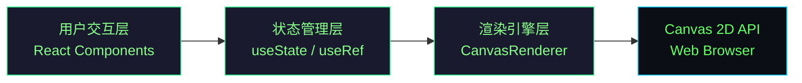

## 1. 架构设计



## 2. 技术选型

- **前端框架**：React@18 + TypeScript@5
- **构建工具**：Vite@5 + @vitejs/plugin-react@4
- **渲染引擎**：Canvas 2D API（高性能动态绘制）
- **状态管理**：React Hooks（useState / useRef / useEffect）
- **样式方案**：原生CSS（内联样式 + styled-components风格的CSS-in-JS）
- **无后端/数据库**：纯前端应用，所有状态内存存储

## 3. 路由定义
| 路由 | 用途 |
|-----|-----|
| / | 主画布页面（唯一页面） |

## 4. 项目文件结构

```
project-root/
├── package.json              # 依赖配置（react, react-dom, typescript, vite, @vitejs/plugin-react）
├── vite.config.js            # Vite构建配置，启用TypeScript + React插件
├── tsconfig.json             # TypeScript严格模式，target ES2020
├── index.html                # 入口HTML，含#root容器
└── src/
    ├── App.tsx               # 主组件：全局状态管理、画布引用、布局、事件分发
    ├── canvasRenderer.ts     # 画布渲染引擎：神经元绘制、透明度混合、脉冲动画、历史栈
    ├── controls.tsx          # 工具栏组件：透明度滑块、撤销按钮、清空按钮
    └── main.tsx              # React入口（由Vite模板生成）
```

## 5. 核心数据模型

### 5.1 类型定义（TypeScript）

```typescript
interface Point {
  x: number;
  y: number;
}

interface PulsePoint {
  pathIndex: number;    // 所属路径在neuron.paths中的索引
  progress: number;     // 沿路径的进度 0~1
  speed: number;        // 每帧移动速度 2~4px
  size: number;         // 光点直径 1~3px
}

interface Branch {
  points: Point[];      // 分支路径点
  width: number;        // 分支宽度 1~2px
  color: string;        // 互补色（色相旋转180°）
}

interface BifurcationPoint {
  x: number;
  y: number;
  branches: Branch[];   // 从此点生成的3~5条分支
}

interface Neuron {
  id: string;
  paths: Point[][];     // 一条神经元由多条路径段组成（遇到分叉点会分段）
  startWidth: number;   // 起始宽度 2px
  endWidth: number;     // 终止宽度 6px
  startColor: string;   // 起始颜色 #66FF66
  endColor: string;     // 终止颜色 #00CCFF
  pulses: PulsePoint[]; // 流动的神经脉冲光点
  bifurcations: BifurcationPoint[]; // 此神经元触发关联的分叉点
}

interface HistoryStep {
  neurons: Neuron[];    // 此步骤绘制的所有神经元（一般一次鼠标抬起为一个步骤）
  bifurcations: BifurcationPoint[]; // 此步骤创建的分叉点
}

interface ViewTransform {
  scale: number;        // 缩放比例 0.5~3.0
  offsetX: number;      // 水平偏移量
  offsetY: number;      // 垂直偏移量
  targetOffsetX: number;// 平滑过渡目标偏移
  targetOffsetY: number;
}

interface RendererState {
  neurons: Neuron[];
  bifurcations: BifurcationPoint[];
  history: HistoryStep[];   // 历史记录栈，最多30步
  globalAlpha: number;      // 全局透明度 0.1~1.0
  transform: ViewTransform;
  isClearing: boolean;      // 是否正在播放清空动画
  clearProgress: number;    // 清空动画进度 0~1
  clearOrigin: Point;       // 清空动画扩散原点
}
```

## 6. 核心算法

### 6.1 渐变颜色插值
```
从 startColor(#66FF66) 到 endColor(#00CCFF)，按路径进度t线性插值RGB分量
```

### 6.2 互补色计算（色相旋转180°）
```
RGB → HSL → (H + 180) % 360 → HSL → RGB
```

### 6.3 贝塞尔平滑线条
```
使用二次贝塞尔曲线连接路径点，取相邻中点作为控制点实现平滑
```

### 6.4 路径长度与光点定位
```
预先计算每段路径累积长度，光点按progress映射到实际坐标
```

### 6.5 分叉检测
```
遍历所有神经元路径点，计算到分叉点的距离 ≤ 2px则判定为相交
```

### 6.6 突触闪烁效果
```
维护交叉区域Map，每帧按随机频率（2~4Hz）在0.6~1.0透明度间跳跃
```

### 6.7 缩放平移变换
```
所有绘制前先 ctx.translate → ctx.scale，鼠标坐标反向映射到画布坐标
```

## 7. 性能优化策略

1. **离屏缓存**：静态神经元绘制到离屏Canvas，每帧只重绘动态脉冲光点
2. **脏矩形渲染**：仅重绘光点经过的区域（复杂度高时退化为全量重绘）
3. **路径预计算**：每条路径的长度、累积距离、颜色插值表仅计算一次
4. **requestAnimationFrame**：统一驱动所有动画（脉冲、闪烁、平滑平移、清空动画）
5. **对象池**：PulsePoint对象复用，避免频繁GC
6. **WebGL回退**：当线条数>200时自动降级视觉效果以保证帧率
