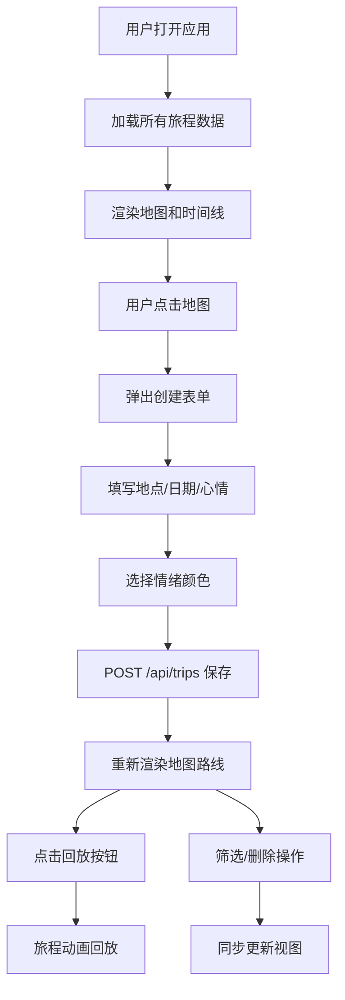

## 1. 产品概述
「旅途心情地图」是一款面向旅行爱好者的心情记录与可视化工具，帮助用户记录旅途中心情变化，并以地图光影路线形式重现旅程回忆。
- 核心价值：将抽象的情绪与具体的地理空间结合，创造沉浸式的旅程回溯体验
- 目标用户：热爱旅行、重视情感记录的年轻用户群体

## 2. 核心功能

### 2.1 用户角色
| 角色 | 注册方式 | 核心权限 |
|------|----------|----------|
| 普通用户 | 无需注册，直接使用本地存储 | 创建、查看、删除旅程记录，回放旅程动画 |

### 2.2 功能模块
1. **主界面**：地图视图 + 侧边列表 + 筛选器 + 回放控制
2. **旅程创建**：地图点击标记地点、情绪选择、心情笔记录入
3. **路线可视化**：HSL颜色插值的情绪光影路线、半透明情绪圆环标记
4. **时间线展示**：垂直时间轴旅程列表，卡片式展示
5. **旅程回放**：1.5秒间隔的动画回放，视角跟随，情绪高亮
6. **多条件筛选**：情绪颜色、日期范围、关键词搜索三重筛选

### 2.3 页面详情
| 页面名称 | 模块名称 | 功能描述 |
|----------|----------|----------|
| 主界面 | 地图视图区 | Leaflet OpenStreetMap底图，点击创建记录点，绘制情绪路线，支持缩放拖拽 |
| 主界面 | 侧边时间线 | 半透明毛玻璃面板，旅程卡片列表，情绪圆点标记，删除按钮 |
| 主界面 | 筛选控制区 | 情绪色块筛选、日期范围输入、关键词搜索框 |
| 主界面 | 回放控制 | 回放按钮、当前旅程信息展示（日期+心情笔记） |
| 创建弹窗 | 表单录入 | 地点名称、日期、心情笔记（200字限制）、情绪调色板选择 |

## 3. 核心流程
用户打开应用 → 浏览地图 → 点击地图任意位置 → 弹出创建表单 → 填写地点/日期/心情 → 选择情绪颜色 → 保存（后端存储）→ 地图自动渲染记录点和路线 → 可选择回放旅程动画 → 在侧边栏筛选或删除记录

## 4. 用户界面设计

### 4.1 设计风格
- **主色调**：深色星空渐变背景（#0F0C29 → #302B63 → #24243E）
- **强调色**：青绿 #00FFCC（标题发光、边框高光）
- **情绪色板**：喜悦金黄#FFD700、平静天蓝#87CEEB、忧伤淡紫#DDA0DD、激动橙红#FF4500
- **按钮风格**：圆角20px，半透明背景，悬停内发光效果
- **字体**：标题使用等宽科幻字体 monospace, 'Courier New'，正文简洁无衬线
- **布局风格**：卡片式布局，左侧70%地图 + 右侧30%毛玻璃侧边栏

### 4.2 页面设计概述
| 页面名称 | 模块名称 | UI元素 |
|----------|----------|--------|
| 主界面 | 地图视图 | 全屏地图、彩色折线、情绪色圆环点、回放流光光点 |
| 主界面 | 侧边面板 | backdrop-filter: blur 10px毛玻璃、圆角12px卡片、悬停上浮阴影 |
| 主界面 | 旅程卡片 | 10px情绪色圆点、日期地点、删除按钮、点击聚焦 |
| 主界面 | 筛选区域 | 4个情绪色块、日期范围输入、搜索框 |
| 创建弹窗 | 表单 | 输入框、日期选择、文本域（200字计数）、情绪调色板 |
| 回放区 | 信息展示 | 底部淡入淡出文字、当前点高亮圆环+光晕 |

### 4.3 响应式设计
- 桌面端（≥768px）：左侧70%地图 + 右侧30%固定侧边栏
- 移动端（<768px）：上方60%地图 + 底部40%抽屉式面板，支持触摸拖拽

## 4.4 动效设计
- 卡片悬停：translateY(-2px) + box-shadow发光扩散（0.3s）
- 回放移动：ease-in-out缓动曲线，1.5秒过渡
- 文字淡入淡出：opacity动画0.5秒
- 流光效果：沿路线移动的6px渐变光点，1px/帧速度
- 高亮标记点：内圆18px + 30px光晕扩散
