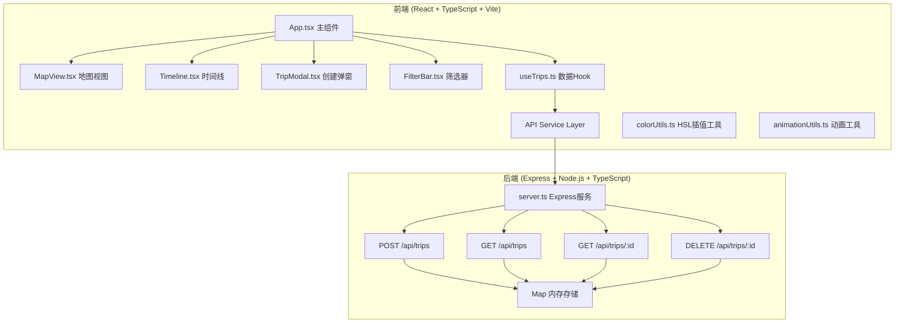
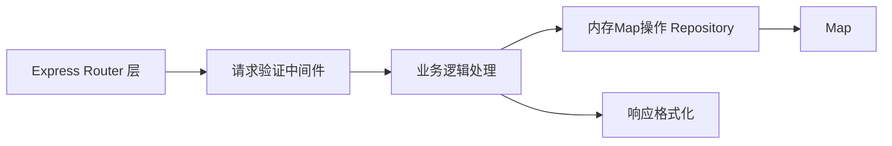
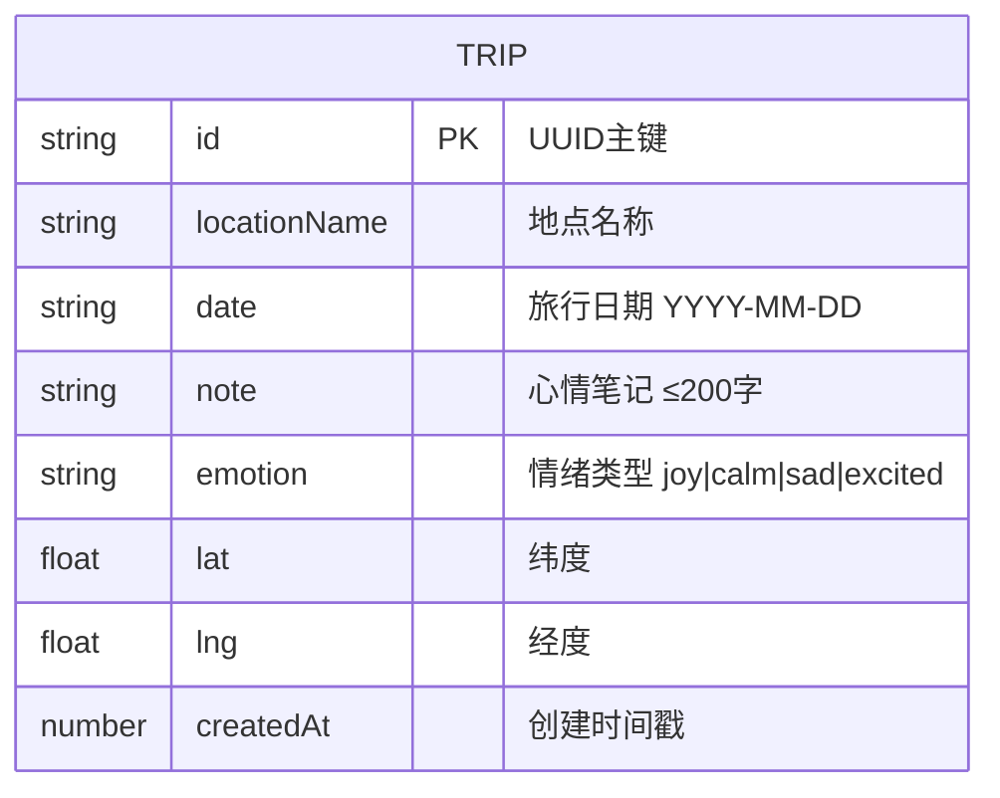

## 1. 架构设计


## 2. 技术描述
- **前端框架**：React 18 + TypeScript 5
- **构建工具**：Vite 5 + @vitejs/plugin-react
- **地图引擎**：Leaflet 1.9 + react-leaflet 4 + @types/leaflet
- **状态管理**：React useState + 自定义Hook useTrips
- **后端框架**：Express 4 + @types/express + ts-node
- **数据存储**：内存 Map<string, Trip>（非持久化）
- **样式方案**：纯CSS App.css + CSS变量 + 响应式媒体查询

## 3. 路由定义
| 路由 | 用途 |
|------|------|
| / | 主应用页面（单页应用，无前端路由） |
| POST /api/trips | 创建新旅程记录 |
| GET /api/trips | 获取所有旅程列表 |
| GET /api/trips/:id | 获取单个旅程详情 |
| DELETE /api/trips/:id | 删除指定旅程记录 |

## 4. API 定义

### 4.1 TypeScript 类型定义

```typescript
// 共享类型
interface Trip {
  id: string;           // UUID
  locationName: string; // 地点名称
  date: string;         // ISO日期字符串 YYYY-MM-DD
  note: string;         // 心情笔记（≤200字）
  emotion: EmotionType; // 情绪类型
  lat: number;          // 纬度
  lng: number;          // 经度
  createdAt: number;    // 创建时间戳
}

type EmotionType = 'joy' | 'calm' | 'sad' | 'excited';

const EMOTION_COLORS: Record<EmotionType, string> = {
  joy: '#FFD700',     // 喜悦-金黄
  calm: '#87CEEB',    // 平静-天蓝
  sad: '#DDA0DD',     // 忧伤-淡紫
  excited: '#FF4500'  // 激动-橙红
};
```

### 4.2 请求/响应 Schema

**POST /api/trips**
```typescript
// Request Body
{
  locationName: string;
  date: string;
  note: string;
  emotion: EmotionType;
  lat: number;
  lng: number;
}
// Response 201 Created
Trip
```

**GET /api/trips**
```typescript
// Response 200 OK
Trip[]  // 按date升序排序
```

**GET /api/trips/:id**
```typescript
// Response 200 OK | 404 Not Found
Trip | { error: string }
```

**DELETE /api/trips/:id**
```typescript
// Response 200 OK | 404 Not Found
{ success: boolean } | { error: string }
```

## 5. 服务器架构


## 6. 数据模型

### 6.1 数据模型定义


### 6.2 内存存储结构
- 存储介质：JavaScript `Map<string, Trip>`
- Key：Trip.id（UUID v4）
- Value：完整 Trip 对象
- 索引：按 date 字段升序排序后返回列表

## 7. 关键算法说明

### 7.1 HSL 颜色插值算法
```
输入：颜色A(hex), 颜色B(hex), 步数N（默认20）
1. hexA → rgbA → hslA
2. hexB → rgbB → hslB
3. 对每一步 i ∈ [0, N-1]：
   t = i / (N-1)
   h = hslA.h + (hslB.h - hslA.h) * t
   s = hslA.s + (hslB.s - hslA.s) * t
   l = hslA.l + (hslB.l - hslA.l) * t
   result[i] = hslToRgb(h,s,l) → hex
输出：长度为N的hex颜色数组，用于每段路线渐变渲染
```

### 7.2 回放动画缓动函数
```typescript
// ease-in-out 三次方缓动
function easeInOutCubic(t: number): number {
  return t < 0.5 ? 4*t*t*t : 1 - Math.pow(-2*t+2, 3)/2;
}
```

### 7.3 虚拟滚动算法
- 容器高度固定，每次渲染可见区域的10条记录
- 根据 scrollTop 计算起始索引 startIndex = floor(scrollTop / itemHeight)
- 仅渲染 startIndex 到 startIndex + 10 范围内的元素
- 通过 translateY 偏移实现滚动视觉效果

## 8. 性能约束实现方案
- **地图帧率≥30fps**：使用CSS transform而非top/left定位动画；requestAnimationFrame驱动
- **颜色插值≤100ms**：纯同步计算，无异步，单次最多20次颜色转换
- **列表虚拟滚动**：固定渲染10条DOM节点，滚动时仅修改translateY
- **API响应≤50ms**：内存操作，无I/O等待，直接操作Map数据结构
