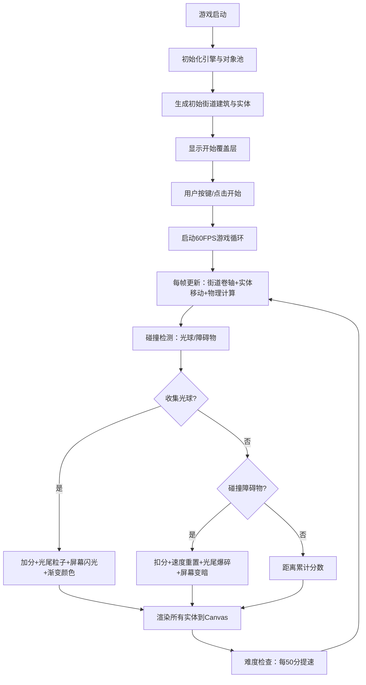

## 1. 产品概述
「光痕滑板·城市夜翔」是一款霓虹赛博朋克风格的2D浏览器跑酷游戏，玩家操控由发光粒子构成的滑板少年在随机生成的城市夜景街道上飞驰，收集渐变光球并留下星辰光尾。解决传统跑酷游戏缺乏动态光影轨迹和速度感反馈的问题。

- **核心玩法**：自动卷轴街道 + 跳跃躲避障碍物 + 收集光球累积光尾特效
- **目标用户**：喜欢休闲跑酷、赛博朋克视觉风格的浏览器游戏玩家

## 2. 核心特性

### 2.1 功能模块
1. **自动卷轴街道生成系统**：随机高度建筑 + 50%亮灯窗户 + 间隔生成
2. **滑板物理操作系统**：跳跃/二段跳/水平移动/落地光晕/跳跃风圈
3. **光球收集与光尾特效系统**：蓝→金渐变光尾 + 粒子透明度衰减 + 速度关联
4. **障碍物交互系统**：碰撞检测 + 光尾爆碎 + 速度重置 + 分数惩罚
5. **分数与难度递增系统**：收集加分/距离加分/每50分提速2px/障碍物频率提升
6. **视觉反馈系统**：屏幕抖动/闪光/变暗 + 霓虹赛博朋克UI

### 2.2 页面详情
| 页面名称 | 模块名称 | 功能描述 |
|-----------|-------------|---------------------|
| 游戏主界面 | 游戏画布区 | Canvas渲染街道、建筑、滑板、光尾、光球、障碍物 |
| 游戏主界面 | 底部HUD | 实时分数、最高分、当前速度、光尾颜色进度条 |
| 游戏主界面 | 移动端控制区 | 底部固定左右触摸按钮（左滑/右滑方向，双击跳跃） |
| 游戏主界面 | 开始/结束覆盖层 | 游戏开始提示、碰撞后重开按钮 |

## 3. 核心流程

## 4. 用户界面设计

### 4.1 设计风格
- **主色调**：深蓝紫暗夜背景 `#0B0B2B`，建筑外墙 `#1A1A3A`，街道路面 `#2A2A3A`
- **强调色**：滑板发光青 `#00FFFF`，窗户暖光 `#FFDD44`，光球蓝→金 `#0044FF → #FFAA00`
- **字体**：使用等宽科技感字体 (JetBrains Mono / Courier New)，数字字号 16-20px
- **布局**：Canvas 100%视口，PC端最小宽度800px，移动端响应式适配
- **视觉风格**：霓虹赛博朋克，发光边缘+粒子光晕+深色背景高对比度

### 4.2 页面设计概述
| 页面名称 | 模块名称 | UI元素 |
|-----------|-------------|-------------|
| 游戏主界面 | Canvas渲染区 | 深蓝紫渐变背景、滚动街道网格线、建筑窗户随机发光 |
| 游戏主界面 | 滑板角色 | 12px青色发光粒子团 + 跳跃风圈 + 落地扩散光晕 |
| 游戏主界面 | 光尾特效 | 50粒子蓝→金渐变、透明度1→0衰减、大小3-8px随机 |
| 游戏主界面 | 底部HUD栏 | 半透明深色底+霓虹边+分数/最高分/速度/进度条横向排列 |
| 游戏主界面 | 移动端控制区 | 左下方向键区+右下跳跃键区，半透明圆形按钮带霓虹边框 |

### 4.3 响应式
- **PC端**：最小宽度800px，键盘操作（空格跳跃/Shift二段跳/←→移动）
- **移动端**：竖屏适配，触摸控制（左右区域滑动调整水平位置，点击跳跃）
- **Canvas适配**：使用devicePixelRatio确保高清渲染，CSS缩放保持100%视口

### 4.4 动画特效
- **跳跃屏幕抖动**：垂直2px幅度，持续0.2秒
- **收集光球闪光**：白色叠加透明度0.2，持续0.1秒
- **碰撞变暗**：黑色叠加透明度0.5，持续0.3秒
- **窗户发光**：轻微呼吸动画（透明度0.7→1.0→0.7循环）
- **光尾粒子**：每帧寿命-2%，位置跟随滑板历史轨迹
