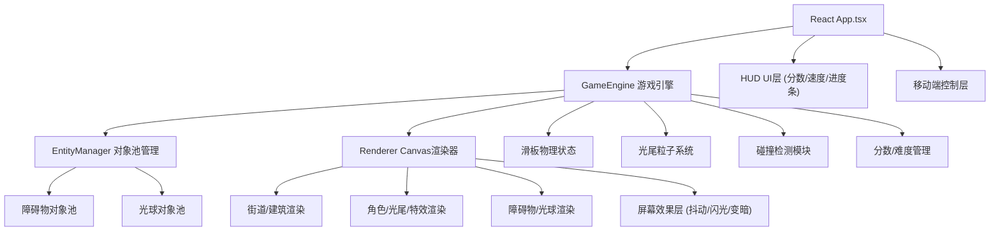

## 1. 架构设计



## 2. 技术说明
- **前端**：React@18 + TypeScript@5 + Vite@5
- **渲染**：Canvas 2D API（不使用WebGL/Three.js）
- **状态管理**：React Hooks (useRef/useState/useEffect)，游戏状态用useRef避免重渲染
- **对象池**：自定义EntityPool类，复用障碍物和光球实例避免GC
- **存储**：localStorage存储最高分记录
- **构建工具**：Vite + @vitejs/plugin-react

## 3. 项目文件结构
| 文件路径 | 职责 |
|-------|---------|
| `/package.json` | 依赖声明 (react, react-dom, typescript, vite, @vitejs/plugin-react) + npm run dev脚本 |
| `/vite.config.js` | Vite构建配置，React插件启用 |
| `/tsconfig.json` | TypeScript严格模式配置 |
| `/index.html` | 入口HTML，100vh视口容器，挂载点#root |
| `/src/App.tsx` | React主组件，管理游戏状态/UI/HUD/移动端控制，挂载Canvas，启动停止游戏循环 |
| `/src/game/GameEngine.ts` | 游戏主循环类，实体更新/碰撞检测/分数难度/对象池调度，驱动Renderer |
| `/src/game/Renderer.ts` | Canvas 2D渲染类，背景/建筑/角色/光尾/粒子/特效/屏幕效果绘制 |
| `/src/game/EntityManager.ts` | 对象池管理类，障碍物+光球的生成/回收/复用/滚动边界检测 |

## 4. 核心数据模型与接口

### 4.1 类型定义 (内联于各文件)
```typescript
// 滑板状态
interface Skateboard {
  x: number; y: number; vx: number; vy: number;
  isJumping: boolean; canDoubleJump: boolean;
  jumpPhase: number; // 0=ground, 1=firstJump, 2=secondJump
  radius: number; // 12px
}

// 光尾粒子
interface TailParticle {
  x: number; y: number; vx: number; vy: number;
  life: number; // 0-1, 每帧-2%
  size: number; // 3-8px随机
  hue: number;  // 色相，蓝(225)→金(40)渐变
}

// 光球
interface Orb {
  x: number; y: number; radius: number; // 20px
  active: boolean; hue: number;
}

// 障碍物类型
type ObstacleType = 'streetlamp' | 'mailbox' | 'barrier';
interface Obstacle {
  x: number; y: number; width: number; height: number;
  type: ObstacleType; active: boolean;
}

// 建筑
interface Building {
  x: number; width: number; height: number;
  windows: { row: number; col: number; lit: boolean; flickerPhase: number }[];
}

// 碰撞碎屑
interface DebrisParticle {
  x: number; y: number; vx: number; vy: number;
  life: number; color: string; size: number;
}

// 游戏状态快照 (供React HUD使用)
interface GameState {
  score: number; highScore: number; speed: number;
  orbCount: number; // 已收集光球数，用于色相计算
  colorProgress: number; // 0-1 蓝→金进度
  isRunning: boolean; isGameOver: boolean;
}
```

### 4.2 对象池接口
```typescript
class EntityPool<T> {
  constructor(factory: () => T, reset: (e: T) => void, initialSize: number);
  acquire(): T;
  release(e: T): void;
  getActive(): T[];
}
```

## 5. 性能约束实现方案

### 5.1 帧率保证 (60FPS, 每帧<16ms)
- 使用 `requestAnimationFrame` 驱动循环，时间戳归一化
- Canvas使用 `devicePixelRatio` 缩放，避免CSS模糊
- 所有粒子预分配，运行中不创建新对象
- 碰撞检测使用简单AABB+圆形，避免复杂运算

### 5.2 粒子总数控制 (≤200)
| 粒子类型 | 上限 | 说明 |
|---------|-----|-----|
| 光尾粒子 | 50 | 环形缓冲，满则覆盖最旧 |
| 建筑窗户发光 | 50 | 每栋建筑最多10窗，≤5栋可见 |
| 光球粒子 | 20 | 屏幕内同时≤4颗可见 |
| 碰撞碎屑 | 80 | 每次碰撞30颗，同时≤3次碰撞残留 |
| **合计** | **200** | 严格控制 |

### 5.3 对象池策略
- 障碍物池：初始15个，最大30个
- 光球池：初始10个，最大20个
- 碰撞碎屑池：初始80个，复用避免GC

## 6. 渲染层级 (从下到上)
1. 背景渐变层：#0B0B2B → #1A1A4A 垂直渐变
2. 远景建筑层：剪影效果，轻微视差
3. 街道地面层：#2A2A3A + 白色网格线 (发光效果)
4. 近景建筑层：#1A1A3A 墙体 + #FFDD44 窗户
5. 障碍物层：路灯/邮筒/护栏
6. 光球层：径向渐变发光
7. 光尾粒子层：蓝→金渐变，加色混合
8. 滑板角色层：青色发光粒子团 + 跳跃风圈
9. 落地光晕层：60px扩散圆
10. 屏幕效果层：抖动/闪光/变暗叠加
11. HUD层：HTML/CSS叠加在Canvas上 (z-index最高)
