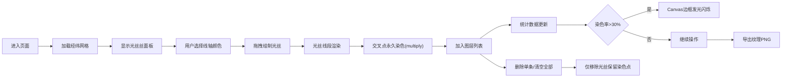

## 1. 产品概述

「织光·数字织物」是一款基于浏览器的交互式数字艺术创作工具，让策展人和普通用户通过鼠标拖拽和点击，在虚拟织布机上将不同颜色的"光丝"编织成动态变化的几何纹理图案。

- **主要用途**：数字艺术创作、交互式策展、纹理图案设计
- **目标用户**：策展人、数字艺术家、设计师、创意爱好者
- **产品价值**：提供沉浸式、可视化的编织体验，将传统纺织工艺与数字艺术结合，产出可导出分享的独特几何纹理

## 2. 核心功能

### 2.1 用户角色

| 角色 | 注册方式 | 核心权限 |
|------|----------|----------|
| 访客用户 | 无需注册，直接使用 | 编织光丝、管理图层、导出图案 |

### 2.2 功能模块

1. **主画布区域**：36条经线 × 24条纬线构成的虚拟织布机网格，支持光丝拖拽编织
2. **色盘与线轴面板**：12色预设色盘，点击选择当前线轴颜色，线轴图标动态更新
3. **图层管理面板**：光丝图层列表，支持单条删除和一键清空
4. **统计展示区**：实时显示染色交叉点数量与活跃光丝数量
5. **图案导出功能**：一键导出800×600像素PNG图片

### 2.3 页面详情

| 页面名称 | 模块名称 | 功能描述 |
|----------|----------|----------|
| 主界面 | 顶部统计栏 | 实时显示染色交叉点(格式: 已染色 N/864)、活跃光丝数、超30%发光边框 |
| 主界面 | 中央Canvas | 36竖经线(#333333, 间隔15px, 宽2px)、24横纬线(间隔20px, 宽2px)、拖拽绘制光丝(宽3px)、端点光晕(半径6px, 透明度0.4)、交叉点染色(multiply混合)、拖尾粒子效果 |
| 主界面 | 左侧图层面板 | 磨砂玻璃面板、图层列表(颜色块+光丝N标签+删除X按钮)、悬停放大(scale 1.02)、删除按钮弹性动画、清空所有光丝按钮 |
| 主界面 | 右侧色盘面板 | 磨砂玻璃面板、12色圆形色块、选中高亮光圈(宽3px)、选中光晕扩散动画、线轴图标动态填色 |
| 主界面 | 底部导出栏 | "导出纹理"按钮、导出800×600 PNG、文件名woven-{4位随机数}.png |

## 3. 核心流程

用户打开页面 → 看到36×24经纬网格和磨砂玻璃面板 → 在右侧色盘选择颜色(线轴同步变色) → 在Canvas区域按住鼠标拖拽绘制光丝路径 → 路径经过的经纬交叉点被永久染色 → 光丝作为图层加入左侧列表 → 可删除单条图层或清空所有(染色点保留) → 顶部统计实时更新 → 超过30%染色率时Canvas边框闪烁发光 → 点击导出按钮下载PNG图片

## 4. 用户界面设计

### 4.1 设计风格
- **整体主题**：深色织物质感背景(#1a1a2e)，数字艺术画廊氛围
- **主色调**：深邃靛蓝背景(#1a1a2e)、半透明白面板(rgba(255,255,255,0.08))、12色活力色盘
- **辅助色**：深灰经纬线(#333333)、白色边框(rgba(255,255,255,0.2))
- **视觉效果**：磨砂玻璃(backdrop-filter: blur(12px))、柔光边框、拖尾粒子、光晕扩散、发光闪烁

### 4.2 动画与交互
- **色盘选中**：box-shadow光晕从0 0 0 0扩展到0 0 12px 4px当前色值
- **图层悬停**：transform: scale(1.02) 微放大
- **删除按钮**：点击时transform先缩小至0.8再恢复的弹性动画
- **拖尾粒子**：半径2px，透明度从0.6渐降到0，持续0.3秒
- **数字跳动**：统计数字更新时从旧值过渡到新值，持续0.5秒
- **边框闪烁**：染色超30%时，周期1.5秒发光，颜色为光丝数最多的颜色

### 4.3 布局方式
- **桌面端(≥768px)**：三栏布局，左侧图层面板(浮动)、中央Canvas(居中)、右侧色盘面板(浮动)
- **移动端(<768px)**：顶部统计栏→顶部色盘横条→中央Canvas(剩余高度)→底部图层横条+导出按钮

### 4.4 排版
- 标题：现代无衬线字体，中大型字号，字间距舒适
- 标签：中等字号，浅色文字(rgba(255,255,255,0.85))
- 数字统计：大号加粗字体，高亮色显示

## 5. 性能约束

- Canvas渲染帧率 ≥ 45fps
- 光丝数量 ≤ 200条时帧率 ≥ 30fps
- 兼容Chrome/Firefox/Edge最新版
