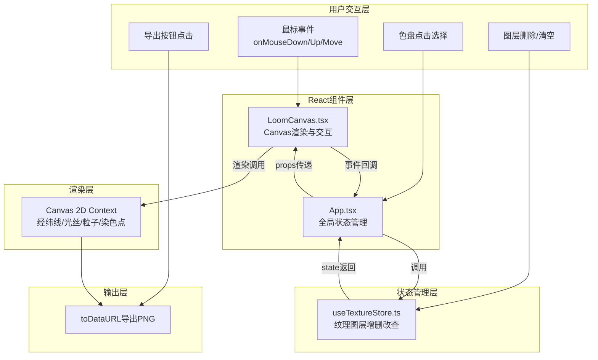

## 1. 架构设计



**调用关系与数据流向说明：**
1. 用户交互 → App.tsx(管理selectedColor, stats等)
2. App.tsx → props: {warps, wefts, selectedColor, threads, stainedPoints} → LoomCanvas.tsx
3. LoomCanvas.tsx 捕获鼠标事件 → 计算光丝坐标 → onAddThread回调 → App.tsx
4. App.tsx → 调用 useTextureStore.addThread() → 状态更新 → 重新渲染
5. 删除图层 → useTextureStore.removeThread() → 状态更新(保留stainedPoints)
6. 导出时 → LoomCanvas ref → toDataURL → Blob下载

## 2. 技术描述

- **前端框架**：React@18 + TypeScript(严格模式)
- **构建工具**：Vite@5 + @vitejs/plugin-react
- **渲染方案**：Canvas 2D API (原生，无需额外图形库)
- **状态管理**：React hooks (useState + 自定义useTextureStore hook，无需zustand)
- **样式方案**：原生CSS3 (styles.css)，含磨砂玻璃、动画、响应式
- **包管理器**：npm
- **后端服务**：无(纯前端)

## 3. 目录结构

```
.
├── package.json
├── vite.config.js
├── tsconfig.json
├── index.html
└── src/
    ├── App.tsx              # 主组件，全局状态调度
    ├── styles.css           # 全局样式与动画
    ├── components/
    │   └── LoomCanvas.tsx   # Canvas核心渲染与交互
    └── hooks/
        └── useTextureStore.ts  # 纹理图层状态管理
```

## 4. 核心数据模型

### 4.1 Thread (光丝图层)

```typescript
interface Thread {
  id: string;              // 唯一id (nanoid或时间戳+随机)
  color: string;           // 光丝颜色(hex)
  x1: number; y1: number;  // 起点坐标(Canvas像素坐标)
  x2: number; y2: number;  // 终点坐标
  opacity: number;         // 透明度 [0.6, 1.0]
  stainedCrossings: string[]; // 覆盖的交叉点id集合 ["w5-w3", ...]
}
```

### 4.2 StainedPoint (染色交叉点)

```typescript
interface StainedPoint {
  id: string;              // "w{warpIndex}-w{weftIndex}"
  color: string;           // 染色颜色(最后覆盖光丝的颜色或混合色)
  warpIndex: number;       // 经线序号
  weftIndex: number;       // 纬线序号
}
```

### 4.3 Palette Colors (12色盘)

```typescript
const COLORS = [
  '#FF6B6B', '#4ECDC4', '#45B7D1', '#96CEB4',
  '#FFEAA7', '#DDA0DD', '#98FB98', '#FFD700',
  '#FF69B4', '#87CEEB', '#F0E68C', '#E6E6FA'
];
```

### 4.4 Canvas Layout Constants

```typescript
const WARP_COUNT = 36;        // 经线数
const WEFT_COUNT = 24;        // 纬线数
const WARP_SPACING = 15;      // 经线间隔(px)
const WEFT_SPACING = 20;      // 纬线间隔(px)
const LINE_WIDTH = 2;         // 经纬线宽
const THREAD_WIDTH = 3;       // 光丝宽
const GLOW_RADIUS = 6;        // 端点光晕半径
const GLOW_OPACITY = 0.4;     // 端点光晕透明度
const CANVAS_W = 800;         // 导出宽度
const CANVAS_H = 600;         // 导出高度
```

## 5. 性能优化要点

1. **离屏缓冲**：经纬网格和染色交叉点预渲染到离屏Canvas，每帧只重绘光丝和粒子
2. **requestAnimationFrame**：统一动画调度，避免重绘风暴
3. **线段-网格求交优化**：使用包围盒预筛选，避免遍历全部864交叉点
4. **粒子池**：复用粒子对象，避免GC频繁触发
5. **React.memo**：LoomCanvas用memo包裹，避免props未变时重渲染
6. **批量重绘**：拖拽时只更新当前绘制光丝，不触发整条图层重算
