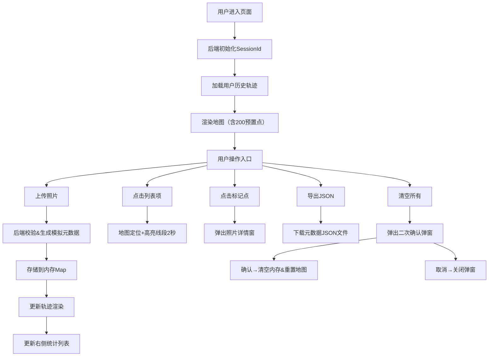

## 1. 产品概述

「光影足迹·旅行地图」是一款面向旅行爱好者的全栈可视化Web应用，通过上传照片自动提取地理、时间与色彩信息，在动态世界地图上生成带渐变色彩的旅行轨迹，让用户以沉浸式方式回顾旅行足迹。

- **核心价值**：将离散的旅行照片转化为连续、可视的光影轨迹，融合地理、时间与色彩三重维度，创造独有的旅行记忆可视化体验。
- **目标用户**：摄影爱好者、旅行记录者、地理数据可视化爱好者。

## 2. 核心功能

### 2.1 用户角色

| 角色 | 注册方式 | 核心权限 |
|------|---------|---------|
| 普通用户 | Session自动识别 | 上传照片、查看轨迹、导出数据、清空记录 |

### 2.2 功能模块

1. **主地图区域**：Leaflet世界地图、渐变轨迹线、发光描边、贝塞尔曲线、标记点脉冲动画
2. **照片上传模块**：批量上传（≤10张）、文件校验、模拟Exif提取、进度反馈
3. **信息面板**：毛玻璃效果、上传历史列表、轨迹统计（距离/时间/数量）、列表项高亮联动
4. **弹窗系统**：照片详情弹窗、二次确认清空弹窗、渐入动画
5. **数据管理**：一键清空（二次确认）、JSON轨迹导出、Session级多用户隔离

### 2.3 页面详情

| 页面名称 | 模块名称 | 功能描述 |
|---------|---------|---------|
| 主页面 | 顶部操作栏 | 上传按钮、清空按钮、导出按钮 |
| 主页面 | 地图容器（70%宽） | Leaflet地图、Canvas轨迹渲染、标记点、弹窗 |
| 主页面 | 右侧面板（30%宽） | 上传历史列表、滚动视图、点击定位高亮 |
| 主页面 | 照片详情弹窗 | 缩略图、时间、坐标、主色调色块、浅色背景 |
| 主页面 | 确认清空弹窗 | 半透明遮罩、中央卡片、取消/确认按钮 |

## 3. 核心流程

### 3.1 主流程描述

用户进入页面 → 系统自动加载Session对应历史轨迹 → 地图渲染预置200个模拟点 → 用户上传照片（≤10张）→ 后端生成模拟元数据 → 按时间排序后渲染新轨迹 → 右侧列表更新统计 → 点击标记点查看详情 → 点击列表项定位高亮 → 可导出JSON或清空所有数据

### 3.2 流程图

## 4. 用户界面设计

### 4.1 设计风格

- **主色调**：深灰蓝背景 `#1A1A2E`，渐变按钮 `#FF6B6B → #FFA07A`
- **轨迹色彩体系**：白天暖色调 `#FF8800 → #FF3366`，夜晚冷色调 `#3366FF → #6633FF`
- **按钮风格**：线性渐变背景、圆角、悬停上浮动效（translateY(-2px)，0.2s过渡）、亮度+10%
- **字体方案**：主字体采用现代无衬线字体，展示标题使用富设计感的字体（如 Playfair Display 搭配 Inter）
- **布局风格**：左右分栏（70/30）、卡片化面板、毛玻璃叠加层、圆角8px
- **视觉层次**：Canvas发光轨迹 + 柔和阴影（`rgba(0,0,0,0.5)`，12px模糊，4px偏移）+ 脉冲微交互
- **动效设计**：弹窗0.3s渐入（scale 0.8→1.0 + opacity 0→1）、悬停脉冲1.5s循环（线宽4→6→4px）、高亮闪烁2s

### 4.2 页面设计概述

| 页面名称 | 模块名称 | UI元素 |
|---------|---------|--------|
| 主页面 | 顶部操作栏 | 渐变按钮组、Logo标题、悬浮于地图之上 |
| 主页面 | 地图容器 | 全屏高度、Leaflet暗色底图、Canvas渲染轨迹、发光描边 |
| 主页面 | 右侧面板 | `rgba(255,255,255,0.08)` 背景、15px高斯模糊、8px圆角、纵向滚动列表 |
| 主页面 | 列表卡片 | 每条上传记录卡片，显示照片数/时间范围/公里数、hover高亮边框 |
| 主页面 | 详情弹窗 | 主色调浅色变体背景、缩略图100x100、信息网格、主色调色块20x20 |
| 主页面 | 确认弹窗 | 半透明黑色遮罩、中央白色卡片、警告图标、双按钮操作 |

### 4.3 响应式设计

- **桌面优先（>768px）**：左右分栏布局，地图70%宽 / 面板30%宽，全屏高度
- **移动端（≤768px）**：上下堆叠布局，地图60vh / 面板40vh，100%宽度
- **触控优化**：按钮最小触控区域44px、标记点扩大点击热区、列表项触控反馈

### 4.4 性能指标约束

- 初始渲染 ≤ 2秒（预置200个数据点）
- Canvas每帧绘制耗时 ≤ 10ms
- 采用Leaflet Canvas渲染器（非DOM）保证复杂轨迹流畅性
- 照片上传单张限制 ≤ 5MB，单次≤10张
