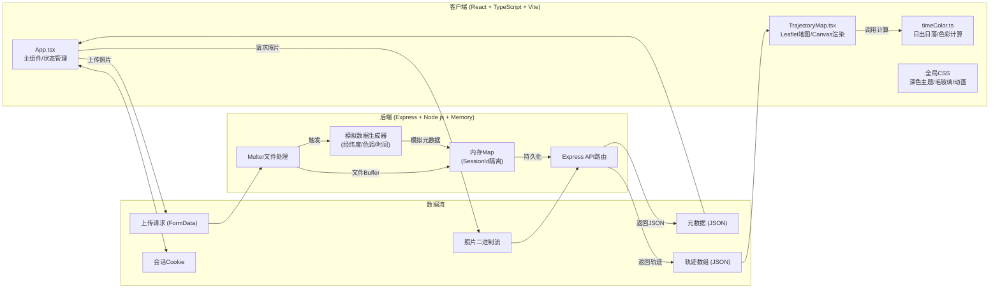
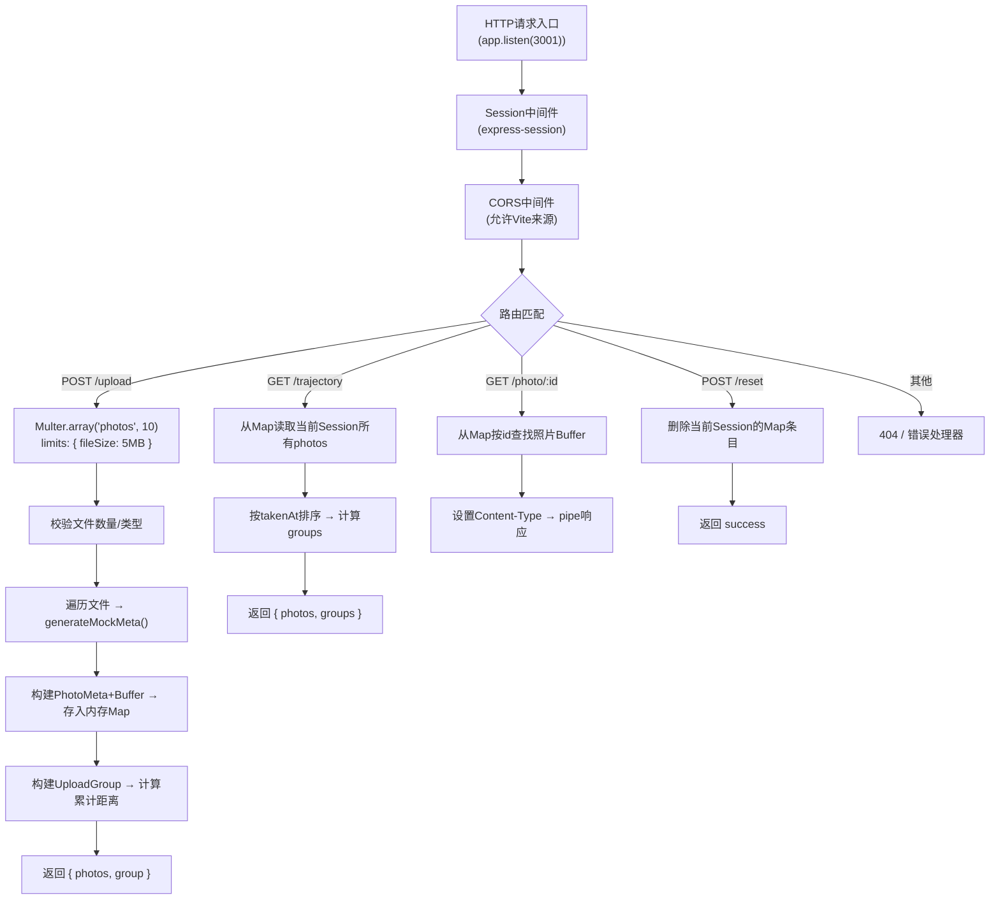
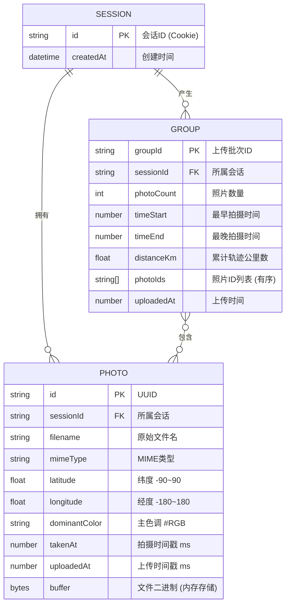

## 1. 架构设计



## 2. 技术描述

- **前端框架**：React 18 + TypeScript 5（严格模式）
- **构建工具**：Vite 5 + @vitejs/plugin-react
- **地图引擎**：Leaflet 1.9 + @types/leaflet（Canvas渲染器）
- **样式方案**：原生CSS + CSS变量（深色主题）、CSS动画、高斯模糊
- **后端框架**：Express 4 + TypeScript（ts-node运行）
- **文件上传**：Multer（内存存储，大小限制5MB/张）
- **会话管理**：express-session（内存存储，Cookie标识用户）
- **数据存储**：服务端内存 `Map<string, UserData>`（SessionId → 照片数组）
- **启动方式**：`npm run dev` 同时启动Vite前端（端口5173）和Express后端（端口3001），使用Vite代理API请求

## 3. 项目结构与调用关系

```
auto18/
├── package.json                    # 依赖定义与启动脚本
├── vite.config.js                  # Vite配置 + React插件 + API代理
├── tsconfig.json                   # TS严格模式配置
├── index.html                      # 入口HTML + Leaflet CDN
└── src/
    ├── server/
    │   └── index.ts                # [后端入口] Express服务、路由、内存存储
    │                                 调用关系：处理/photo/:id → 读取内存Map → 返回二进制
    │                                 处理/upload → Multer解析 → 生成模拟元数据 → 存入Map
    │                                 处理/trajectory → 读取Map → 返回排序后的JSON
    ├── utils/
    │   └── timeColor.ts            # [工具函数] 日出日落计算、轨迹色彩插值
    │                                 被调用：TrajectoryMap 逐段计算颜色/透明度
    ├── components/
    │   └── TrajectoryMap.tsx       # [地图组件] Leaflet初始化、Canvas轨迹、标记点、弹窗
    │                                 调用：timeColor.ts; 被调用：App.tsx 传入trajectory props
    ├── App.tsx                     # [主组件] 布局、状态管理、API调用、交互逻辑
    │                                 调用：TrajectoryMap; API: /upload, /trajectory, /photo/:id
    └── index.css                   # [全局样式] 深色主题、毛玻璃、渐变按钮、动画
```

## 4. API 定义

### 4.1 类型定义

```typescript
interface PhotoMeta {
  id: string;              // UUID
  sessionId: string;       // 会话ID
  filename: string;        // 原始文件名
  mimeType: string;        // image/jpeg | image/png
  latitude: number;        // -90 ~ 90
  longitude: number;       // -180 ~ 180
  dominantColor: string;   // #RRGGBB
  takenAt: number;         // 时间戳 ms (2023年内随机)
  uploadedAt: number;      // 上传时间戳
}

interface UploadGroup {
  groupId: string;
  photoCount: number;
  timeRange: { start: number; end: number };
  distanceKm: number;      // Haversine公式累计距离
  photoIds: string[];
  uploadedAt: number;
}

interface UserData {
  photos: Map<string, PhotoMeta & { buffer: Buffer }>;
  groups: UploadGroup[];
}
```

### 4.2 路由与请求响应

| 路由 | 方法 | 请求 | 响应 | 用途 |
|------|------|------|------|------|
| `/api/upload` | POST | `multipart/form-data` 字段: `photos` (文件数组，≤10个，≤5MB/个) | `{ success: true, photos: PhotoMeta[], group: UploadGroup }` | 批量上传照片并返回模拟元数据 |
| `/api/trajectory` | GET | Query: 无 | `{ photos: PhotoMeta[], groups: UploadGroup[] }` | 获取当前用户所有照片轨迹和分组列表 |
| `/api/photo/:id` | GET | Path: `id` (PhotoMeta.id) | 二进制流 `Content-Type: image/*` | 获取指定照片文件用于缩略图 |
| `/api/reset` | POST | Body: 无 | `{ success: true }` | 清空当前用户所有数据和照片 |
| `/api/session` | GET | 无 | `{ sessionId: string }` | 调试用：获取当前会话ID |

### 4.3 错误响应格式

```typescript
interface ApiError {
  success: false;
  error: string;
  code: 'FILE_TOO_LARGE' | 'TOO_MANY_FILES' | 'INVALID_TYPE' | 'NOT_FOUND' | 'INTERNAL';
}
```

## 5. 后端服务架构



## 6. 数据模型

### 6.1 内存数据结构



### 6.2 模拟数据生成策略

- **预置200个模拟点**：后端启动后为首个访问Session自动注入200条随机PhotoMeta，模拟历史数据
- **经纬度**：`latitude = (Math.random()-0.5)*180`, `longitude = (Math.random()-0.5)*360`，并对连续点加入连贯性偏移
- **主色调色板**：`['#FF6B6B','#4ECDC4','#45B7D1','#96CEB4','#FFEAA7','#DDA0DD','#98D8C8','#F7DC6F','#BB8FCE','#85C1E2']` 随机选取
- **拍摄时间**：2023年1月1日 ~ 2023年12月31日之间随机，同一批次照片时间加入递增序列模拟行程
- **距离计算**：Haversine公式计算相邻点大圆距离并累加
