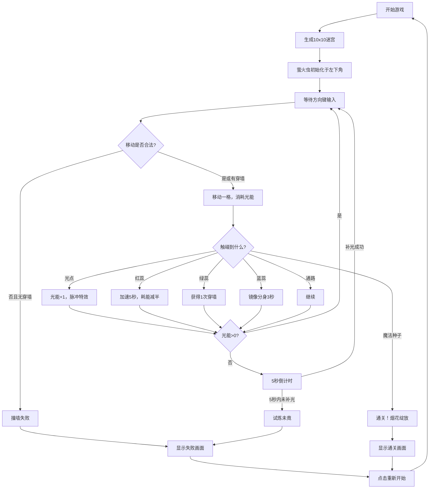

## 1. 产品概述
「萤火迷宫·灵光寻径」是一款2D策略解谜浏览器游戏，玩家操控由发光粒子构成的萤火虫，在随机生成的网格迷宫中穿梭，收集光点补充光能，获取花蕊能力，最终点亮中央的魔法种子通关。
- 目标用户：休闲解谜游戏爱好者、独立游戏玩家
- 产品价值：提供梦幻、唯美的夜间生态主题解谜体验，结合策略资源管理与能力搭配玩法

## 2. 核心功能

### 2.1 用户角色
| 角色 | 注册方式 | 核心权限 |
|------|----------|----------|
| 玩家 | 无需注册，直接游戏 | 进行游戏、重试关卡、查看状态 |

### 2.2 功能模块
1. **游戏主界面**：800x800 Canvas画布、HUD状态显示、游戏结束覆盖层
2. **迷宫生成系统**：10x10动态网格迷宫、深度优先算法、花蕊/光点随机放置
3. **萤火虫控制系统**：键盘方向键移动、光能消耗、拖尾粒子特效
4. **花蕊能力系统**：红色加速、绿色穿墙、蓝色镜像分身
5. **光点收集系统**：光能补充、脉冲光晕特效
6. **粒子特效系统**：拖尾光粒、花蕊脉冲、通关烟花
7. **胜负判定系统**：触碰魔法种子通关、光能耗尽失败、撞墙失败

### 2.3 页面详情
| 页面名称 | 模块名称 | 功能描述 |
|----------|----------|----------|
| 游戏主页面 | Canvas画布 | 渲染迷宫、萤火虫、花蕊、光点、粒子特效 |
| 游戏主页面 | HUD状态层 | 显示当前光能值、能力状态、操作提示 |
| 游戏主页面 | 通关覆盖层 | 显示胜利提示、粒子烟花、重新开始按钮 |
| 游戏主页面 | 失败覆盖层 | 显示"试炼未竟"提示、失败原因、重新开始按钮 |

## 3. 核心流程
玩家进入游戏 → 迷宫随机生成（起点左下角，魔法种子在中央）→ 通过方向键控制萤火虫移动 → 每步消耗1点光能（初始10点）→ 触碰光点补充光能 → 触碰花蕊获得临时能力（加速/穿墙/镜像）→ 到达中央触碰魔法种子 → 种子绽放、粒子烟花爆发 → 显示通关画面。若光能耗尽5秒未补、或无穿墙能力时撞墙/越界 → 萤火虫碎裂消散 → 显示失败画面。

## 4. 用户界面设计

### 4.1 设计风格
- **主色调**：深夜蓝紫色渐变背景（#0B0B2B → #1A1A3A）
- **辅助色**：
  - 墙壁：半透明绿色 #2ECC71（透明度0.3）
  - 通路：浅灰色 #D5DBDB（透明度0.2）
  - 萤火虫：亮黄色 #F1C40F（柔光光晕）
  - 红蕊：#E74C3C，绿蕊：#27AE60，蓝蕊：#3498DB
  - 光点：白色 #FFFFFF
- **风格定位**：柔和发光、梦幻夜间生态主题
- **字体**：圆润优雅的无衬线字体，发光文字效果
- **动效**：所有交互均带有柔光脉冲、瞬移残影、粒子拖尾等视觉反馈

### 4.2 页面设计概览
| 页面名称 | 模块名称 | UI元素 |
|----------|----------|--------|
| 游戏主页面 | Canvas画布 | 800x800居中，蓝紫渐变背景，网格迷宫带发光边缘，萤火虫柔光拖尾，花蕊脉冲扩散，光点呼吸闪烁，粒子烟花爆发 |
| 游戏主页面 | HUD状态层 | 左上角光能条（黄色发光进度条+数值），右上角当前能力图标（带剩余时间），底部操作提示文字，所有元素带柔光效果 |
| 游戏主页面 | 通关覆盖层 | 全屏柔光渐亮，中央金色发光"灵光绽放"文字，下方"重新试炼"按钮，背景粒子烟花持续绽放 |
| 游戏主页面 | 失败覆盖层 | 屏幕渐暗灰，中央暗红发光"试炼未竟"文字，下方小字失败原因，"重新试炼"按钮 |

### 4.3 响应式设计
- 桌面端优先：Canvas固定800x800像素居中显示
- 移动适配：通过CSS transform等比缩放Canvas保持比例
- 触屏优化：支持虚拟方向键（可选增强）

### 4.4 视觉特效规范
| 特效名称 | 参数说明 |
|----------|----------|
| 萤火虫光晕 | 直径8px，#F1C40F，高斯模糊 |
| 拖尾粒子 | 半径2-4px，黄色→透明渐变，位置跟随 |
| 光点呼吸 | 透明度0.5-1.0正弦变化 |
| 光点脉冲 | 半径20px，持续0.3秒 |
| 花蕊脉冲 | 半径扩展至40px，持续0.4秒 |
| 低光闪烁 | 亮度10%，2Hz频率 |
| 通关烟花 | ≥1000粒子，7色随机，大小3px→0，持续2秒 |
| 移动残影 | 半透明萤火虫残影短时间保留 |
| 能力提示 | 屏幕边缘闪烁对应能力颜色 |
