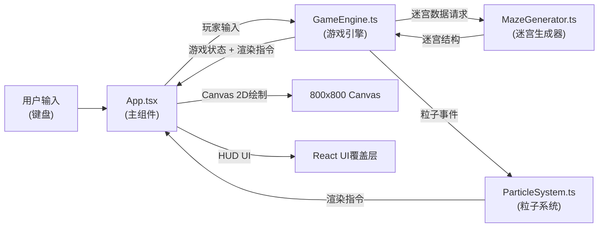
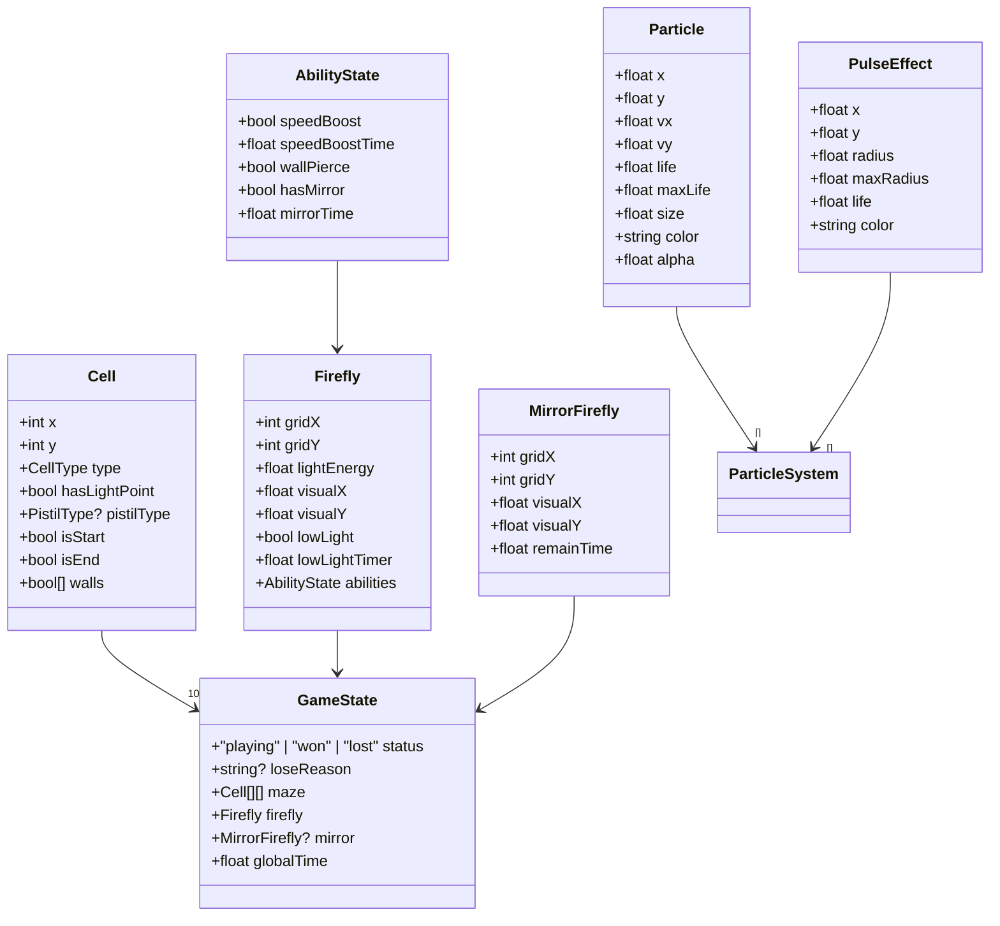

## 1. 架构设计



**数据流向说明**：
1. `App.tsx` 捕获键盘事件，传递给 `GameEngine`
2. `GameEngine` 初始化时调用 `MazeGenerator` 生成迷宫数据
3. `GameEngine` 根据输入更新游戏状态，产生粒子触发事件给 `ParticleSystem`
4. `ParticleSystem` 维护所有粒子的生命周期，输出渲染数据
5. `App.tsx` 在 requestAnimationFrame 循环中：调用 `GameEngine.update()` → 收集 `ParticleSystem` 渲染数据 → 通过 Canvas 2D API 绘制 → 通过 React 渲染 HUD

## 2. 技术栈说明
- **前端框架**：React 18 + TypeScript（严格模式，目标ES2020）
- **构建工具**：Vite + @vitejs/plugin-react
- **渲染方式**：Canvas 2D（游戏实体与粒子）+ React（UI覆盖层）
- **状态管理**：GameEngine内部状态机 + React useState（UI层状态）
- **无需后端、无需数据库**，纯前端单页应用

## 3. 路由定义
| 路由 | 用途 |
|------|------|
| / | 游戏主页面（单页应用，无路由切换） |

## 5. 核心数据模型

### 5.1 数据类型定义



### 5.2 枚举类型
- **CellType**：`WALL` | `PATH`
- **PistilType**：`RED_SPEED` | `GREEN_PIERCE` | `BLUE_MIRROR`
- **GameStatus**：`PLAYING` | `WON` | `LOST`

### 5.3 迷宫数据结构
```typescript
// 10x10 二维数组
interface MazeData {
  cells: Cell[][];
  startPos: { x: number; y: number };   // 左下角 (0, 9)
  endPos: { x: number; y: number };     // 中央 (5, 5)
  width: 10;
  height: 10;
}
```

## 6. 模块调用关系与职责

| 文件 | 职责 | 对外接口 | 依赖 |
|------|------|----------|------|
| `src/App.tsx` | 主组件，管理Canvas引用、游戏循环、键盘输入、HUD渲染 | 渲染Canvas与UI | `GameEngine`, `ParticleSystem` |
| `src/game/GameEngine.ts` | 核心引擎：游戏状态机、碰撞检测、光能计算、能力管理、关卡重置 | `start()`, `update(dt)`, `move(direction)`, `getRenderData()`, `getStatus()` | `MazeGenerator`, `ParticleSystem` |
| `src/effects/ParticleSystem.ts` | 粒子系统：萤火虫拖尾、光点脉冲、花蕊脉冲、烟花粒子、移动残影 | `spawnTrail(pos)`, `spawnPulse(pos, color, type)`, `spawnFirework(pos)`, `update(dt)`, `getParticles()`, `getPulseEffects()` | 无外部依赖 |
| `src/game/MazeGenerator.ts` | 迷宫生成：深度优先算法生成通路、随机放置花蕊和光点、确保起点到终点可达 | `generate(width, height)`, `validatePath(maze)` | 无外部依赖 |

## 7. 性能约束实现方案
- **FPS保障**：使用 `requestAnimationFrame` 驱动循环，逻辑与渲染分离，更新逻辑基于 `deltaTime`
- **粒子数量控制**：
  - 常态：活跃粒子池 ≤ 200（对象池复用 + 拖尾限制最多20个 + 脉冲最多5个）
  - 烟花：爆发 1000-1500 粒子，2秒内快速衰减回收
- **迷宫生成**：10x10 规模极小，DFS 递归回溯在 1ms 内完成
- **Canvas 优化**：
  - 迷宫网格静态缓存至离屏 Canvas，只重绘萤火虫与粒子层
  - 使用 `globalCompositeOperation = 'lighter'` 优化发光叠加
  - 粒子批量绘制减少状态切换

## 8. 关键算法说明
- **迷宫生成**：深度优先搜索（DFS）回溯算法，从起点开始随机凿墙直到终点可达，保证连通
- **路径验证**：BFS 验证起点 → 终点存在通路，否则重新生成
- **花蕊/光点放置**：在随机通路上放置，3种花蕊各1个，光点5-8个，避开起点和终点
- **碰撞检测**：网格化坐标直接索引 CellType，穿墙能力标记忽略 WALL 判定
- **镜像分身移动**：记录玩家移动方向序列，镜像取反（上↔下，左↔右），边界自动停止
