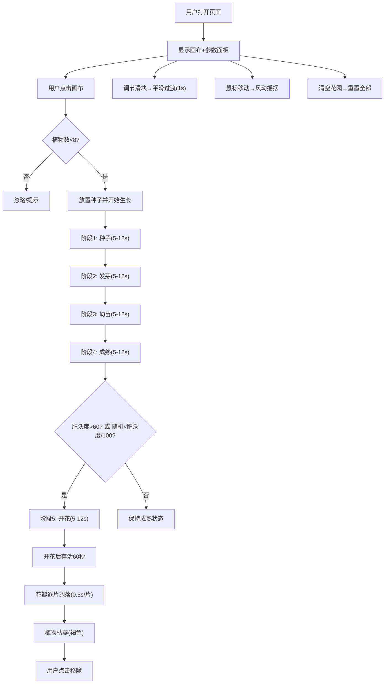

## 1. 产品概述

像素盆栽是一款基于浏览器的交互式植物生长模拟器，通过Canvas 2D渲染技术，让用户在虚拟画布上亲手种植并观察植物完整的生长周期。产品核心解决虚拟绿植展示缺乏动态生长过程和用户参与感的痛点，通过L-system分形算法生成自然形态的植物，结合光照、水分、土壤肥沃度三要素的动态调节，为每株植物赋予独特的生命特性。

- 目标用户：植物爱好者、休闲游戏玩家、教育场景用户
- 核心价值：沉浸式的植物生长体验、参数化的植物形态生成、自然风动动画的视觉享受

## 2. 核心特性

### 2.1 用户角色
| 角色 | 注册方式 | 核心权限 |
|------|----------|----------|
| 普通用户 | 无需注册 | 种植植物、调节参数、观察生长、清空花园 |

### 2.2 功能模块
1. **主画布区域**：种子放置、植物生长渲染、风动动画、粒子效果、花瓣凋落
2. **参数控制面板**：光照/水分/肥沃度滑块调节、植物生长记录列表、清空花园按钮

### 2.3 页面详情
| 页面名称 | 模块名称 | 功能描述 |
|----------|----------|----------|
| 主页面 | 画布区域 | 鼠标点击放置种子（最多8棵），L-system分形算法生成植物主干和分支（4层迭代），5个生长阶段（种子→发芽→幼苗→成熟→开花），每阶段5-12秒随机，总周期40-50秒 |
| 主页面 | 风动效果 | 鼠标水平移动模拟风，枝条叶片摇摆（最大15度，周期0.8-1.5秒），停止2秒后阻尼衰减至0（0.95/帧） |
| 主页面 | 生命周期 | 开花后存活60秒→花瓣逐片凋落（0.5秒/片，自由落体+旋转）→枯萎为褐色枯枝→点击移除 |
| 主页面 | 粒子系统 | 根部辉光粒子（半径2-4px，透明度0.2-0.5，与叶色匹配，单株≤50个） |
| 参数面板 | 三要素滑块 | 光照（0-100，默认50，影响高度1.0-1.5倍、茎色#2d5a27→#8fbc45）；水分（0-100，默认50，影响叶片数×1.5、叶面积×1.3）；肥沃度（0-100，默认50，影响分支数×2、开花概率） |
| 参数面板 | 植物列表 | 种植时间、当前阶段、三要素参数、迷你进度条 |
| 参数面板 | 清空按钮 | 一键移除所有植物，重置参数为默认值 |

## 3. 核心流程

用户打开应用→深色渐变背景的温室界面出现→用户在画布空白处点击放置种子→种子立即开始生长（5阶段循环）→用户可通过滑块实时调节三要素参数→植物形态1秒内平滑插值过渡→鼠标在画布上水平移动产生风动效果→植物开花后60秒开始凋落→花瓣凋落后植物枯萎→点击枯萎植物移除/或点击"清空花园"重置全部

## 4. 用户界面设计

### 4.1 设计风格
- **主色调**：深色渐变背景（顶部深蓝#0a0a2e → 底部墨绿#1a2e1a），营造夜间温室氛围
- **植物色系**：暗绿#2d5a27、黄绿#8fbc45、褐色#6b4226、棕色种子、半透明花瓣(alpha 0.6)
- **滑块样式**：淡灰色渐变轨道，叶片轮廓SVG滑块按钮，对应emoji图标（☀️💧🌱）
- **字体**：选用优雅的无衬线字体，标题略大，正文紧凑
- **按钮风格**：圆角矩形，悬停缩放+颜色微变，点击反馈

### 4.2 页面设计概览
| 页面名称 | 模块名称 | UI元素 |
|----------|----------|--------|
| 主页面 | 画布区域 | 全屏Canvas（桌面左70%），深色渐变背景，贝塞尔曲线枝干，椭圆叶片（随机叶脉），半透明圆形花瓣，辉光粒子 |
| 主页面 | 参数面板 | 桌面右30% / 移动端底部堆叠，3个定制滑块带emoji图标，植物记录列表带迷你进度条，清空按钮 |
| 主页面 | 响应式切换 | 0.3秒ease-out滑动过渡动画 |

### 4.3 响应式
- **桌面端（≥768px）**：左右分栏布局，画布70%，参数面板30%
- **移动端（<768px）**：上下堆叠布局，画布上，参数面板下
- 布局切换时使用0.3秒ease-out滑动过渡
- 所有交互元素有悬停/点击缩放+颜色微变反馈

### 4.4 Canvas渲染指导
- **枝干**：贝塞尔曲线，颜色随光照插值
- **叶片**：椭圆填充，随机叶脉纹理，数量/面积随水分变化
- **花瓣**：半透明圆形叠加（alpha 0.6），颜色多样
- **根部粒子**：持续飘散，与叶色匹配，透明度渐变
- **枯萎**：颜色渐变至#6b4226
- **性能**：30fps稳定，单株粒子≤50，8株同时生长≥25fps
