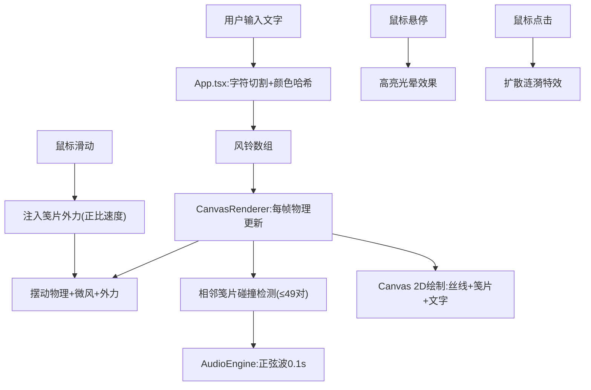

## 1. 产品概述

「风铃诗笺」是一款面向独立创作者与文字爱好者的浏览器端交互式文字风铃生成器。用户输入短诗或任意文字，系统将每个字符转化为悬挂在虚拟风铃上的彩色笺片，通过物理模拟、视觉动画与碰撞音效的结合，打造沉浸式的诗意交互体验。

- 核心价值：将静态文字转化为有声有动的诗意艺术品，为创作者提供文字情感表达的新媒介
- 目标用户：独立创作者、诗人、设计师、文字爱好者

## 2. 核心功能

### 2.1 功能模块

1. **风铃生成主界面**：Canvas画布渲染区 + 文字输入卡片
2. **文本转风铃系统**：字符→笺片映射、颜色哈希分配、丝线布局
3. **物理动画引擎**：二维摆动物理模拟、鼠标外力、自然微风、阻尼振荡
4. **碰撞音效系统**：Web Audio音高生成、碰撞检测、正弦波包络
5. **视觉反馈系统**：文字飘动、悬停高亮、点击涟漪

### 2.2 功能详情

| 页面名称 | 模块名称 | 功能描述 |
|-----------|-------------|---------------------|
| 主界面 | 文字输入卡片 | 居中卡片(60%宽, 最大600px)，支持最多50字输入，实时更新风铃 |
| 主界面 | Canvas渲染区 | 占页面主体80%，深色渐变背景，60FPS渲染循环 |
| 文本转风铃 | 笺片生成 | 每字符→宽30高22圆角矩形笺片，12色调色板哈希分配 |
| 文本转风铃 | 丝线布局 | 垂直丝线，间距20px均匀分布，笺片悬挂于末端 |
| 物理动画 | 鼠标交互 | 滑动时外力正比于鼠标速度(最大偏移30px)，阻尼0.98，恢复力0.1 |
| 物理动画 | 自然风效 | 随机小幅摆动(≤3px)，模拟持续微风 |
| 碰撞音效 | 碰撞检测 | 相邻笺片间距<笺片宽+2px触发，最多49对/帧 |
| 碰撞音效 | 音高生成 | 频率400-1200Hz，红→低音/蓝→高音，0.1s正弦波渐入渐出 |
| 文字飘动 | 字符渲染 | 手写体16px#333，倾斜θ时偏移sin(θ)×3px，旋转θ/2 |
| 交互反馈 | 悬停高亮 | 6px补色光晕(透明度0.4，0.3s)，指针变手型 |
| 交互反馈 | 点击涟漪 | 半径5→30px扩散，透明度0.6→0，持续0.5s |
| 响应式适配 | 移动端 | <768px时笺片20×16px，丝线间距15px |

## 3. 核心流程

用户在输入框键入文字 → 系统按字符切割生成笺片数组(含颜色/位置/物理状态) → CanvasRenderer逐帧执行物理更新+碰撞检测+绘制 → 碰撞事件触发AudioEngine播放对应音高 → 鼠标/点击事件注入物理外力或视觉特效

## 4. 界面设计

### 4.1 设计风格

- **设计理念**：东方诗意美学 × 现代极简，营造静谧雅致的氛围
- **主色调**：深蓝紫渐变背景(#1a1a2e → #16213e)，营造夜空感
- **笺片调色板(12色)**：#FF9970、#70B8FF、#A0E7A0、#FFB7D5、#B79CFF、#FFE066、#66D9CC、#FF8080、#9CC8FF、#C9E79C、#FFAA66、#99B3FF
- **视觉层次**：深色背景→半透明银灰丝线→彩色笺片→深灰文字
- **字体方案**：手写体'Comic Sans MS', cursive (文字)，系统默认(输入框)

### 4.2 页面设计

| 页面名称 | 模块名称 | UI元素 |
|-----------|-------------|-------------|
| 主界面 | 背景 | 垂直线性渐变 #1a1a2e→#16213e |
| 主界面 | Canvas区域 | 占页面主体80%，居中，风铃自顶部垂下 |
| 主界面 | 输入卡片 | 半透明白色(backdrop-filter: blur)，圆角16px，60%宽/≤600px，阴影柔和 |
| 主界面 | 输入框 | 浅灰边框，内边距16px，占位符提示：「输入一段短诗，聆听风铃吟唱...」 |
| 笺片样式 | 本体 | 圆角矩形30×22(移动20×16)，圆角3px，2px半透明亮边 |
| 笺片样式 | 丝线 | 银灰色1px宽，透明度0.5，从画布顶部延伸 |
| 文字 | 笺片文字 | 16px(移动12px)，#333深灰，手写体，居中对齐 |
| 高亮 | 悬停光晕 | 6px宽，笺片补色，透明度0.4，0.3s渐入渐出 |
| 涟漪 | 点击特效 | 笺片颜色，5→30px扩散，0.6→0透明度，0.5s |

### 4.3 响应式策略

桌面优先设计，768px断点适配：
- 笺片尺寸：30×22px → 20×16px
- 丝线间距：20px → 15px
- 输入卡片：60%宽 → 90%宽
- 字号适配：笺片文字16px → 12px

## 5. 性能指标

- **帧率**：稳定60FPS，50笺片时≥55FPS
- **碰撞检测**：≤49对/帧，≤2ms
- **渲染驱动**：requestAnimationFrame
