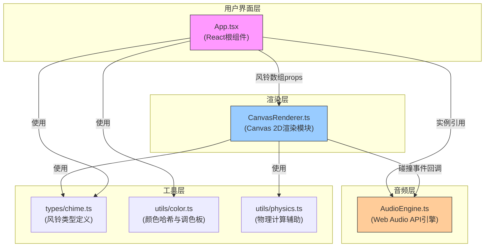

## 1. 架构设计



**调用关系与数据流向：**
1. **App.tsx** 接收用户输入 → 调用 `utils/color.ts` 生成笺片颜色 → 构造 `ChimeData[]` 数组
2. **App.tsx** 将 `ChimeData[]` 作为 props 传入 **CanvasRenderer**，并持有 **AudioEngine** 实例引用
3. **CanvasRenderer** 每帧：读取 `ChimeData[]` → `utils/physics.ts` 物理更新 → 碰撞检测 → 绘制 → 碰撞回调触发 **AudioEngine.playTone()**
4. **CanvasRenderer** 检测鼠标事件：悬停/外力注入/涟漪，直接修改 `ChimeData` 的可变字段（`angle`、`angularVelocity`、`hovered`、`ripples`）

## 2. 技术栈说明

| 类别 | 技术选择 | 版本要求 | 用途 |
|-------|---------|---------|------|
| 前端框架 | React | ^18.2.0 | UI组件化与状态管理 |
| 构建工具 | Vite | ^5.0.0 | 快速开发与构建 |
| 类型系统 | TypeScript | ^5.3.0 | strict严格模式 |
| React插件 | @vitejs/plugin-react | ^4.2.0 | Vite React HMR |
| 渲染引擎 | Canvas 2D API | - | 风铃实体与动画绘制 |
| 音频引擎 | Web Audio API | - | 碰撞音效合成 |
| 开发语言 | TypeScript | - | 全栈类型安全 |

**初始化命令（Windows）：**
```
npm init vite-init@latest -y . "--" --template react-ts --force
```

## 3. 文件结构与职责

```
auto186/
├── index.html                          # 入口HTML，挂载根节点
├── package.json                        # 依赖配置(npm run dev)
├── vite.config.js                      # Vite配置(严格模式插件)
├── tsconfig.json                       # TS配置(strict:true)
└── src/
    ├── main.tsx                        # React入口渲染
    ├── App.tsx                         # 主应用组件
    ├── components/
    │   └── CanvasRenderer.ts           # Canvas渲染与物理模块(.ts非.tsx，纯逻辑)
    ├── audio/
    │   └── AudioEngine.ts              # Web Audio音频引擎
    ├── types/
    │   └── chime.ts                    # 风铃相关类型定义
    └── utils/
        ├── color.ts                    # 颜色哈希与调色板工具
        └── physics.ts                  # 物理计算辅助函数
```

## 4. 类型定义（核心数据模型）

```typescript
// src/types/chime.ts
export interface ChimeData {
  id: number;
  char: string;
  color: string;         // 笺片填充色(来自调色板)
  complementaryColor: string; // 补色(用于光晕)
  hue: number;           // 0-360色相值(用于音高计算)
  anchorX: number;       // 丝线顶部锚点X
  anchorY: number;       // 丝线顶部锚点Y(固定为0)
  stringLength: number;  // 丝线长度
  angle: number;         // 当前摆动角度(弧度)
  angularVelocity: number; // 角速度
  hovered: boolean;      // 鼠标悬停标志
  hoverFade: number;     // 悬停淡出进度0-1
  ripples: Ripple[];     // 点击涟漪列表
}

export interface Ripple {
  x: number;
  y: number;
  radius: number;
  maxRadius: number;
  alpha: number;
  color: string;
  startTime: number;
}

export interface CollisionEvent {
  chimeA: ChimeData;
  chimeB: ChimeData;
  intensity: number; // 0-1碰撞强度(基于相对速度)
}
```

## 5. 核心模块接口契约

### 5.1 CanvasRenderer (类)

```typescript
// src/components/CanvasRenderer.ts
export class CanvasRenderer {
  constructor(
    canvas: HTMLCanvasElement,
    audioEngine: AudioEngine,
    options: { responsive?: boolean }
  );
  
  setChimes(chimes: ChimeData[]): void;       // 更新风铃数据
  start(): void;                               // 启动requestAnimationFrame循环
  stop(): void;                                // 停止循环
  resize(): void;                              // 响应DPR/尺寸变化
  applyMouseForce(mouseX: number, mouseY: number, velocityX: number): void;
  setHover(x: number, y: number): number | -1; // 返回悬停笺片ID或-1
  triggerClickRipple(x: number, y: number): boolean;
}
```

### 5.2 AudioEngine (类)

```typescript
// src/audio/AudioEngine.ts
export class AudioEngine {
  constructor();
  init(): Promise<void>;          // 用户手势后解锁AudioContext
  playCollision(e: CollisionEvent): void;
  playTone(frequency: number, duration: number, volume: number): void;
  dispose(): void;
}
```

### 5.3 工具模块接口

```typescript
// src/utils/color.ts
export const CHIME_PALETTE: string[]; // 12种柔和渐变色
export function hashCharToColor(char: string): { color: string; hue: number; complementary: string };
export function hexToHsl(hex: string): { h: number; s: number; l: number };
export function getComplementary(hex: string): string;

// src/utils/physics.ts
export const DAMPING = 0.98;
export const RESTORATION = 0.1;
export const MAX_OFFSET = 30;
export const WIND_AMPLITUDE = 3;
export function applyPendulumPhysics(chime: ChimeData, dt: number, windForce: number): void;
export function checkCollision(a: ChimeData, b: ChimeData, chimeWidth: number): CollisionEvent | null;
export function getChimePosition(chime: ChimeData): { x: number; y: number };
```

## 6. 渲染循环与性能优化

```
每帧流程 (~16.7ms @60FPS):
├─ 物理更新阶段 (<3ms)
│   ├─ 遍历所有笺片: 应用微风噪声→阻尼振荡→外力
│   └─ 计算笺片实际屏幕坐标
├─ 碰撞检测阶段 (<2ms)
│   └─ 遍历相邻笺片对 (最多49对): 距离判定→触发回调
├─ 绘制阶段 (<8ms)
│   ├─ 清空画布+背景渐变
│   ├─ 批量绘制丝线 (path一次stroke)
│   ├─ 批量绘制笺片 (save/translate/rotate/draw/restore)
│   ├─ 批量绘制文字 (文字随笺片偏移/旋转)
│   ├─ 绘制悬停光晕
│   └─ 绘制涟漪特效
└─ 调度下一帧 requestAnimationFrame
```

**性能约束保障：**
- 物理计算：纯数学运算无DOM访问，O(N)复杂度
- 碰撞检测：仅检测相邻索引对(i, i+1)，O(N-1)而非O(N²)
- 绘制优化：丝线统一路径一次stroke，笺片按批次避免频繁状态切换
- 内存：涟漪对象池化复用，Ripple完成后立即从数组splice

## 7. 音频合成算法

碰撞音高映射算法：
```
频率 = 400 + (1 - normalizedHue) * 800
其中 normalizedHue = hue / 360
- 红色(hue≈0) → 低音 ~1200Hz
- 蓝色(hue≈240) → 高音 ~400Hz  
(注意：用户要求红偏低音蓝偏高音，与直觉相反，需反向映射)
```

ADSR包络（0.1秒短促音）：
- Attack: 0 → 0.01s (线性渐入)
- Decay: 0.01s → 0.1s (指数衰减至0)
- 波形：正弦波(OscillatorNode + GainNode)

## 8. 构建与配置要点

### package.json 关键依赖
```json
{
  "name": "fengling-shijian",
  "private": true,
  "version": "0.1.0",
  "type": "module",
  "scripts": { "dev": "vite", "build": "tsc && vite build", "preview": "vite preview" },
  "dependencies": { "react": "^18.2.0", "react-dom": "^18.2.0" },
  "devDependencies": {
    "@types/react": "^18.2.0", "@types/react-dom": "^18.2.0",
    "@vitejs/plugin-react": "^4.2.0", "typescript": "^5.3.0", "vite": "^5.0.0"
  }
}
```

### tsconfig.json strict模式
```json
{
  "compilerOptions": {
    "target": "ES2020", "useDefineForClassFields": true, "lib": ["ES2020", "DOM", "DOM.Iterable"],
    "module": "ESNext", "skipLibCheck": true, "moduleResolution": "bundler",
    "allowImportingTsExtensions": true, "resolveJsonModule": true, "isolatedModules": true,
    "noEmit": true, "jsx": "react-jsx",
    "strict": true, "noUnusedLocals": true, "noUnusedParameters": true,
    "noFallthroughCasesInSwitch": true
  },
  "include": ["src"]
}
```

### vite.config.js
```js
import { defineConfig } from 'vite';
import react from '@vitejs/plugin-react';
export default defineConfig({ plugins: [react()] });
```
