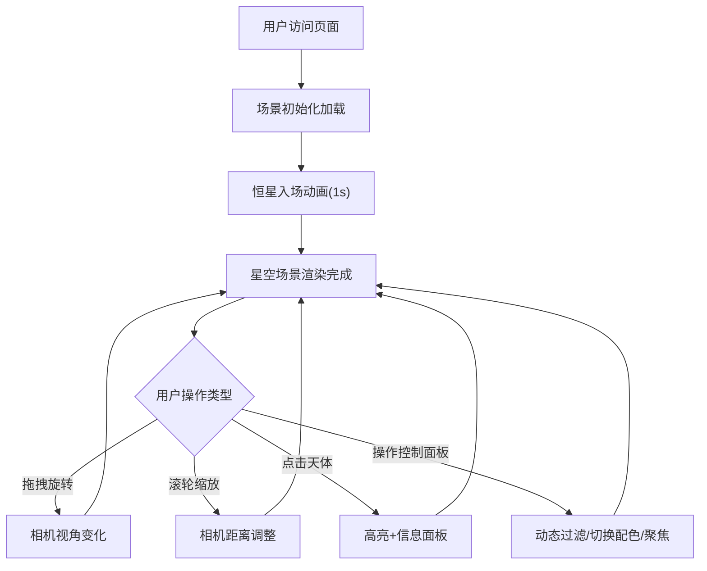

## 1. 产品概述

「银河沙盘」是一款面向天文学爱好者的浏览器端3D星空交互可视化应用，通过WebGL渲染数千颗恒星与星云的空间分布，让用户在沉浸式深空场景中自由探索宇宙结构。

- 核心目标：提供高交互性的巡天数据可视化体验，支持视角操控、对象交互、动态过滤等功能
- 目标用户：天文学爱好者、科普教育工作者、对宇宙空间感兴趣的普通用户
- 产品价值：将抽象的天体空间数据转化为直观可交互的3D视觉呈现，降低深空探索的认知门槛

## 2. 核心功能

### 2.1 功能模块

1. **3D星空主场景**：恒星粒子系统、星云团块渲染、背景星空氛围
2. **视角控制系统**：轨道相机拖拽旋转、滚轮缩放、聚焦动画
3. **天体交互系统**：悬停高亮、点击信息面板、对象选中发光
4. **动态过滤系统**：恒星数量过滤、颜色映射切换、随机聚焦功能
5. **UI界面系统**：磨砂玻璃控制面板、信息展示面板

### 2.2 页面详情

| 页面名称 | 模块名称 | 功能描述 |
|---------|---------|---------|
| 星空主界面 | 恒星粒子系统 | 渲染8000颗动态恒星，支持闪烁动画、从中心入场、按距离着色 |
| 星空主界面 | 星云团块渲染 | 200个半透明星云球体/立方体，自定义着色器边缘羽化效果 |
| 星空主界面 | 背景星空氛围 | 2000个远距离微光点，缓慢旋转装饰场景 |
| 星空主界面 | 视角控制 | OrbitControls轨道相机，缩放范围20-300 |
| 星空主界面 | 天体交互 | 点击高亮发光（2秒）、悬停反馈、信息面板弹出 |
| 控制面板 | 数量过滤 | 滑块控制0-8000恒星显示，步长100 |
| 控制面板 | 颜色映射 | 下拉菜单切换按距离/按亮度着色 |
| 控制面板 | 聚焦动画 | 平滑移动相机到随机星团附近（3秒） |
| 信息面板 | 信息展示 | 显示名称、距离、大小、颜色值等模拟信息 |

## 3. 核心流程

### 主用户流程
用户进入应用后，场景加载（1秒恒星入场动画），用户可通过拖拽旋转视角、滚轮缩放远近。用户可：
1. 点击恒星/星云查看详情信息
2. 通过右侧控制面板调整显示参数
3. 触发聚焦动画探索特定星团区域



## 4. 用户界面设计

### 4.1 设计风格
- **整体主题**：深空黑暗主题，营造宇宙沉浸式氛围
- **主背景色**：#0a0a1a（深邃藏青黑）
- **文本颜色**：#e0e8ff（冷白色，高可读性）
- **玻璃面板**：背景rgba(255,255,255,0.08)，边框1px rgba(255,255,255,0.2)，圆角8px，模糊10px
- **交互元素**：悬停时缩放1.05，过渡0.2秒
- **字体**：12px系统字体（无衬线，保证跨平台一致性）

### 4.2 页面布局
```
┌─────────────────────────────────────────────────────┐
│ 信息面板(200x160)  │                                  │
│  左上角悬浮         │                                  │
│  (点击对象后显示)   │           3D星空场景              │
│                    │           (全屏Canvas)            │
│                    │                                  │
│                    │                      控制面板     │
│                    │                    (280px宽)      │
│                    │                    右下角20px边距│
│                    │                    高度自适应     │
└─────────────────────────────────────────────────────┘
```

### 4.3 3D场景设计
- **环境氛围**：纯黑背景 + 2000缓慢旋转远景星点
- **光照设置**：环境光 + 点光源模拟恒星自发光
- **相机设置**：PerspectiveCamera，初始距离100，FOV 60°
- **恒星配色**：近→暖橙(#ffb060)，远→冷蓝(#4080ff)，渐变过渡
- **星云效果**：半透明球体，边缘羽化着色器，柔和发光
- **动画**：恒星正弦波闪烁、星云线性漂移、聚焦ease-in-out缓动

### 4.4 响应式设计
- 桌面优先设计，Canvas全屏自适应
- 控制面板固定右侧，小屏幕下可折叠
- 信息面板左上角，不遮挡主要交互区域

## 5. 性能指标
- 帧率目标：交互操作时≥45 FPS（Chrome 110+）
- 绘制调用：≤100次/帧
- 粒子上限：8000颗恒星 + 200个星云 + 2000背景星点
- 内存占用：≤200MB
