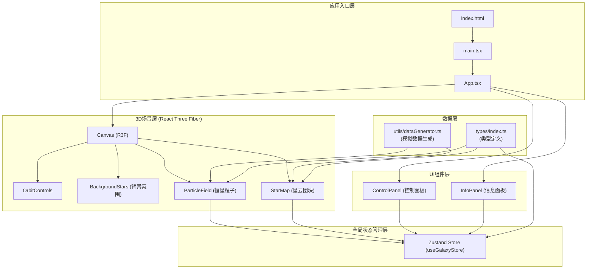

## 1. 架构设计

本项目为纯前端3D可视化应用，采用组件化分层架构：



## 2. 技术栈说明

| 类别 | 技术选型 | 版本 | 用途 |
|-----|---------|------|-----|
| 前端框架 | React | ^18.x | UI组件化开发 |
| 渲染引擎 | Three.js | ^0.160.x | WebGL 3D渲染底层 |
| React绑定 | @react-three/fiber | ^8.x | React声明式Three.js |
| 辅助组件 | @react-three/drei | ^9.x | OrbitControls等实用组件 |
| 类型系统 | TypeScript | ^5.x | 静态类型检查 |
| 构建工具 | Vite | ^5.x | 开发服务器与构建 |
| 状态管理 | zustand | ^4.x | 轻量全局状态管理 |
| 语言包 | @types/three | ^0.160.x | Three.js类型定义 |

## 3. 目录结构

```
auto187/
├── index.html                      # 入口HTML
├── package.json                    # 依赖与脚本
├── vite.config.js                  # Vite配置
├── tsconfig.json                   # TS配置
└── src/
    ├── main.tsx                    # React入口
    ├── App.tsx                     # 主组件（场景组装+状态）
    ├── types/
    │   └── index.ts                # 类型定义：Star/Nebula/Store等
    ├── utils/
    │   ├── dataGenerator.ts        # 模拟数据生成器（恒星+星云）
    │   └── colorMappers.ts         # 颜色映射函数库
    ├── store/
    │   └── useGalaxyStore.ts       # Zustand全局状态
    ├── shaders/
    │   ├── nebulaVertex.glsl       # 星云顶点着色器
    │   └── nebulaFragment.glsl     # 星云片元着色器（边缘羽化）
    ├── components/
    │   ├── three/
    │   │   ├── ParticleField.tsx   # 恒星粒子系统组件
    │   │   ├── StarMap.tsx         # 星云团块组件
    │   │   └── BackgroundStars.tsx # 背景星空组件
    │   └── ui/
    │       ├── ControlPanel.tsx    # 右侧控制面板
    │       └── InfoPanel.tsx       # 左上角信息面板
    └── styles/
        └── globals.css             # 全局样式（玻璃效果、布局）
```

## 4. 数据模型与类型定义

### 4.1 核心数据类型

```typescript
// src/types/index.ts

interface Star {
  id: number;
  position: [number, number, number]; // 三维坐标
  radius: number;                      // 恒星半径(0.1-0.5)
  brightness: number;                  // 模拟亮度(0-1)
  distance: number;                    // 距中心距离(50-200)
  color: string;                       // 十六进制颜色
  twinkleSpeed: number;                // 闪烁周期(1-3秒)
  twinkleOffset: number;               // 闪烁相位偏移
  name: string;                        // 恒星编号名称
  type: string;                        // 光谱类型模拟
}

interface Nebula {
  id: number;
  position: [number, number, number];
  initialPosition: [number, number, number];
  size: number;                        // 团块尺寸
  color: [number, number, number];     // RGB颜色[0-1]
  shape: 'sphere' | 'cube';            // 几何体形状
  driftSpeed: [number, number, number]; // 漂移速度
  rotationSpeed: [number, number, number]; // 自转角速度
  name: string;                        // 星云名称
  density: number;                     // 密度值
}

interface SelectedObject {
  type: 'star' | 'nebula';
  id: number;
  data: Star | Nebula;
  highlightUntil: number;              // 高亮截止时间戳
}

interface GalaxyState {
  stars: Star[];
  nebulae: Nebula[];
  starThreshold: number;               // 显示阈值(0-8000)
  colorMode: 'distance' | 'brightness'; // 颜色映射模式
  selectedObject: SelectedObject | null;
  focusedNebulaId: number | null;      // 正在聚焦的星云ID
  isAnimatingFocus: boolean;
  
  // Actions
  setStarThreshold: (n: number) => void;
  setColorMode: (m: 'distance' | 'brightness') => void;
  selectStar: (star: Star) => void;
  selectNebula: (nebula: Nebula) => void;
  clearSelection: () => void;
  triggerRandomFocus: () => void;
  completeFocus: () => void;
}
```

## 5. 数据流与组件调用关系

### 5.1 数据流拓扑
```
用户输入 (鼠标/键盘)
    │
    ├──→ App.tsx (事件监听)
    │       │
    │       ├──→ useGalaxyStore (状态更新)
    │       │       │
    │       │       ├──→ ControlPanel (显示当前参数)
    │       │       ├──→ InfoPanel (显示选中信息)
    │       │       └──→ 3D场景组件 (重新渲染)
    │       │
    │       └──→ OrbitControls (相机变换)
    │
    └──→ 3D对象 (raycast拾取)
            │
            └──→ selectStar / selectNebula
```

### 5.2 组件调用关系
| 调用方 | 被调用方 | 数据流向 |
|-------|---------|---------|
| App.tsx | ParticleField.tsx | props: visibleCount, colorMode → R3F渲染Points |
| App.tsx | StarMap.tsx | props: nebulae, focusedId → 渲染Mesh + 自定义着色器 |
| App.tsx | BackgroundStars.tsx | 独立渲染，无交互 |
| App.tsx | ControlPanel.tsx | 事件回调 → 更新store |
| App.tsx | InfoPanel.tsx | store.selectedObject → 面板内容渲染 |
| ParticleField.tsx | useGalaxyStore | 读取阈值/颜色模式；点击时调用selectStar |
| StarMap.tsx | useGalaxyStore | 读取聚焦ID；点击时调用selectNebula |

## 6. 性能优化策略

### 6.1 渲染优化
- **粒子合批**：8000恒星使用单个`THREE.Points` + `BufferGeometry`，1次draw call
- **星云实例化**：200星云若同材质可考虑InstancedMesh（保留独立着色器则每团1次，共200）
- **背景星空**：2000点使用单个Points，深度写入关闭，放在独立渲染组
- **总draw call控制**：背景(1)+恒星(1)+星云(≤200)+UI(HTML/CSS) ≈ 202次（若星云需降低可合并相似材质批次）

### 6.2 动画优化
- 恒星闪烁：使用`ShaderMaterial`在GPU侧计算正弦波，避免CPU逐粒子更新
- 星云漂移：`useFrame`中统一更新position，单次遍历O(N)
- 入场动画：`useFrame`中对scale属性ease-out插值，完成后停止监听

### 6.3 内存优化
- 共享`ShaderMaterial`引用，避免重复创建着色器程序
- 几何体复用：星云球形使用单个`SphereGeometry`引用
- 数据生成时使用Float32Array存储BufferAttribute

## 7. 着色器设计

### 7.1 星云边缘羽化片元着色器
```glsl
// nebulaFragment.glsl
uniform float uTime;
uniform vec3 uColor;
uniform float uOpacity;
varying vec3 vNormal;
varying vec3 vPosition;

void main() {
  float rim = 1.0 - abs(dot(normalize(vNormal), vec3(0.0, 0.0, 1.0)));
  float feathered = smoothstep(0.0, 1.0, rim);
  float core = 1.0 - length(vPosition) * 0.5;
  float alpha = max(feathered * 0.6, core * 0.3) * uOpacity;
  vec3 finalColor = uColor + rim * 0.3; // 边缘发光增强
  gl_FragColor = vec4(finalColor, alpha);
}
```
