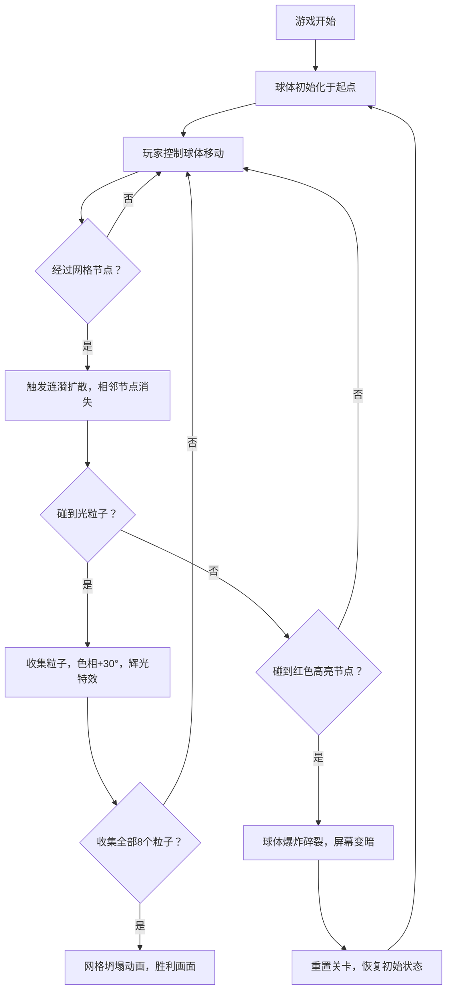

## 1. 产品概述

「量子涟漪·光锥跃迁」是一款在浏览器中运行的2D抽象解谜游戏，通过空间维度转换和视觉因果反馈机制为玩家带来全新的解谜体验。玩家控制可变色的半透明能量球体在光锥网格中滚动，利用涟漪效应改变节点状态，收集光粒子完成关卡。

- 核心目的：解决传统平台跳跃游戏缺乏空间维度转换和视觉因果反馈的问题，以量子物理抽象概念为主题创造独特的解谜玩法
- 目标用户：休闲解谜游戏爱好者、对视觉艺术和抽象概念感兴趣的玩家

## 2. 核心特性

### 2.1 功能模块

1. **游戏主界面**：Canvas游戏画布、HUD信息显示、帮助面板、暂停界面、胜利画面
2. **网格系统**：20x20节点光锥网格、节点脉冲发光、涟漪扩散、节点消失/重现
3. **能量球体系统**：球体物理滚动、色相渐变、辉光特效、爆炸碎裂、重置机制
4. **粒子系统**：光粒子生成与收集、星光飞散特效、波纹粒子、碎片粒子
5. **音频系统**：Web Audio API合成音效、粒子收集音、爆炸音、节点互动音
6. **控制系统**：键盘方向键/WSAD移动、R重置、P暂停、H帮助

### 2.2 页面详情

| 页面名称 | 模块名称 | 功能描述 |
|---------|---------|---------|
| 游戏主界面 | Canvas画布 | 实时渲染20x20光锥网格、能量球体、光粒子、各类粒子特效 |
| 游戏主界面 | HUD面板 | 实时显示已收集光粒子数量(0/8)、球体当前色相值、重置/暂停/帮助按键提示 |
| 游戏主界面 | 帮助面板 | 半透明悬浮层，说明颜色变化规则、操作方法、胜利条件、失败条件 |
| 游戏主界面 | 暂停界面 | 半透明遮罩+暂停提示，按P继续游戏 |
| 游戏主界面 | 胜利画面 | 网格坍塌动画结束后显示的胜利画布，含庆祝粒子特效 |

## 3. 核心流程

玩家打开游戏后，能量球体出现在网格左上角起点。玩家通过方向键控制球体滚动：
1. 球体在网格节点间滚动，每次经过节点触发涟漪，涟漪扩散至相邻节点使其暂时消失
2. 球体碰到光粒子后收集粒子，色相偏移+30度，触发辉光和音效
3. 玩家规划路径，利用节点消失机制绕过障碍，确保不碰到红色高亮节点
4. 收集全部8个光粒子后，触发网格坍塌动画，显示胜利画面
5. 若球体碰到红色节点或爆炸，触发失败重置，所有状态恢复初始

## 4. 用户界面设计

### 4.1 设计风格
- **主色调**：赛博霓虹美学，深蓝紫渐变背景(#0B0C2A → #2B1B54)
- **高亮色**：亮青蓝色(#00BFFF)网格线、青色(#00FFFF)初始球体、金橙色(#FFD700→#FFA500)光粒子
- **视觉效果**：所有元素带1px发光描边、Canvas阴影模糊辉光、半透明波纹图层叠加
- **字体**：无衬线等宽字体，数字用等宽字体显示计数
- **布局**：全屏Canvas居中渲染，HUD信息固定于左上角和右上角

### 4.2 页面设计概览

| 页面名称 | 模块名称 | UI元素 |
|---------|---------|--------|
| 游戏主界面 | Canvas画布 | 全屏暗紫星空渐变背景、发光网格节点、滚动球体、旋转棱形粒子、涟漪波纹、碎片星光 |
| 游戏主界面 | HUD面板 | 左上角：粒子计数 x/8、色相条；右上角：R重置/P暂停/H帮助按键提示 |
| 游戏主界面 | 帮助面板 | 半透明(0.85)深色面板、带霓虹边框、居中层叠显示 |
| 游戏主界面 | 胜利画面 | 中央显示「跃迁完成」、彩色粒子环绕、「按R重新开始」提示 |

### 4.3 响应式适配
- **桌面端**(≥800px宽度)：20x20节点网格，节点间距40px，完整尺寸渲染
- **移动端**(<800px宽度)：自动适配为16x16节点网格，节点间距30px，保持核心玩法结构
- **Canvas尺寸**：根据窗口大小动态调整，保持正方形比例居中显示
