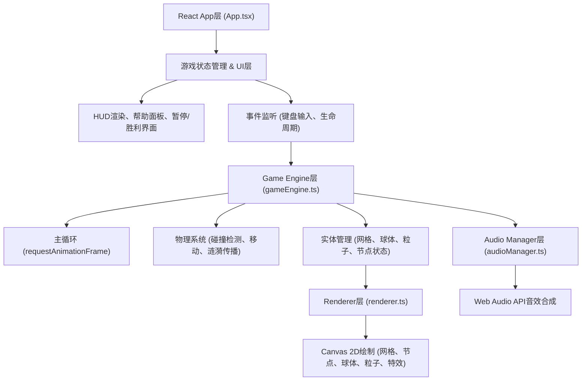

## 1. 架构设计



## 2. 技术描述

- **前端框架**：React@18 + TypeScript（严格模式）
- **构建工具**：Vite + @vitejs/plugin-react
- **渲染引擎**：HTML5 Canvas 2D API（requestAnimationFrame主循环）
- **音频引擎**：Web Audio API（实时合成音效，无外部音频文件）
- **状态管理**：React Hooks (useState、useEffect、useRef) 管理UI状态，引擎内部管理游戏实体状态
- **性能优化**：粒子池复用、帧间计算量限制、帧率控制(≥45FPS)、粒子数上限(≤300)

## 3. 文件组织

| 文件路径 | 用途 |
|---------|------|
| `/package.json` | 项目依赖配置（react、react-dom、typescript、vite、@vitejs/plugin-react） |
| `/vite.config.js` | Vite构建配置，启用React插件 |
| `/tsconfig.json` | TypeScript严格模式配置，启用域名解析 |
| `/index.html` | 入口HTML，含viewport meta标签，挂载root |
| `/src/App.tsx` | React根组件，管理游戏状态、HUD、UI层、生命周期、键盘事件 |
| `/src/gameEngine.ts` | 游戏主引擎，管理实体更新、物理检测、状态流转、帧调度 |
| `/src/renderer.ts` | Canvas渲染模块，负责所有视觉元素和粒子特效绘制 |
| `/src/audioManager.ts` | 音频管理器，Web Audio API合成各事件音效 |

## 4. 核心数据模型

### 4.1 实体类型定义

```typescript
// 网格节点
interface GridNode {
  x: number;
  y: number;
  hue: number;
  opacity: number;
  isDisappearing: boolean;
  disappearTimer: number;
  pulsePhase: number;
  isHighlighted: boolean;
  highlightTimer: number;
  isRed: boolean;
  redTimer: number;
}

// 能量球体
interface EnergyBall {
  x: number;
  y: number;
  vx: number;
  vy: number;
  radius: number;
  hue: number;
  isExploding: boolean;
  explodeTimer: number;
}

// 光粒子
interface LightParticle {
  x: number;
  y: number;
  gridX: number;
  gridY: number;
  rotation: number;
  collected: boolean;
  collectAnimTimer: number;
}

// 涟漪波纹
interface Ripple {
  x: number;
  y: number;
  radius: number;
  maxRadius: number;
  startHue: number;
  endHue: number;
  life: number;
  maxLife: number;
}

// 通用粒子
interface Particle {
  x: number;
  y: number;
  vx: number;
  vy: number;
  life: number;
  maxLife: number;
  hue: number;
  size: number;
  type: 'glow' | 'star' | 'fragment' | 'victory';
}

// 胜利圆环
interface VictoryRing {
  radius: number;
  life: number;
}

// 游戏状态
type GameState = 'playing' | 'paused' | 'victory' | 'resetting';
```

### 4.2 引擎对外接口

```typescript
class GameEngine {
  constructor(canvas: HTMLCanvasElement, audio: AudioManager);
  public start(): void;
  public stop(): void;
  public reset(): void;
  public pause(): void;
  public resume(): void;
  public setKeys(keys: Set<string>): void;
  public getState(): {
    collected: number;
    totalParticles: number;
    ballHue: number;
    isPaused: boolean;
    isVictory: boolean;
  };
  public onStateChange(callback: (state: any) => void): void;
}
```

## 5. 核心算法与机制

### 5.1 网格与节点交互
- 网格尺寸：桌面20×20(间距40px)，移动16×16(间距30px)
- 空闲节点：色相220°，透明度0.3-0.6正弦循环脉冲
- 球体经过节点：亮度瞬时提升至1.0，触发涟漪
- 涟漪参数：半径从0增长到80px，持续0.8秒，色相球体色→互补色渐变
- 相邻节点影响：涟漪覆盖四邻节点后，蓝色染色，消失2秒

### 5.2 球体物理与色变
- 移动：键盘方向键控制加速度，有摩擦力减速
- 色变：每次收集粒子色相+30°，青色(180°)→红色(0°)共6次收集
- 爆炸：红色色相时碰到红色节点，白色圆环0→300px，0.3秒，全节点重置
- 碰撞红色节点：50颗碎片飞散，0.3秒屏幕全黑，关卡重置

### 5.3 粒子系统
- 8个光粒子：随机分布在14×14(或12×12)内部区域，不贴边
- 粒子外观：8px边长棱形晶体，缓慢旋转，金色渐变填充
- 收集判定：球心距粒子<15px自动吸收，10颗星光飞散0.5秒
- 全部收集：20秒网格坍塌动画，节点向中心合并消散，胜利画面

### 5.4 性能控制
- 帧率：requestAnimationFrame，deltaTime限制每帧计算量
- 粒子池：对象池复用，总粒子≤300，爆炸动画≤30帧
- 渲染优化：离屏画布缓存静态背景，脏矩形区域重绘
