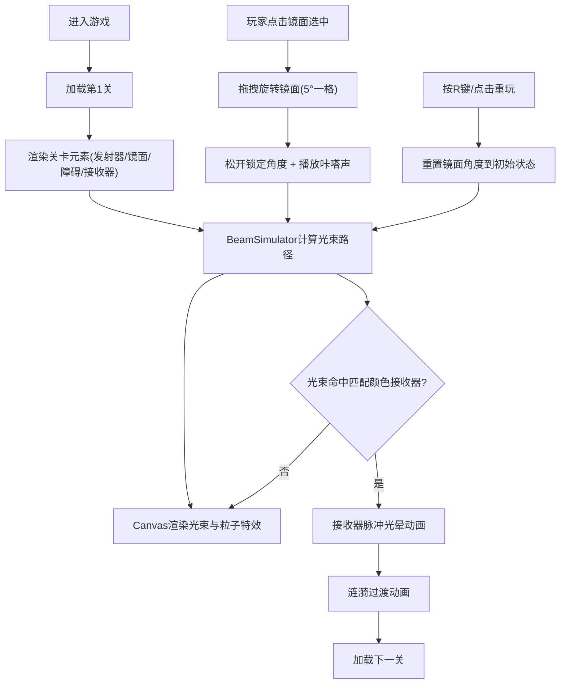

## 1. 产品概述

「光线迷宫·折影」是一款面向独立游戏爱好者的2D浏览器益智解谜游戏。玩家通过旋转和移动虚拟「折光镜」，引导彩色激光穿过障碍与反射点，最终照射到匹配颜色的接收器上完成关卡。

- **目标用户**：休闲解谜游戏爱好者、独立游戏玩家
- **核心价值**：通过光学物理原理设计的创新谜题，配合精美的视觉特效，提供沉浸式的解谜体验

## 2. 核心功能

### 2.1 功能模块

1. **游戏主界面**：关卡信息展示、计时器、关卡导航、重玩按钮
2. **光束物理模拟系统**：激光发射、镜面反射计算、障碍物吸光、接收器判定
3. **镜面交互系统**：镜面选择、拖拽旋转、角度锁定、音效反馈
4. **关卡系统**：6个初始关卡、关卡数据管理、胜利判定、关卡切换动画
5. **视觉特效系统**：光束流光粒子、反射点光晕、接收器脉冲、关卡过渡涟漪

### 2.2 页面详情

| 页面名称 | 模块名称 | 功能描述 |
|-----------|-------------|---------------------|
| 游戏主界面 | 顶部导航栏 | 显示关卡编号(Lv.x)、计时器(MM:SS)、重玩按钮、上一关/下一关按钮 |
| 游戏主界面 | 画布区域 | 居中显示游戏画布，渲染激光发射器、镜面、障碍物、接收器、光束及粒子特效 |
| 关卡选择界面 | 关卡列表 | 展示所有可用关卡缩略图，点击可直接跳转 |

## 3. 核心流程

## 4. 用户界面设计

### 4.1 设计风格

- **主色调**：深色主题，背景色 `#1a1a2e`
- **辅助色**：
  - 镜面选中光环：半透明蓝色 `rgba(100, 180, 255, 0.4)`
  - 激光颜色：红、蓝、绿、黄、紫、橙（每关不同）
  - 按钮悬停高亮：白色渐变
- **按钮风格**：圆角按钮，点击时微弹跳动画 (scale 0.95 → 1)，过渡 0.2s ease
- **字体**：现代无衬线字体，数字采用等宽字体
- **布局**：顶部半透明毛玻璃导航栏，居中画布（左右5%边距，最小800px最大1200px）
- **动效**：所有交互元素平滑过渡(0.2s ease)，关卡切换淡出+放大动画(0.8s)，胜利涟漪(1.2s)

### 4.2 页面设计概述

| 页面名称 | 模块名称 | UI元素 |
|-----------|-------------|-------------|
| 游戏主界面 | 顶部导航栏 | 毛玻璃背景(backdrop-filter: blur(4px))、左侧关卡信息、右侧操作按钮 |
| 游戏主界面 | Canvas下层 | 镜面(玻璃质感+角度变色边框)、黑色障碍物、彩色接收器、激光发射器 |
| 游戏主界面 | Canvas上层 | 动态光束(带流光粒子)、反射点光晕、吸光消散粒子、接收器脉冲、涟漪过渡 |
| 关卡选择 | 关卡卡片 | 6个关卡预览图、锁定/解锁状态、已完成标记 |

### 4.3 响应式

- **桌面优先**：最小宽度800px，最大1200px，居中布局
- **Canvas自适应**：窗口resize时重新计算元素位置（≤10ms）
- **触摸支持**：拖拽旋转支持触摸事件

### 4.4 视觉层次

- **z-index分层**：
  - 下层：镜面、障碍物、接收器、发射器
  - 上层：光束、粒子、光晕特效、选中光环
