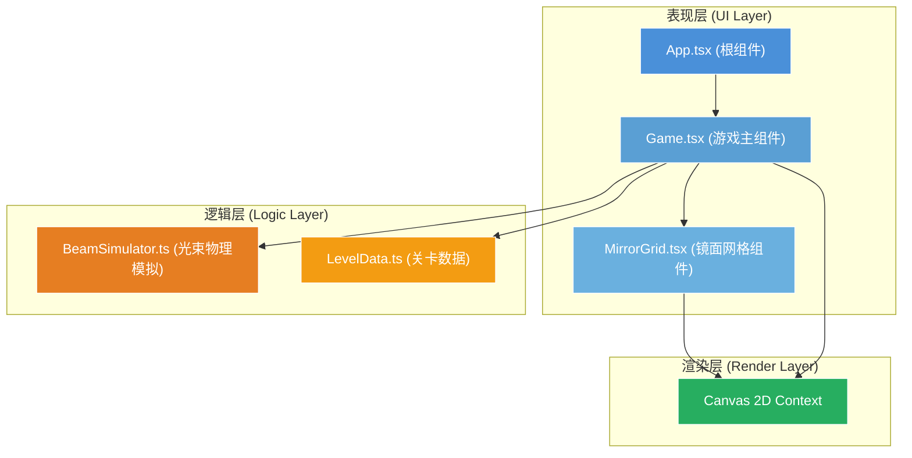

## 1. 架构设计



**数据流向**：
1. `App.tsx` → 传递当前关卡索引到 `Game.tsx`
2. `Game.tsx` → 从 `LevelData.ts` 读取关卡配置 → 初始化镜面数组
3. `MirrorGrid.tsx` → 接收镜面数据 → 渲染并处理交互 → 更新角度回调到 `Game.tsx`
4. `Game.tsx` → 将镜面坐标/角度 + 发射器 + 障碍物传入 `BeamSimulator.ts`
5. `BeamSimulator.ts` → 返回光束路径点列表 + 碰撞事件
6. `Game.tsx` → 汇总所有渲染数据 → 通过 Canvas 2D 绘制

## 2. 技术描述

- **前端框架**：React@18 + TypeScript@5
- **构建工具**：Vite@5 + @vitejs/plugin-react@4
- **渲染引擎**：Canvas 2D API（纯浏览器API，无第三方图形库）
- **状态管理**：React Hooks (useState, useEffect, useRef, useCallback)
- **音效**：Web Audio API（无需第三方库）
- **初始化工具**：vite-init (react-ts模板)

## 3. 核心类型定义

```typescript
// 镜面类型
interface Mirror {
  id: string;
  x: number;           // 中心点X坐标
  y: number;           // 中心点Y坐标
  angle: number;       // 镜面法线角度（度）
  length: number;    // 镜面长度（像素）
  length length length length length length length
}

// 障碍物
interface Obstacle {
  x: number;
  y: number;
  width: number;
  height: number;
}

// 接收器
interface Receiver {
  id: string;
  x: number;
  y number;
  color: string;       // 目标颜色
  radius: number;
  radius length
}

// 发射器
interface Emitter {
  x: number;
  y: number;
  angle: number;       // 发射角度
  color: string;
}

// 光束路径段
interface BeamSegment {
  points: Array<{x: number, y: number}>;
  color: string;
  length brightness: number;
}

// 碰撞事件
interface CollisionEvent {
  type: 'mirror' | 'obstacle' | 'receiver';
  x: number;
  y: number;
  timestamp: number;
  receiverMatched length boolean;
  length mirrorId: string;
}

// 关卡
interface LevelData {
  level: number;
  emitter: Emitter;
  mirrors: Mirror[];
  mirrors length initialAngle: number;
  obstacles: Obstacle[];
  receivers: Receiver[];
  canvasWidth: number;
  canvasHeight: number;
}

// 粒子
interface Particle {
  x: number;
  y number;
  vx: number;
  vy: number;
  radius: number;
  length color: string;
  length opacity: number;
  length: number;
  length: number;
  timestamp: number;
}
```

## 4. 模块职责

### 4.1 LevelData.ts
- **职责**：定义6个初始关卡的静态数据
- **输入**：无
- **输出**：`LevelData[]` 数组
- **包含**：每关的发射器位置/角度/颜色、镜面初始位置/角度、障碍物坐标、接收器位置/颜色
- **调用关系**：被 Game.tsx 直接 import

### 4.2 BeamSimulator.ts
- **职责**：纯函数式光束物理模拟引擎
- **核心函数**：`simulateBeam(emitter, mirrors, obstacles, receivers, canvasSize)`
- **输入**：发射器对象、镜面数组、障碍物数组、接收器数组、画布尺寸
- **输出**：`{ segments: BeamSegment[], collisions: CollisionEvent[] }`
- **算法**：
  1. 从发射器起点沿角度发射射线
  2. 射线-镜面碰撞检测 → 计算反射角（入射角=反射角）→ 亮度+10% → 继续传播
  3. 射线-矩形障碍物碰撞检测 → 终止+生成吸光事件
  4. 射线-接收器圆形碰撞检测 → 颜色匹配判定
  5. 射线-画布边界 → 终止
  6. 递归最多反射10次防止死循环
- **调用关系**：被 Game.tsx 调用

### 4.3 MirrorGrid.tsx
- **职责**：Canvas渲染所有镜面+处理镜面拖拽交互
- **Props**：
  - `mirrors: Mirror[]`
  - `selectedMirrorId: string | null`
  - `onSelectMirror: (id) => void`
  - `onRotateMirror: (id, newAngle) => void`
  - `canvasWidth, canvasHeight`
- **交互**：
  - 鼠标/触摸按下命中镜面 → 选中 + 开始拖拽
  - 拖拽过程计算相对角度 → 每5度一格更新
  - 松开 → 锁定角度 + 回调 + Web Audio播放800Hz 0.1秒音效
- **调用关系**：被 Game.tsx 渲染

### 4.4 Game.tsx
- **职责**：游戏主控制器
- **状态管理**：
  - `currentLevel`: 当前关卡索引
  - `mirrors`: 当前镜面状态（含角度）
  - `selectedMirrorId`: 选中的镜面
  - `elapsedTime`: 已用时间（秒）
  - `isPlaying`: 游戏进行中
  - `isWin`: 胜利状态
  - `beamSegments`: 当前光束段
  - `particles`: 粒子数组
  - `transitionState`: 过渡动画状态
- **核心逻辑**：
  - requestAnimationFrame主循环
  - 每帧调用BeamSimulator → 生成粒子 → 渲染到Canvas
  - 定时器更新计时器
  - R键事件监听重置
  - 胜利判定 → 脉冲动画 → 涟漪切换
- **调用关系**：App.tsx → Game.tsx

### 4.5 App.tsx
- **职责**：应用根组件
- **功能**：关卡选择界面、游戏界面切换、全局样式
- **调用关系**：入口渲染

## 5. 性能优化策略

| 优化项 | 策略 |
|--------|------|
| 粒子池 | 最多500个粒子，超出复用最旧粒子 |
| Canvas分层 | 单Canvas双层渲染逻辑，避免重绘静态元素 |
| 光束计算节流 | 镜面拖拽时debounce 16ms重算 |
| 碰撞优化 | 镜面边界矩形粗检 → 精确线段相交 |
| resize防抖 | window resize事件防抖100ms |
| 粒子简化 | 非关键帧降低粒子更新频率（每2帧更新一次） |

## 6. 文件清单

```
├── package.json
├── vite.config.js
├── tsconfig.json
├── index.html
└── src/
    ├── main.tsx
    ├── App.tsx
    ├── Game.tsx
    ├── MirrorGrid.tsx
    ├── BeamSimulator.ts
    ├── LevelData.ts
    └── index.css
```
