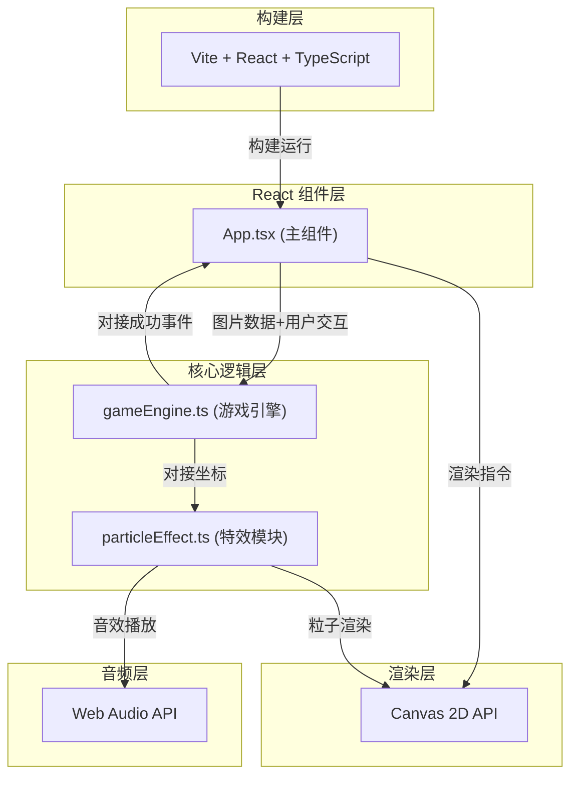

## 1. 架构设计



**数据流向**：用户上传图片 → App.tsx解码为ImageData → gameEngine.ts生成分片数据(Polygon[]) → App.tsx通过requestAnimationFrame循环将碎片状态渲染到Canvas → 用户交互(鼠标/滚轮) → App.tsx调用gameEngine拖拽/旋转函数更新碎片状态 → 对接检测触发 → gameEngine回调App.tsx → particleEffect.ts播放光晕+音效 → 全部完成 → 播放庆祝特效

## 2. 技术描述

- **前端框架**：React 18 + TypeScript 5.0
- **构建工具**：Vite 5.0 + @vitejs/plugin-react
- **图形渲染**：Canvas 2D API（requestAnimationFrame驱动）
- **音频系统**：Web Audio API（OscillatorNode + GainNode合成音效）
- **状态管理**：React useState/useRef（避免引入额外状态库）
- **无后端**：纯前端运行，图片通过FileReader本地处理
- **无数据库**：所有状态在内存中维护

**核心依赖版本**：
```json
{
  "react": "^18.3.1",
  "react-dom": "^18.3.1",
  "typescript": "^5.4.5",
  "vite": "^5.2.0",
  "@vitejs/plugin-react": "^4.2.1"
}
```

## 3. 路由定义

| 路由 | 用途 |
|------|------|
| / | 单页应用，主画布+所有功能模块 |

本应用为单页应用(SPA)，不使用react-router，所有功能集成于主组件App.tsx。

## 4. 核心类型定义

```typescript
// 碎片顶点坐标（相对碎片中心）
interface Point {
  x: number;
  y: number;
}

// 单个碎片数据
interface PuzzlePiece {
  id: string;
  vertices: Point[];           // 多边形顶点（相对中心的局部坐标）
  center: Point;               // 当前世界坐标（碎片中心位置）
  rotation: number;            // 当前旋转角度（弧度）
  targetCenter?: Point;        // 吸附目标位置（对接成功时使用）
  targetRotation?: number;     // 吸附目标角度
  isDragging: boolean;         // 是否正在被拖拽
  isSelected: boolean;         // 是否被选中（滚轮旋转）
  isLocked: boolean;           // 是否已合并锁定
  groupId: string;             // 所属合并组ID
  originalCenter: Point;       // 原图中正确位置的中心坐标
  originalRotation: number;    // 原图中的正确角度（通常为0）
  neighborIds: string[];       // 相邻碎片ID列表
}

// 粒子数据
interface Particle {
  x: number;
  y: number;
  vx: number;
  vy: number;
  life: number;       // 0-1 剩余生命
  maxLife: number;    // 总时长(ms)
  size: number;       // 直径
  color: string;
}

// 难度配置
interface DifficultyConfig {
  pieceCount: number;       // 碎片数量 50 或 80
  rotationRange: number;    // 初始旋转范围 ±45° 或 ±180°
}

// 游戏状态
type GameStatus = 'idle' | 'playing' | 'completed';
```

## 5. 核心模块文件结构与调用关系

```
src/
├── App.tsx                  # 主组件：挂载Canvas、图片加载、状态管理、UI控件
│   └── 调用关系：
│       ├── 导入 gameEngine 函数
│       ├── 导入 particleEffect 模块
│       ├── 监听 canvas 事件 → 调用 engine 交互函数
│       ├── rAF 循环 → 渲染碎片 + 粒子 + 特效
│       └── 接收 engine 完成回调 → 播放庆祝动画
│
├── gameEngine.ts            # 核心引擎
│   └── 导出函数：
│       ├── generatePieces(imageData, config) → PuzzlePiece[]
│       ├── getPieceAtPoint(pieces, x, y) → PuzzlePiece | null
│       ├── dragPiece(piece, dx, dy) → void
│       ├── rotatePiece(piece, deltaAngle) → void
│       ├── checkSnap(piece, allPieces) → { snapped: boolean, pair?: [id,id] }
│       ├── mergePieces(pieces, id1, id2) → PuzzlePiece[]
│       ├── checkCompletion(pieces) → boolean
│       └── shufflePieces(pieces, config) → PuzzlePiece[]
│
└── particleEffect.ts        # 特效与音效模块
    └── 导出：
        ├── ParticleSystem 类
        │   ├── spawnSnapGlow(centerX, centerY) → void
        │   ├── spawnCompletionRing(centerX, centerY) → void
        │   └── updateAndRender(ctx) → void
        └── AudioManager 类
            ├── playSnapSound() → void
            └── playCompletionSound() → void
```

**文件间调用链**：
1. App.tsx 接收用户上传 → FileReader → 创建 HTMLImageElement → drawImage 到离屏 canvas → getImageData
2. App.tsx 调用 `gameEngine.generatePieces(imageData, difficulty)` 获取初始碎片
3. App.tsx 在 onMouseDown 时调用 `gameEngine.getPieceAtPoint()` 拾取碎片
4. onMouseMove 时调用 `gameEngine.dragPiece()` 更新位置
5. onMouseWheel 时调用 `gameEngine.rotatePiece()` 更新角度
6. onMouseUp 时调用 `gameEngine.checkSnap()` → 若对接成功：
   - 调用 `gameEngine.mergePieces()` 合并碎片
   - 调用 `particleEffect.spawnSnapGlow()` + `AudioManager.playSnapSound()`
7. 每次 checkSnap 后调用 `gameEngine.checkCompletion()` → 完成则：
   - 调用 `particleEffect.spawnCompletionRing()` + `AudioManager.playCompletionSound()`

## 6. 关键算法说明

### 6.1 不规则多边形碎片生成（Voronoi + 扰动）
```
算法：
1. 在图片区域内随机撒 N 个种子点（50或80），使用 Lloyd松弛 优化分布均匀度
2. 对种子点执行 Voronoi 分块，得到每个碎片的初始凸多边形
3. 对每个多边形的每条边进行「扰动切割」：在边中点±20%范围内插入1-2个随机点
4. 确保每个碎片最终顶点数在 6-12 之间，剔除过小或过于细长的碎片并重生成
5. 计算每个碎片的质心作为 center，将顶点平移至以 center 为原点的局部坐标
6. 为每个碎片建立 neighborIds（Voronoi图中共享边的种子互为邻居）
7. 初始化散落位置：在画布中心附近区域（canvas/2 ± 100px）随机分布，至少留5px间隙
```

### 6.2 碎片对接判定（边距差+角度差双重校验）
```
函数 checkSnap(piece, allPieces):
  1. 遍历 piece.neighborIds 中尚未锁定的邻居 n
  2. 将 piece 和 n 的顶点都旋转到世界坐标，计算对应边缘
  3. 取 piece 的每条边，与 n 的边进行「最近点对」距离计算
  4. 找到最小距离 dist_min，计算两碎片当前角度差 angle_diff
  5. 若 dist_min < 3px 且 |angle_diff| < 5°：
     - 返回 snapped=true，记录 pair
     - 将 piece 的位置/角度吸附到 n 的对应正确位置（磁铁效果）
```

### 6.3 碎片合并机制
```
函数 mergePieces(pieces, id1, id2):
  1. 将两个碎片设置 isLocked=true，设置相同 groupId
  2. 视觉上：拼接区域边缘不再单独描边，内部按原图颜色连续填充
  3. 后续拖拽时，拾取组内任一碎片 → 整个组同步平移/旋转
  4. 当所有碎片共享同一 groupId 时，拼图完成
```

### 6.4 粒子系统（金色光粒 + 彩虹光环）
```
spawnSnapGlow(x, y):
  在 (x,y) 周围生成 20-30 个粒子
  - 直径：随机 2-4px
  - 颜色：#ffd700, 透明度 life*0.7 + 0.3
  - 初速度：径向向外随机 30-80 px/s
  - 生命：0.6s，线性衰减

spawnCompletionRing(cx, cy):
  生成环形扩散波（非离散粒子）
  - 半径：20px → 500px，持续1.5s
  - 颜色：HSL(hue从0→360, 100%, 60%) 随半径变化形成彩虹
  - 透明度：1 → 0，环宽固定 20px
```

### 6.5 Web Audio音效合成
```
playSnapSound(): 「咔嗒」
  - Oscillator: 方波，800Hz → 400Hz 指数衰减（0.2s）
  - GainNode: 线性 0.3 → 0
  - 总时长 0.2s

playCompletionSound(): 上升音阶
  - 7个音符依次触发（间隔0.1s）
  - 频率：C5(523) → D5 → E5 → F5 → G5 → A5 → C6(1047)
  - 每个音符：正弦波，Attack 0.02s，Decay 0.1s，峰值Gain 0.2
```

## 7. 性能优化策略

- **离屏缓存**：已合并且未被拖拽的碎片组，预渲染到离屏Canvas，每帧只drawImage一次
- **脏矩形**：仅当碎片状态变化时重绘该区域（使用bounding box计算）
- **对象池**：Particle对象复用，避免频繁GC
- **节流**：滚轮事件每16ms处理一次，避免过度触发
- **指针事件**：使用PointerEvent统一处理鼠标/触控，passive:true避免阻塞滚动
- **类型检查**：tsconfig开启 strict，运行时零开销
