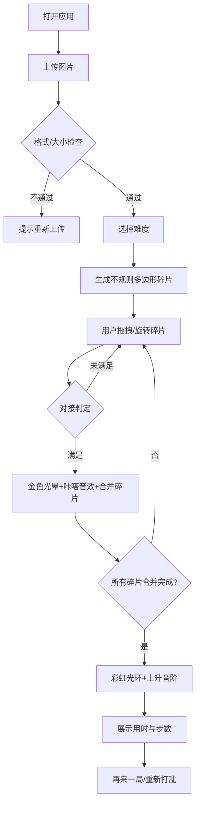

## 1. 产品概述

「碎镜重构」是一款沉浸式浏览器拼图应用，用户通过拖拽、旋转不规则多边形碎片，将被随机撕碎的图片重新拼接还原。产品以深色美学为基调，融合物理悬浮感、金色光晕特效和清脆「咔嗒」音效，打造如修复碎镜般的治愈体验。

- **核心用户**：拼图爱好者、休闲游戏玩家、解压需求人群
- **市场价值**：浏览器即玩、无需安装、视觉与听觉双重沉浸的拼图体验

## 2. 核心功能

### 2.1 用户角色

| 角色 | 注册方式 | 核心权限 |
|------|----------|----------|
| 普通用户 | 无需注册，浏览器直接使用 | 上传图片、拼图操作、难度切换、查看统计 |

### 2.2 功能模块

1. **主画布页面**：图片上传区、Canvas拼图画布、碎片交互层
2. **游戏引擎模块**：碎片生成、碰撞检测、对接判定、合并逻辑
3. **特效反馈模块**：金色光粒、对接光晕、彩虹光环、Web Audio音效
4. **统计面板模块**：计时器、步数统计、完成展示
5. **控制面板模块**：难度切换、重新打乱、再来一局

### 2.3 页面详情

| 页面名称 | 模块名称 | 功能描述 |
|----------|----------|----------|
| 主画布页 | 图片上传区 | 虚线圆形上传区域（直径200px），支持点击/拖拽上传jpg/png（≤5MB，建议512x512） |
| 主画布页 | Canvas画布 | 渲染深色背景、悬浮碎片、光晕特效、完成光环 |
| 主画布页 | 碎片交互层 | 鼠标拖拽（弹性手感ease-out）、滚轮旋转（15°/格）、吸附对接动画 |
| 主画布页 | 统计面板 | 右上角磨砂玻璃卡片，实时显示mm:ss计时与总步数 |
| 主画布页 | 控制面板 | 难度切换（简单50片±45°/困难80片±180°）、重新打乱、再来一局 |

## 3. 核心流程

用户打开应用 → 上传图片 → 系统自动生成50-80个不规则多边形碎片 → 用户拖拽/旋转碎片 → 碎片对接判定（边距差<3px、角度差<5°）→ 对接成功：金色光晕+咔嗒音效+碎片合并 → 所有碎片合并完成 → 彩虹光环扩散+上升音阶庆祝 → 展示最终用时与步数 → 再来一局

## 4. 用户界面设计

### 4.1 设计风格

- **主色调**：深色背景 #1a1a2e，金色强调 #ffd700，银色描边 #c0c0c0
- **辅色调**：按钮渐变 #4a4a6e → #2a2a4e，悬停 #5a5a7e，半透明白 rgba(255,255,255,0.1)
- **按钮样式**：圆角矩形（圆角6px），白色12px文字，点击缩放0.95倍
- **字体选择**：中文用"PingFang SC/微软雅黑"，数字用等宽字体"JetBrains Mono"
- **布局风格**：画布居中（桌面最大800px，移动占满宽），统计面板悬浮右上角
- **视觉特效**：碎片半透明光泽质感、边缘1px亮色描边、拖拽时金色描边+1.2倍缩放、对接吸附动画

### 4.2 页面设计概览

| 页面名称 | 模块名称 | UI元素 |
|----------|----------|--------|
| 主画布页 | 上传区域 | 虚线圆形（直径200px），#888提示文字，悬停金色边框过渡0.3s，拖入放大1.1倍闪烁 |
| 主画布页 | 碎片样式 | 半透明原图填充，1px #c0c0c0描边，悬浮缓慢自转，拖拽时#ffd700描边+1.2倍缩放（0.15s） |
| 主画布页 | 统计面板 | 圆角12px，背景rgba(255,255,255,0.1)磨砂玻璃，mm:ss计时+步数 |
| 主画布页 | 控制按钮 | 渐变背景#4a4a6e→#2a2a4e，圆角6px，悬停#5a5a7e，点击缩放0.95 |
| 主画布页 | 完成动画 | 彩虹光环（半径20→500px，透明1→0，持续1.5s） |

### 4.3 响应式设计

- **桌面端（≥768px）**：画布居中，最大宽度800px，统计面板悬浮右上角
- **移动端（<768px）**：画布占满屏幕宽度，统计面板缩小字号适配触控
- **触控优化**：拖拽区域放大判定，支持双指旋转（滚轮等价操作）

### 4.4 Canvas性能优化

- requestAnimationFrame循环，优先渲染拼图区域和特效
- 碎片拖拽响应<50ms，整体帧率≥55FPS
- 减少重绘区域，合并的碎片缓存为离屏Canvas
- UI元素让出主线程，动画使用transform而非重排
