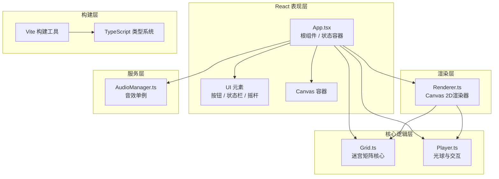

## 1. 架构设计



## 2. 技术说明
- **前端框架**：React 18 + TypeScript 严格模式
- **构建工具**：Vite 5 + @vitejs/plugin-react
- **渲染方案**：Canvas 2D API，requestAnimationFrame 驱动
- **状态管理**：React useState/useRef 本地状态，无第三方依赖
- **音效方案**：Web Audio API 原生实现，单例模式管理
- **样式方案**：内联样式 + CSS 变量，无 UI 库依赖

## 3. 目录结构
```
项目根
├── package.json
├── index.html
├── vite.config.js
├── tsconfig.json
└── src/
    ├── App.tsx              # 根组件：状态管理、关卡逻辑、UI组织
    ├── core/
    │   ├── Grid.ts          # 矩阵逻辑：光柱状态、连锁反应、可解性检测
    │   └── Player.ts        # 玩家逻辑：位置更新、碰撞检测、撤销栈
    ├── render/
    │   └── Renderer.ts      # 渲染器：背景/光柱/光球/光痕/动画绘制
    └── audio/
        └── AudioManager.ts  # 音效管理：Web Audio封装、各类音效生成
```

## 4. 核心数据模型

### 4.1 Grid 状态模型
```typescript
// 光柱颜色枚举
enum PillarColor { RED = 0, GREEN = 1, BLUE = 2, PURPLE = 3 }

// 单根光柱
interface Pillar {
    row: number;          // 行索引
    col: number;          // 列索引
    color: PillarColor;   // 当前颜色
    extinguished: boolean;// 是否已熄灭
    // 动画瞬时状态（供渲染层读取，不影响逻辑）
    brightness: number;   // 0.1 ~ 1.0，熄灭动画中
    flashPhase: number;   // 闪烁相位
}

// 撤销快照（记录一步操作前的完整矩阵）
interface GridSnapshot {
    pillars: Pillar[][];  // 深拷贝的光柱矩阵
}

// Grid 公开只读接口
interface GridState {
    readonly size: number;
    readonly level: number;
    getPillar(row, col): Readonly<Pillar>;
    isAllExtinguished(): boolean;
}
```

### 4.2 Player 状态模型
```typescript
// 网格位置
interface GridPos { row: number; col: number; }

// 光痕轨迹点（渲染用，带时间戳/透明度）
interface TrailPoint {
    x: number;          // 像素坐标（格子中心）
    y: number;
    alpha: number;      // 0 ~ 0.5
    createdAt: number;  // 时间戳，用于淡出
}

// 移动动画状态
interface MoveAnimation {
    from: GridPos;
    to: GridPos;
    startTime: number;
    duration: number;   // 300ms
    isPlaying: boolean;
}

// 撤销栈条目
interface UndoEntry {
    playerFrom: GridPos;
    playerTo: GridPos;
    gridSnapshot: GridSnapshot;
    pillarHit: GridPos | null;  // 本次移动是否碰撞光柱
}

// Player 公开接口
interface PlayerState {
    readonly currentPos: GridPos;        // 逻辑位置
    readonly renderPos: { x, y };       // 渲染插值位置
    readonly trail: TrailPoint[];       // 光痕点列表
    readonly undoCount: number;         // 剩余撤销次数（上限10）
    readonly moveCount: number;         // 已走步数
    readonly isMoving: boolean;
}
```

### 4.3 App 顶层状态
```typescript
interface GameState {
    level: number;          // 当前关卡（决定网格大小 4~6）
    moveCount: number;      // 步数（右上角）
    undoRemaining: number;  // 剩余撤销次数（右下角）
    isWin: boolean;         // 是否已通关
    isPaused: boolean;      // 暂停状态
    winAnimationPhase: number; // 通关动画进度 0~1
}
```

## 5. 核心算法说明

### 5.1 光柱连锁反应算法
```
当玩家移动到 (r, c) 且该格有未熄灭光柱：
1. 标记 pillars[r][c] 为熄灭，启动 500ms 亮度衰减动画
2. 对正交四邻域 (dr, dc) ∈ {(-1,0),(1,0),(0,-1),(0,1)}：
   - 若邻域在网格内且未熄灭：
     - color = (color + 1) mod 4 （红→绿→蓝→紫→红循环）
3. 将变化写入撤销快照
```

### 5.2 关卡可解性生成算法
```
生成 N×N 关卡：
1. 从"所有光柱已熄灭"的终态开始反向生成
2. 随机选取 K 个格子（K ∈ [N, 2N]）作为"反向触发"序列
3. 对每个反向触发点 (r, c)：
   - 将 (r, c) 处的光柱"点亮"（设为随机颜色）
   - 将四邻域的颜色反向循环一次：color = (color + 3) mod 4
4. 生成完成后，将该触发序列的反向作为"存在的可行解"
5. 玩家初始位置设为网格外（边缘外侧一格），保证首步可移动
```

### 5.3 Ease-Out 插值
```
easeOutCubic(t) = 1 - (1 - t)³   t ∈ [0, 1]
用于光球移动的 300ms 位置插值
```

## 6. 性能优化点
- **粒子上限**：TrailPoint 数组限制 150 个，超出时 FIFO 淘汰最旧点
- **脏矩形**：光柱仅在闪烁/熄灭/变色阶段重绘高亮层，否则复用缓存
- **动画调度**：统一 requestAnimationFrame 循环，Renderer 内部按时间戳计算各动画进度
- **音效内存**：AudioContext 复用、振荡器用完立即 disconnect，总内存 < 5MB
- **避免 GC**：TrailPoint 对象池复用、GridSnapshot 只在触发碰撞时才深拷贝
