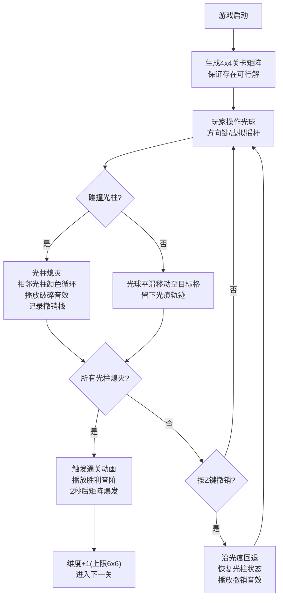

## 1. 产品概述

光痕谜阵是一款基于动态光影交互和空间推理的2D浏览器解谜游戏。玩家控制发光光球在彩色光柱矩阵中移动，通过光柱熄灭与连锁颜色变化机制规划路径，使所有光柱同时熄灭即可通关。

- 核心问题：解决传统益智游戏缺乏动态光影交互和空间推理深度的问题
- 目标用户：休闲解谜游戏爱好者，追求视觉美感与智力挑战的玩家
- 产品价值：提供沉浸式光影视觉体验与深度空间推理玩法的创新结合

## 2. 核心功能

### 2.1 功能模块
1. **游戏主界面**：Canvas渲染游戏矩阵、光球、光痕轨迹、光柱及所有动画效果
2. **光柱系统**：四色光柱（红/绿/蓝/紫）状态管理、连锁颜色循环、熄灭动画、呼吸闪烁
3. **光球系统**：键盘/虚拟摇杆控制、平滑移动过渡、碰撞检测、拖尾光痕粒子
4. **撤销系统**：最多10步操作撤销、光痕回退动画、状态反向恢复、撤销音效
5. **关卡系统**：4x4→6x6维度递增、随机颜色生成、可解性保证、自动进入下一关
6. **音效系统**：Web Audio API生成光柱破碎声、撤销噗声、通关胜利音阶
7. **UI系统**：关卡数/步数/撤销次数显示、重置/暂停按钮、通关结算动画

### 2.2 页面详情
| 页面名称 | 模块名称 | 功能描述 |
|---------|---------|---------|
| 游戏主页面 | 游戏画布 | Canvas 2D渲染矩阵、光柱、光球、光痕、所有动画过渡 |
| 游戏主页面 | 状态栏 | 左上角关卡数、右上角步数、右下角剩余撤销次数 |
| 游戏主页面 | 控制按钮 | 重置按钮（重新生成当前关卡）、暂停按钮（冻结动画） |
| 游戏主页面 | 虚拟摇杆 | 移动端左下角圆形摇杆，支持8方向拖拽控制 |
| 游戏主页面 | 通关层 | 屏幕中央通关文字动画、矩阵光柱爆发点亮动画 |

## 3. 核心流程

## 4. 用户界面设计

### 4.1 设计风格
- **主色调**：深蓝背景 #0B0C1E，网格线 #3A3C5E
- **光柱四色**：红 #FF4444、绿 #44FF44、蓝 #4444FF、紫 #FF44FF，熄灭态暗灰色
- **光球配色**：外发光白色渐变透明 + 核心纯白 #FFFFFF
- **光痕轨迹**：冷色→暖色随关卡进度渐变
- **按钮配色**：渐变绿 #2ECC71 → #27AE60，圆角8px
- **通关金色**：#FFD700

### 4.2 页面设计概述
| 页面名称 | 模块名称 | UI元素 |
|---------|---------|--------|
| 主游戏页 | 游戏画布 | 深色背景、半透明网格线、圆柱体光柱带底部光晕、发光光球、拖尾光痕粒子 |
| 主游戏页 | 状态栏 | 白色等宽字体、左上关卡/右上步数/右下撤销次数、轻微发光效果 |
| 主游戏页 | 控制按钮 | 渐变绿色圆角矩形、悬停放大1.1倍+阴影、点击缩放反馈 |
| 主游戏页 | 虚拟摇杆 | 左下半透明圆形底座（半径60px）+ 可拖动摇杆头、移动端自动显示 |
| 主游戏页 | 通关层 | 中央"通关"文字从白→金渐变放大到100px、光柱10%→150%→100%爆发式点亮 |

### 4.3 响应式设计
- **桌面端优先**：适配宽度480px - 1920px，Canvas自动居中缩放
- **移动端适配**：<768px自动切换虚拟摇杆，隐藏键盘提示
- **触摸优化**：摇杆区域触摸优先、按钮最小44px点击区域
- **画布缩放**：保持80px格子为基准，整体按容器宽度等比缩放

## 5. 动画与性能规范
- 光球移动：0.3秒Ease-Out平滑过渡
- 光柱熄灭：0.5秒亮度100%→10%线性衰减
- 颜色闪烁：每3秒色相偏移±10度，持续0.2秒
- 撤销回退：沿光痕原路返回，光痕0.5秒淡出
- 通关动画：文字2秒放大渐变、矩阵1秒爆发点亮
- 性能目标：60FPS、光痕粒子≤150个、CPU占用≤15%
