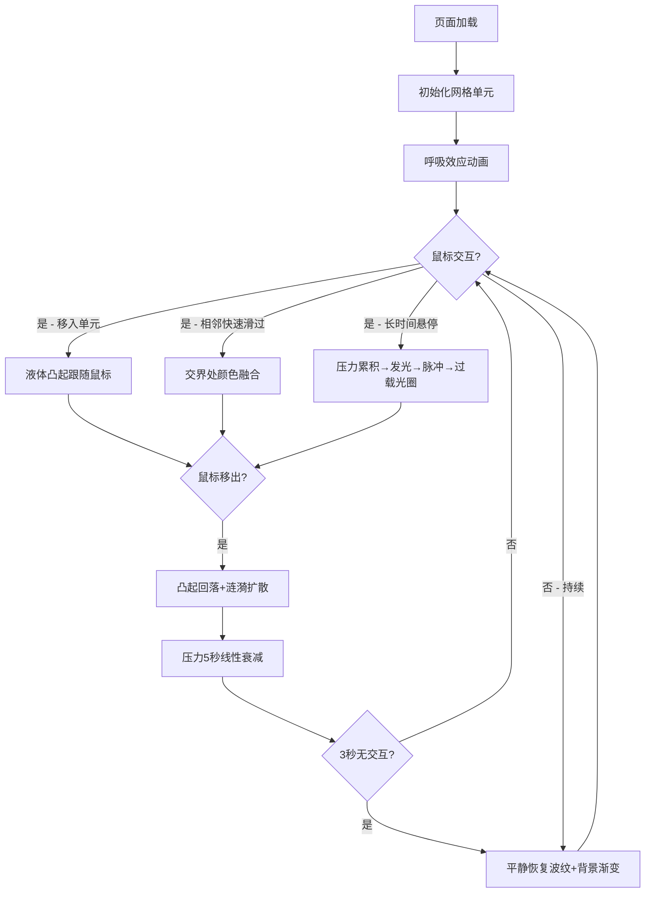

## 1. 产品概述

「磁流体·律动墙」是一款基于浏览器的交互式可视化应用，通过模拟磁流体的动态物理特性，为用户提供沉浸式的触觉反馈式视觉体验。解决传统静态数字海报缺乏动态流体感和交互深度的问题，适用于数字艺术展示、品牌互动墙、展览装置等场景。

## 2. 核心特性

### 2.1 用户角色
| 角色 | 注册方式 | 核心权限 |
|------|---------|----------|
| 浏览用户 | 无需注册 | 鼠标/触摸交互体验磁流体效果 |

### 2.2 功能模块
1. **主交互页**：磁流体网格展示、鼠标交互、动态渲染、响应式适配

### 2.3 页面详情
| 页面名称 | 模块名称 | 功能描述 |
|---------|---------|----------|
| 主交互页 | 磁流体单元网格 | 8x8/6x6/4x4自适应网格布局，64/36/16个圆角矩形单元 |
| 主交互页 | 凸起与流动效果 | 鼠标移入时液体向光标流动形成径向渐变凸起，跟随移动 |
| 主交互页 | 涟漪衰减动画 | 鼠标移出后1秒平滑回落并产生2秒扩散涟漪 |
| 主交互页 | 颜色渗透融合 | 相邻单元快速滑过时在交界处发生色相融合 |
| 主交互页 | 压力累积发光 | 悬停时间累积映射发光强度，0-1秒增强、1-3秒脉冲、>3秒过载光圈 |
| 主交互页 | 平静恢复模式 | 3秒无交互后进入缓慢波纹动画，背景渐变过渡 |
| 主交互页 | 呼吸效应 | 基础亮度±5%同步波动，周期4秒 |
| 主交互页 | 噪点纹理 | Canvas像素级扰动模拟真实磁流体质感 |

## 3. 核心流程

用户打开页面 → 看到深色背景上的磁流体网格（呼吸效应） → 鼠标滑过单元 → 单元液体凸起跟随 → 快速滑过相邻单元 → 颜色融合 → 长时间悬停 → 压力累积、发光增强、脉冲、过载光圈 → 鼠标离开 → 压力5秒衰减 → 3秒无交互 → 平静恢复波纹动画

## 4. 用户界面设计

### 4.1 设计风格
- **主色调**：深色金属液体（HSL 220°, 30%, 50%），背景从深夜蓝#0B1021到暖紫#1B0B36渐变
- **辅助色**：缝隙半透明灰蓝#2A3A5A（透明度0.3），融合色为相邻单元色相中间值
- **视觉风格**：有机流体、液态金属、赛博深邃、沉浸式暗色主题
- **圆角**：单元圆角半径12px
- **字体**：无衬线现代字体，以视觉效果为主，文字极简
- **动效原则**：所有动画60fps流畅渲染，requestAnimationFrame驱动

### 4.2 页面设计概览
| 页面名称 | 模块名称 | UI元素 |
|---------|---------|--------|
| 主交互页 | 网格容器 | CSS Grid布局，8px缝隙，全屏居中，自适应单元尺寸 |
| 主交互页 | 流体单元 | Canvas 2D渲染，圆角矩形裁切，噪点纹理，径向渐变凸起 |
| 主交互页 | 交互反馈 | 发光光晕、脉冲振荡、扩散光圈、颜色融合带 |
| 主交互页 | 背景层 | 细腻渐变基底，平静模式下缓慢色过渡 |

### 4.3 响应式设计
- **桌面端（≥600px）**：8×8网格，最小单元边长80px，自适应窗口宽度
- **平板端（400-599px）**：6×6网格（36单元），单元边长60px
- **移动端（<400px）**：4×4网格（16单元），单元边长50px
- **触摸优化**：支持touch事件映射为鼠标交互

### 4.4 性能指标
- **帧率目标**：64单元全交互时≥45fps
- **GPU内存**：≤300MB
- **渲染方式**：Canvas 2D逐单元独立渲染，脏矩形优化
- **动画驱动**：统一requestAnimationFrame循环，避免重复计算
