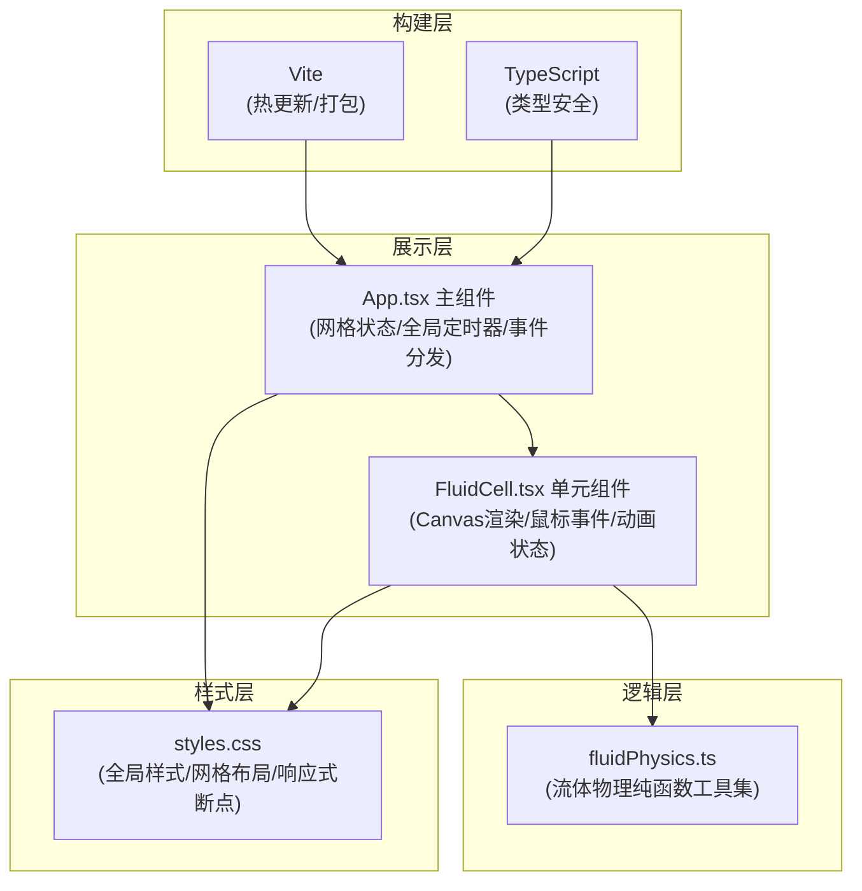

## 1. 架构设计



## 2. 技术描述

- **前端框架**：React@18 + ReactDOM@18（函数式组件 + Hooks）
- **构建工具**：Vite@5（自动端口、HMR热更新）
- **类型系统**：TypeScript@5（严格模式，target ES2020）
- **渲染引擎**：Canvas 2D API（原生，无第三方渲染库）
- **样式方案**：原生CSS3（CSS Grid布局、CSS变量、媒体查询）
- **动画驱动**：requestAnimationFrame（统一60fps循环）
- **后端**：无（纯前端应用）
- **初始化方式**：手动配置文件搭建（非脚手架生成）

## 3. 路由定义

| 路由 | 用途 |
|-----|------|
| / | 主交互页面（唯一页面，磁流体网格展示） |

## 4. 文件组织结构

```
auto198/
├── package.json              # 项目依赖与脚本
├── vite.config.js            # Vite构建配置
├── tsconfig.json             # TypeScript配置
├── index.html                # HTML入口
├── src/
│   ├── App.tsx               # 主组件：网格管理、全局状态、事件协调
│   ├── FluidCell.tsx         # 单元组件：Canvas渲染、交互处理
│   ├── styles.css            # 全局样式：布局、响应式、主题
│   └── utils/
│       └── fluidPhysics.ts   # 流体物理计算纯函数
```

## 5. 组件与数据流设计

### 5.1 App.tsx 主组件
**职责**：
- 计算网格尺寸（根据窗口宽度确定 8x8/6x6/4x4）
- 生成单元矩阵数据（行列索引、初始色相、唯一ID）
- 维护全局状态：平静模式标志、最后交互时间戳、全局背景过渡进度
- 统一 requestAnimationFrame 主循环驱动
- 相邻单元检测与颜色融合事件广播
- CSS Grid 容器渲染与响应式断点适配

**Hooks使用**：
- `useState`：网格配置、平静模式状态、背景渐变进度
- `useEffect`：窗口resize监听、全局动画循环、平静模式定时器
- `useRef`：raf句柄、最后交互时间戳引用、动画帧计时器

### 5.2 FluidCell.tsx 单元组件
**Props定义**：
```typescript
interface FluidCellProps {
  id: string;
  row: number;
  col: number;
  cellSize: number;
  baseHue: number;
  onEnter?: (id: string, pos: {x:number,y:number}, row:number, col:number) => void;
  onMove?: (id: string, pos: {x:number,y:number}) => void;
  onLeave?: (id: string) => void;
  blendInfos?: BlendInfo[]; // 相邻融合信息
  globalCalmProgress?: number; // 0-1 平静模式进度
  globalBreathPhase?: number; // 呼吸相位
}
```

**内部状态（useRef优化）**：
- `pressure`：悬停累积压力值（秒，精度0.1）
- `mousePos`：当前鼠标在单元内的相对坐标
- `isHovering`：是否悬停中
- `convexAnim`：凸起动画进度（0-1，回落用）
- `ripples[]`：活跃涟漪列表（起始时间、中心、当前进度）
- `blends[]`：本单元融合区域列表（相邻ID、融合色相、扩散进度、残留度）
- `overloadBurst`：过载光圈动画状态（起始时间、是否活跃）
- `calmWaves[]`：平静波纹列表（相位、振幅、初始时间）
- `noiseCanvas`：预渲染噪点离屏Canvas

**渲染循环（每帧）**：
1. 更新压力值（悬停累加/离开衰减）
2. 计算发光强度与脉冲振荡
3. 检测是否触发过载光圈
4. 更新凸起动画与涟漪扩散
5. 更新颜色融合区域进度
6. 更新平静波纹相位
7. Canvas重绘：背景色→噪点→径向凸起→融合带→涟漪→光晕

### 5.3 fluidPhysics.ts 纯函数工具

**函数签名**：
```typescript
export interface HSL { h: number; s: number; l: number; }

export function getConvexRadiusForMouse(
  cellSize: number,
  mouseX: number, mouseY: number,
  animProgress: number // 0回落 - 1满凸起
): { cx: number; cy: number; radius: number; intensity: number };

export function getRippleOpacityByTime(
  elapsed: number,     // 涟漪已过秒数
  duration: number = 2 // 总时长
): { radius: number; opacity: number };

export function getBlendColorForAdjacent(
  hueA: number, hueB: number,
  blendProgress: number // 0未融合 - 1最大扩散 - 0残留
): HSL;

export function generateNoiseTexture(
  width: number, height: number,
  perturbation: number = 2
): HTMLCanvasElement;

export function hslToString(hsl: HSL, alpha: number = 1): string;
export function hexToHsl(hex: string): HSL;
export function lerpHue(h1: number, h2: number, t: number): number;
export function easeOutCubic(t: number): number;
export function easeInOutSine(t: number): number;
```

## 6. 关键实现策略

### 6.1 性能优化
- **离屏Canvas缓存噪点**：每个单元生成一次噪点纹理，重复使用
- **脏标记渲染**：悬停/动画活跃的单元每帧重绘，完全平静时降低绘制频率
- **requestAnimationFrame节流**：60fps全局循环，时间差驱动而非固定步长
- **CSS will-change**：Canvas元素标记优化合成层
- **避免state触发重渲染**：动画数据存入useRef，仅Canvas重绘

### 6.2 数学模型
- **凸起径向渐变**：`brightness = base + 40% * (1 - dist/radius)^2`
- **脉冲振荡**：`brightness = peak * (0.95 + 0.05 * sin(2π * 0.5 * t))`
- **压力发光映射**：分段线性函数（0-1s上升，1-3s脉冲，>3s过载）
- **HSL色相插值**：沿色相环最短路径插值，避免359°→0°跳跃
- **平静波纹**：`y = center + A * sin(2πft + φ) * (1 - dist/R)`，多波叠加

### 6.3 颜色融合判定
- App监听全局`onCellEnter`事件，记录上一个进入的单元ID与时间戳
- 若相邻（`|r1-r2|+|c1-c2|===1`）且间隔<200ms → 触发融合
- 通过props向两个单元广播BlendInfo，各自在交界侧渲染融合带
