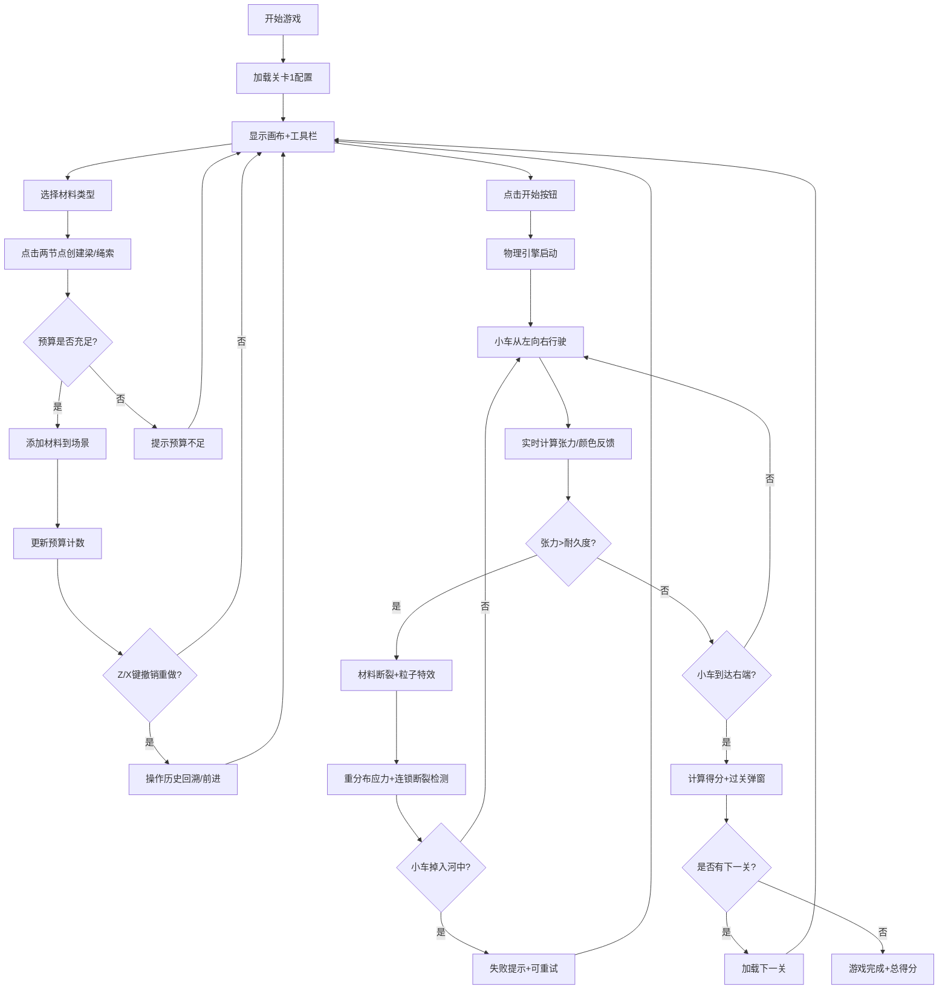

## 1. 产品概述

「筑桥大师·结构挑战」是一款基于浏览器的2D物理模拟游戏，玩家使用有限的木材、钢材和绳索材料搭建桥梁，让小车安全通过河流。游戏强调物理真实性、结构思维和美学反馈，解决传统物理沙盒缺乏明确目标和视觉反馈的问题。

- **核心目标**：在横版侧视场景中，使用有限材料搭建可承载小车的桥梁，材料越少越轻盈得分越高
- **目标用户**：喜欢结构挑战、益智类游戏的玩家，以及对物理模拟感兴趣的学生群体
- **市场价值**：教育性与娱乐性结合，通过真实物理引擎理解结构力学原理

## 2. 核心功能

### 2.1 用户角色
本游戏为单机单人游戏，无需角色区分。

### 2.2 功能模块
1. **主游戏界面**：游戏画布、材料工具栏、顶部状态面板
2. **材料搭建系统**：材料选择、节点吸附、梁/绳索连接、撤销重做
3. **物理模拟系统**：Matter.js引擎、实时张力计算、断裂检测
4. **关卡系统**：3个预置关卡、跨度递进、预算限制、时间限制
5. **视觉反馈系统**：受力颜色渐变、断裂粒子特效、闪烁覆盖层、操作提示
6. **评分系统**：材料剩余奖励、重量惩罚、时间奖励、基础分

### 2.3 页面详情

| 页面名称 | 模块名称 | 功能描述 |
|----------|----------|----------|
| 主游戏页 | 游戏画布 | Canvas 2D渲染、网格系统、节点吸附、桥梁绘制、小车行驶、断裂特效 |
| 主游戏页 | 顶部状态栏 | 关卡编号、倒计时、材料预算剩余数显示 |
| 主游戏页 | 材料工具栏 | 木材/钢材/绳索选择、选中高亮、剩余数量、操作按钮 |
| 主游戏页 | 操作提示层 | 撤销/重做提示文字、过关/失败弹窗、得分展示 |

## 3. 核心流程

## 4. 用户界面设计

### 4.1 设计风格
- **主色调**：深蓝灰背景 (#1a1a2e)，橙金高亮 (#FFD700/#FF6B00)
- **配色系统**：
  - 页面背景：#1a1a2e
  - 画布渐变：#0f0c29 → #302b63 → #24243e
  - 工具栏底色：#2d2d44
  - 网格线：#FF6B00 (透明度0.15)
  - 受力颜色：绿色#00FF00 → 黄色#FFAA00 → 红色#FF0000
- **按钮样式**：圆角矩形 (圆角6px)，深灰底白字，悬停橙色，点击缩小0.95倍
- **字体**："Press Start 2P" 像素风格字体
- **布局**：固定60px左侧工具栏 + 主游戏区域 (16:9比例居中)

### 4.2 页面设计概述

| 页面名称 | 模块名称 | UI元素 |
|----------|----------|--------|
| 主游戏页 | 顶部状态栏 | 关卡编号 (居中左)、倒计时 (居中中，红色警告)、预算剩余图标+数字 (居中右) |
| 主游戏页 | 材料工具栏 | 木材棕色木纹圆圈、钢材银金属圆圈、绳索麻黄编织圆圈，金色高亮边框2px |
| 主游戏页 | 游戏画布 | 星空渐变背景、半透明橙色网格、节点吸附点、材料受力颜色线、卡通红小车 |
| 主游戏页 | 视觉反馈 | 断裂碎片粒子、红色闪烁覆盖层、1.5秒淡出操作提示、速度条、脉动光晕 |

### 4.3 响应式设计
- **桌面优先**：以16:9比例为核心尺寸 (最小800×600)
- **窗口缩放**：保持16:9宽高比，缩放时居中显示
- **触控适配**：画布点击拖拽操作支持触摸事件

### 4.4 性能指标
- **帧率**：稳定60FPS，偶尔可降45FPS
- **物理计算**：50根材料时单帧≤16ms
- **内存**：≤150MB
