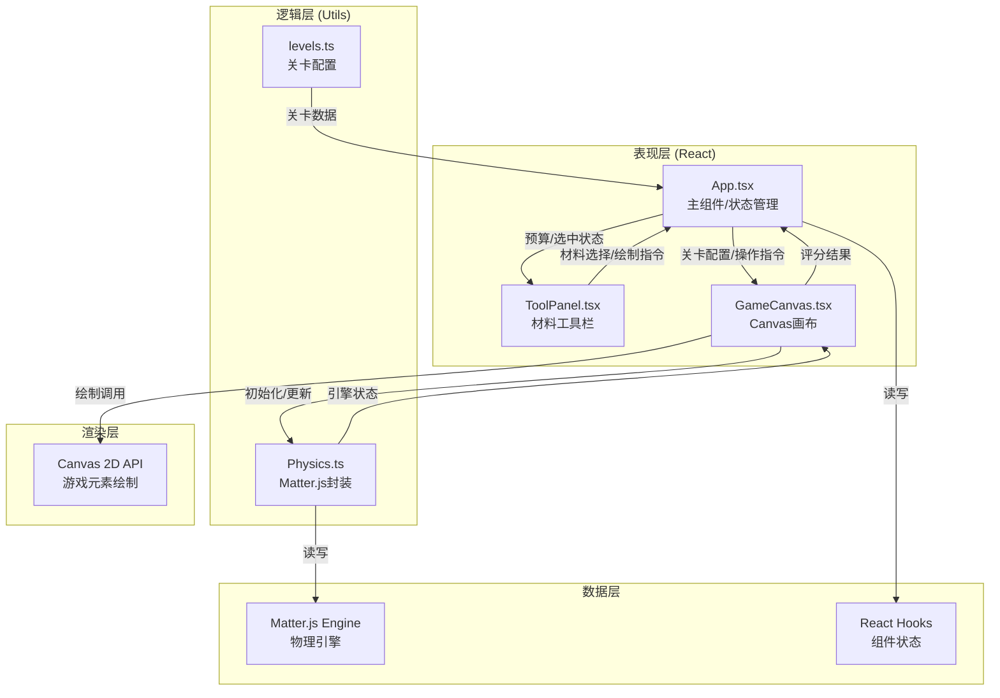

## 1. 架构设计



## 2. 技术栈说明
- **前端框架**：React 18 + TypeScript 5 (严格模式)
- **构建工具**：Vite 5 + @vitejs/plugin-react
- **物理引擎**：Matter.js 0.19 + @types/matter-js
- **渲染方式**：Canvas 2D API (无额外绘图库)
- **状态管理**：React Hooks (useState, useRef, useCallback, useEffect)，无需外部状态库
- **样式方案**：内联样式 + CSS变量 (深色科技风，无需Tailwind)

## 3. 项目结构

```
auto199/
├── index.html              # 入口页面 (引入Press Start 2P字体)
├── package.json            # 依赖配置
├── vite.config.js          # Vite配置 (路径别名 @ → src)
├── tsconfig.json           # TypeScript严格配置
└── src/
    ├── App.tsx             # 主组件：关卡管理/计时/分数/状态协调
    ├── components/
    │   ├── GameCanvas.tsx  # Canvas组件：物理更新/绘制/输入/断裂
    │   └── ToolPanel.tsx   # 工具栏：材料选择/预算计数/按钮
    └── utils/
        ├── Physics.ts      # Matter.js封装：引擎/材料/张力/断裂
        └── levels.ts       # 三关关卡配置：跨度/预算/深度
```

## 4. 核心数据模型

### 4.1 TypeScript类型定义

```typescript
// 材料类型
type MaterialType = 'wood' | 'steel' | 'rope';

// 材料属性
interface MaterialConfig {
  durability: number;    // 耐久度阈值
  cost: number;          // 单根成本
  color: string;         // 默认显示色
  name: string;          // 中文名称
}

// 关卡配置
interface LevelConfig {
  id: number;
  span: number;          // 桥面跨度 (px)
  depth: number;         // 河底深度 (px)
  timeLimit: number;     // 时间限制 (秒)
  budget: {
    wood: number;        // 木材根数
    steel: number;       // 钢材根数
    rope: number;        // 绳索根数
  };
}

// 节点
interface Node {
  x: number;
  y: number;
  id: string;
}

// 材料实例
interface BridgeMember {
  id: string;
  type: MaterialType;
  startNode: Node;
  endNode: Node;
  tension: number;       // 当前张力
  durability: number;    // 耐久度
  isBreaking: boolean;   // 是否正在断裂
  breakProgress: number; // 断裂进度 0-1
  body?: Matter.Body;    // 物理刚体引用
}

// 粒子
interface Particle {
  x: number;
  y: number;
  vx: number;
  vy: number;
  size: number;
  life: number;          // 剩余生命 (秒)
  maxLife: number;
  color: string;
}

// 游戏状态
type GamePhase = 'building' | 'running' | 'success' | 'failed';

// 评分结果
interface ScoreResult {
  base: number;          // 基础分
  materialBonus: number; // 材料剩余奖励
  weightPenalty: number; // 重量惩罚
  timeBonus: number;     // 时间奖励
  total: number;         // 总分
}
```

## 5. 核心算法

### 5.1 节点吸附算法
```
网格间距 GRID_SIZE = 30px
输入: 鼠标坐标 (mx, my)
输出: 吸附后坐标 (ax, ay)
  ax = round(mx / GRID_SIZE) * GRID_SIZE
  ay = round(my / GRID_SIZE) * GRID_SIZE
```

### 5.2 张力计算算法
```
对每根材料member:
  两端点A, B → 刚体pA, pB
  瞬时距离 d = dist(pA.position, pB.position)
  原长 L0 = member.originalLength
  应变 ε = |d - L0| / L0
  张力 T = k * ε  (k为弹性系数，因材料而异)
  member.tension = T
```

### 5.3 断裂判定与应力重分布
```
每帧检测所有材料:
  if member.tension > member.durability && !member.isBreaking:
    触发断裂流程:
      member.isBreaking = true
      生成10-15个碎片粒子于中点
      0.3秒后:
        从Matter.js移除该body
        从BridgeMembers列表移除
        剩余材料张力自动由物理引擎重分布
```

### 5.4 评分公式
```
base = 1000
materialBonus = (剩余木材*10 + 剩余钢材*25 + 剩余绳索*5) * 5
weight = Σ(每根材料长度 * 材料密度)
weightPenalty = floor(weight / kg) * 20
timeBonus = 剩余秒数 * 2
total = base + materialBonus - weightPenalty + timeBonus
```

### 5.5 受力颜色插值
```
输入: 张力-耐久度比值 r = tension/durability
输出: RGB颜色
  if r <= 0.3:
    #00FF00 (绿)
  elif r <= 0.7:
    t = (r - 0.3) / 0.4
    R = lerp(0, 255, t)
    G = lerp(255, 170, t)
    B = 0
    → 绿→黄插值
  else:
    t = (r - 0.7) / 0.3
    R = 255
    G = lerp(170, 0, t)
    → 黄→红插值
```

## 6. 性能优化策略

1. **物理引擎节流**：固定60Hz物理步长 (Matter.Engine.update delta=1000/60)，与渲染解耦
2. **Canvas绘制优化**：
   - 使用离屏Canvas预渲染网格背景
   - 节点/材料使用Path2D批量绘制
   - requestAnimationFrame驱动渲染
3. **粒子系统上限**：同屏粒子≤200，超出后FIFO淘汰
4. **对象池复用**：粒子对象池避免频繁GC
5. **Ref存储大对象**：Matter引擎、粒子数组、材料数组用useRef而非useState，减少React重渲染
6. **事件委托**：Canvas统一处理mousedown/mousemove/mouseup，不注册多个监听器
