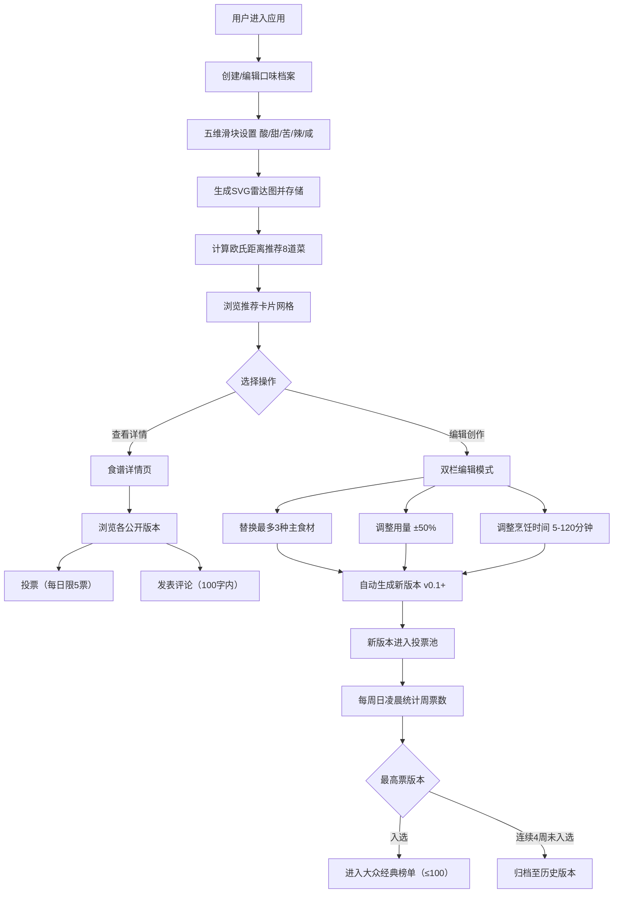

## 1. 产品概述

味觉图谱·食谱共创是一个基于个性化口味映射的协作式食谱分享平台，解决传统食谱平台缺乏个性化推荐和协作创作的痛点。用户通过五维口味档案获取精准推荐，可对食谱进行二次创作并通过社区投票遴选出大众经典版本。

- **核心价值**：个性化口味推荐 + 协作式食谱迭代 + 社区投票共识
- **目标用户**：美食爱好者、家庭主妇、烹饪初学者、创意厨师
- **市场定位**：社交化美食创作平台，结合AI推荐与UGC协作

## 2. 核心功能

### 2.1 用户角色

| 角色 | 注册方式 | 核心权限 |
|------|----------|----------|
| 普通用户 | 浏览器会话注册（无需登录） | 创建口味档案、浏览推荐、编辑食谱、投票评论 |

### 2.2 功能模块

1. **口味档案页**：五维滑块设置、雷达图可视化、修改历史记录
2. **食谱推荐页**：智能推荐列表、匹配度进度条、搜索筛选、翻页浏览
3. **我的创建页**：个人修改版本列表、版本管理
4. **大众经典页**：周度上榜食谱、历史版本归档
5. **食谱编辑页**：双栏对比编辑、食材替换、用量调整、时间修改、版本生成
6. **食谱详情页**：版本列表展示、投票功能、评论区

### 2.3 页面详情

| 页面名称 | 模块名称 | 功能描述 |
|----------|----------|----------|
| 口味档案页 | 五维滑块组 | 酸/甜/苦/辣/咸 0-100 拖拽滑块，实时更新雷达图 |
| 口味档案页 | SVG雷达图 | 五维渐变填充，中心透明向外半透明过渡 |
| 口味档案页 | 修改历史 | 最近5条记录，展示时间戳和改动差异 |
| 食谱推荐页 | 推荐卡片网格 | 8张推荐卡片，含缩略图、名称、匹配度进度条、投票数 |
| 食谱推荐页 | 搜索筛选栏 | 名称模糊搜索、口味标签筛选、食材搜索 |
| 食谱推荐页 | 排序分页 | 匹配度/更新时间/投票数排序，每页12条翻页 |
| 食谱编辑页 | 双栏对比布局 | 左栏固定原版v0.0，右栏可编辑当前版本 |
| 食谱编辑页 | 食材替换 | 最多替换3种主食材，从50种食材库选择 |
| 食谱编辑页 | 参数调整 | 用量-50%~+50%滑块，烹饪时间5-120分钟步长5分钟 |
| 食谱详情页 | 版本列表 | 所有公开版本，按投票数排序 |
| 食谱详情页 | 投票组件 | 每人每天限5票，赞成票按钮 |
| 食谱详情页 | 评论区 | 纯文本100字内评论输入与展示 |
| 大众经典页 | 榜单展示 | 最多100条周度冠军版本 |
| 大众经典页 | 历史归档 | 连续4周未上榜版本自动归档 |

## 3. 核心流程

### 3.1 主用户流程（自然语言）

用户首次进入 → 创建五维口味档案（拖拽滑块）→ 系统生成雷达图并存储 → 基于欧氏距离计算推荐8道菜 → 用户浏览推荐卡片 → 选中某道菜进入详情页 → 查看所有公开版本并投票/评论 → 或进入编辑模式 → 双栏对比编辑（替换食材、调用量、改时间）→ 系统自动生成新版本（版本号递增）→ 新版本进入社区投票池 → 每周日凌晨统计周票数 → 最高票进入大众经典榜单 → 连续4周未上榜则归档

### 3.2 Mermaid 流程图

## 4. 用户界面设计

### 4.1 设计风格

- **主色系**：暖色系米杏 #F5E6D3（背景主色）
- **重点色**：暖棕褐 #D4A373（按钮、进度条、强调元素）
- **文字色**：深咖棕 #3D2B1F（所有文本）
- **圆角设计**：所有菜单/按钮采用 12px 柔和圆角
- **悬停效果**：鼠标悬停卡片缩放 1.03 倍，0.2s ease-out 过渡
- **涟漪动画**：点击元素产生 0.4s 涟漪扩散动效
- **设计理念**：温暖自然、食物质感、家的味道

### 4.2 页面设计概览

| 页面名称 | 模块名称 | UI元素风格 |
|----------|----------|------------|
| 全局框架 | 左侧导航栏 | 220px宽固定栏，4个标签项，暖棕图标+文字 |
| 全局框架 | 主内容区 | 卡片式网格布局，280px宽卡片 |
| 口味档案页 | 雷达图 | SVG五边形渐变填充（中心透明→外围半透明#D4A373） |
| 口味档案页 | 滑块组 | 5条横向滑块，轨道#F5E6D3，滑块头#D4A373圆形 |
| 食谱推荐页 | 卡片 | 上图片下文字，匹配度进度条（绿到红渐变），投票数徽标 |
| 食谱推荐页 | 搜索栏 | 圆角输入框，下拉标签多选，排序切换按钮组 |
| 食谱编辑页 | 双栏容器 | 左右各50%，中间分割线，左半透明遮罩标记"原版" |
| 食谱编辑页 | 食材列表 | 每行食材+用量输入+替换按钮，行高均匀排列 |
| 食谱详情页 | 版本时间线 | 垂直时间线展示各版本，投票按钮在右侧 |
| 大众经典页 | 榜单卡片 | 带排名徽章（#1-#3金色），入选日期标签 |

### 4.3 响应式设计

- **桌面优先（≥1024px）**：左侧220px导航展开，卡片网格每行3-4张
- **平板端（768px-1024px）**：导航栏保留，卡片每行2张
- **移动端（<768px）**：导航折叠为顶部汉堡菜单，卡片单列布局，编辑双栏改为上下堆叠

### 4.4 交互细节

- **涟漪动画**：所有可点击元素在点击时从触点产生圆形波纹扩散，0.4s完成，使用CSS radial-gradient + transform 实现
- **懒加载图片**：卡片缩略图使用 loading="lazy" + IntersectionObserver，淡入过渡
- **进度条**：匹配度百分比进度条，从<50%红色→50-75%黄色→>75%绿色渐变
- **滑块反馈**：拖拽滑块时实时更新雷达图对应顶点位置，带缓动过渡
