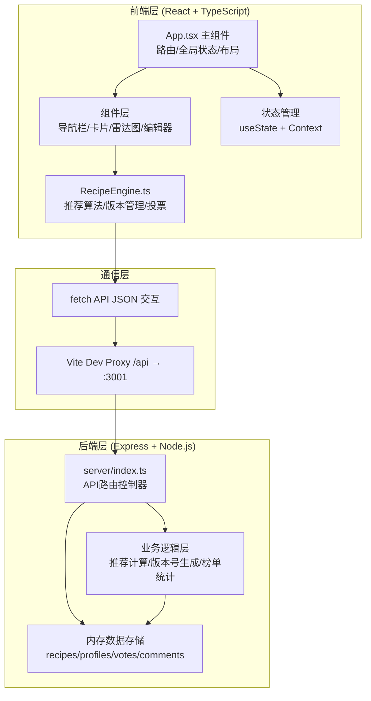
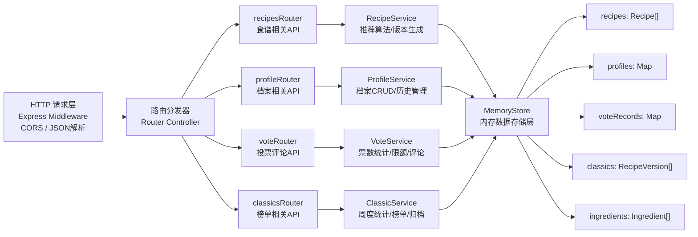
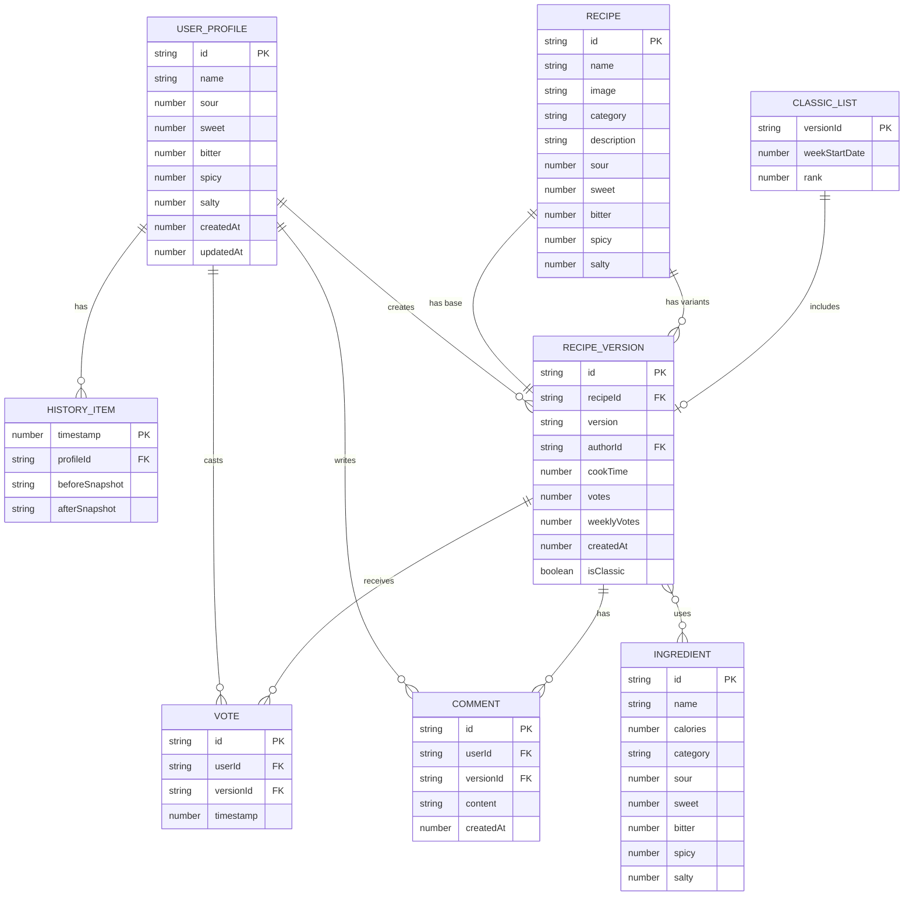

## 1. 架构设计



## 2. 技术选型说明

| 层级 | 技术栈 | 版本要求 | 用途说明 |
|------|--------|----------|----------|
| 构建工具 | Vite | 5.x | 前端构建，HMR热更新，代理配置 |
| 前端框架 | React | 18.x | 组件化UI开发，Hooks API |
| 语言 | TypeScript | 5.x | 严格类型检查，接口定义 |
| 后端框架 | Express | 4.x | RESTful API服务 |
| 后端运行 | ts-node | 10.x | 直接运行TS后端代码 |
| 状态管理 | React Context | 内置 | 全局用户会话、口味档案状态 |
| 图表渲染 | 原生SVG | - | 雷达图绘制，无需第三方库 |
| 数据存储 | 内存数组 | - | recipes/profiles/votes/comments 内存存储 |

## 3. 路由定义

### 3.1 前端路由（React 内切换，单页应用）

| 路由路径 | 页面组件 | 功能说明 |
|----------|----------|----------|
| `/profile` | ProfilePage | 口味档案创建与管理，雷达图，历史记录 |
| `/recommend` | RecommendPage | 智能推荐列表，搜索筛选，分页浏览 |
| `/my-recipes` | MyRecipesPage | 用户创建/修改的版本列表 |
| `/classics` | ClassicsPage | 大众经典榜单，历史版本归档 |
| `/recipe/:id` | RecipeDetailPage | 食谱详情，版本列表，投票评论 |
| `/recipe/:id/edit` | RecipeEditPage | 双栏编辑模式，生成新版本 |

### 3.2 后端API路由

| 方法 | 路径 | 请求体/参数 | 返回 | 功能说明 |
|------|------|-------------|------|----------|
| GET | `/api/recipes` | query: page,size,sort,search,taste,ingredient | Recipe[] | 搜索/筛选/分页获取食谱列表 |
| GET | `/api/recipes/recommend` | query: sour,sweet,bitter,spicy,salty | RecipeWithMatch[] | 基于口味档案推荐8道菜 |
| GET | `/api/recipes/:id` | param: id | RecipeDetail | 获取单食谱详情含所有版本 |
| GET | `/api/recipes/:id/versions` | param: id | Version[] | 获取食谱所有公开版本 |
| POST | `/api/recipes/:id/versions` | param: id, body: VersionData | Version | 创建新版本（编辑后提交） |
| GET | `/api/profile` | query: userId | UserProfile | 获取用户口味档案 |
| POST | `/api/profile` | body: ProfileData | UserProfile | 创建/更新口味档案 |
| GET | `/api/profile/history` | query: userId | HistoryItem[] | 获取最近5条修改历史 |
| POST | `/api/vote` | body: {userId, recipeId, versionId} | VoteResult | 投赞成票（每日限5票） |
| GET | `/api/vote/stats` | query: userId | VoteStats | 获取用户今日剩余票数 |
| POST | `/api/comment` | body: {userId, recipeId, versionId, content} | Comment | 发表评论（100字内） |
| GET | `/api/classics` | - | Recipe[] | 获取大众经典榜单（≤100条） |
| GET | `/api/ingredients` | - | Ingredient[] | 获取50种食材库列表 |
| POST | `/api/cron/weekly` | (内部调用) | StatsResult | 周度榜单统计模拟接口 |

## 4. API 类型定义

```typescript
// 五维口味档案
interface TasteProfile {
  sour: number;   // 0-100
  sweet: number;  // 0-100
  bitter: number; // 0-100
  spicy: number;  // 0-100
  salty: number;  // 0-100
}

// 食材定义
interface Ingredient {
  id: string;
  name: string;
  calories: number;       // 每100g热量
  taste: TasteProfile;    // 口味偏量（相对权重0-10）
  category: string;       // 分类：肉类/蔬菜/调料/主食/水产
}

// 食谱版本
interface RecipeVersion {
  version: string;           // "v0.0" / "v0.1" ... "v9.9"
  authorId: string;
  authorName: string;
  createdAt: number;         // 时间戳
  ingredients: {
    id: string;
    name: string;
    amount: number;          // 克
    unit: string;
    isReplaced?: boolean;
    originalId?: string;
  }[];
  cookTime: number;          // 分钟 5-120
  steps: string[];
  votes: number;             // 当前累计票数
  weeklyVotes: number;       // 本周票数
  weekRankHistory: (number | null)[]; // 最近4周排名，null=未上榜
  comments: Comment[];
  isClassic?: boolean;
  classicDate?: number;
}

// 食谱主体
interface Recipe {
  id: string;
  name: string;
  image: string;             // 图片URL/占位图
  taste: TasteProfile;       // 原版口味维度 0-10
  baseVersion: RecipeVersion; // v0.0 原版
  versions: RecipeVersion[]; // 所有修改版本
  category: string;          // 菜系分类
  description: string;
  updatedAt: number;
}

// 推荐结果（带匹配度）
interface RecipeWithMatch extends Recipe {
  matchScore: number;        // 0-100 百分比
  matchLabel?: '正常' | '可能不符合口味';
}

// 用户档案
interface UserProfile {
  id: string;
  name: string;
  taste: TasteProfile;
  createdAt: number;
  updatedAt: number;
  history: HistoryItem[];    // 最近5条
}

// 修改历史
interface HistoryItem {
  timestamp: number;
  before: TasteProfile;
  after: TasteProfile;
}

// 评论
interface Comment {
  id: string;
  userId: string;
  userName: string;
  content: string;           // ≤100字
  createdAt: number;
}

// 投票结果
interface VoteResult {
  success: boolean;
  remainingVotes: number;
  totalVotes: number;
  message?: string;
}
```

## 5. 服务器架构图



## 6. 数据模型

### 6.1 ER 关系图



### 6.2 初始化数据说明

- **食谱库**：30道基础菜肴，每道菜含 5 维口味标签（0-10），涵盖川菜、粤菜、鲁菜、家常菜、甜品等类别
- **食材库**：50种食材，覆盖肉类（猪肉、牛肉、鸡肉、鱼、虾等）、蔬菜（白菜、萝卜、番茄、青椒等）、调料（酱油、醋、糖、盐、辣椒等）、主食（米、面、土豆等）、水产海鲜类
- **示例档案**：内置一个示例用户档案用于首次展示效果
- **版本种子**：部分食谱预置 2-3 个用户修改版本，展示版本对比和投票效果

## 7. 启动配置

### 7.1 端口分配
- 前端 Vite 开发服务器：`http://localhost:5173`
- 后端 Express API 服务：`http://localhost:3001`
- Vite 代理规则：`/api/**` → `http://localhost:3001/api/**`

### 7.2 启动脚本
```bash
npm install      # 安装所有依赖
npm run dev      # 同时启动前后端（concurrently）
                 # 前端: vite
                 # 后端: ts-node server/index.ts
```
