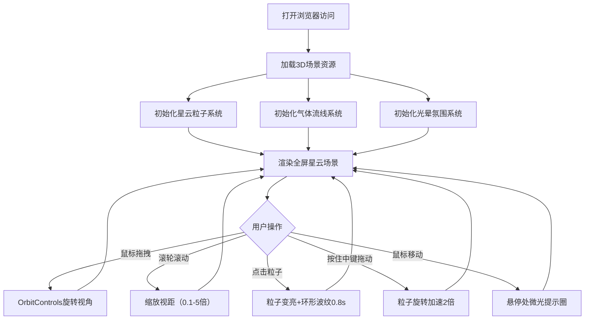

## 1. 产品概述

「星云幻境」是一款面向科学传播场景的沉浸式3D交互可视化应用，让参观者通过浏览器自由探索绚丽的太空星云世界。应用通过真实感的粒子系统、动态气体流线和光晕特效，营造出深邃而神秘的宇宙氛围。

- 目标用户：科技馆参观者、天文爱好者、教育场景中的学生和教师
- 核心价值：将抽象的天文概念转化为可感知、可交互的可视化体验，激发对宇宙科学的兴趣

## 2. 核心功能

### 2.1 用户角色
无需注册登录，所有访问者拥有完整的探索权限。

| 角色 | 注册方式 | 核心权限 |
|------|----------|----------|
| 参观者 | 直接访问 | 自由旋转视角、缩放、拖拽、点击粒子互动 |

### 2.2 功能模块
1. **星云粒子系统**：8000颗恒星粒子，球坐标随机分布，位置渐变着色，自转与闪烁动画
2. **气体流线系统**：200条螺旋延伸的气体尘埃流，暖橙到冷紫的渐变色彩
3. **光晕氛围系统**：15-20个公转发光点，鼠标悬停微光提示圈
4. **交互控制系统**：OrbitControls视角控制，点击粒子特效，中键加速旋转

### 2.3 页面详情
| 页面名称 | 模块名称 | 功能描述 |
|----------|----------|----------|
| 主场景页 | 星云粒子系统 | 8000个粒子BufferGeometry，半径200-400单位球体分布，核心白黄→外围蓝紫渐变，随机大小0.5-3单位，Y轴自转0.005rad/帧，透明度正弦波动闪烁 |
| 主场景页 | 气体流线系统 | 200条螺旋线，每条30个点，从核心向外延伸，暖橙(#FF8C00)→冷紫(#8B5CF6)渐变，线宽0.2，透明度脉动 |
| 主场景页 | 光晕氛围系统 | 15-20个半透明发光点（#FF6B6B/#4ECDC4/#FFE66D），30-60秒随机公转周期，鼠标悬停微光提示 |
| 主场景页 | 交互控制系统 | 拖拽旋转视角，滚轮缩放0.1-5倍，点击粒子变亮+环形波纹，中键拖动2倍速旋转 |

## 3. 核心流程

参观者打开应用后进入全屏3D星云场景：可以自由拖拽鼠标旋转视角观察星云不同角度，滚动滚轮缩放距离远近，点击任意恒星触发高亮波纹特效，按住鼠标中键拖动加速星云旋转，鼠标移动时悬停位置显示微光提示圈。

## 4. 用户界面设计

### 4.1 设计风格
- **主色调**：深邃太空蓝紫（背景 #0a0a1a），核心白黄（#FFF4D6），外围蓝紫（#8B5CF6）
- **点缀色**：暖橙（#FF8C00）、珊瑚红（#FF6B6B）、青绿色（#4ECDC4）、明黄色（#FFE66D）
- **视觉风格**：无UI控件的纯沉浸式3D场景，所有发光元素带柔和半透明光晕，避免刺眼高光
- **字体**：'Segoe UI'、'Poppins' 作为界面文字（界面极简，文字极少）
- **交互反馈**：鼠标悬停粒子/线条时变为pointer光标，点击时通过粒子亮度提升模拟触感反馈

### 4.2 页面设计概述
| 页面名称 | 模块名称 | UI元素 |
|----------|----------|--------|
| 主场景页 | 3D Canvas | 全屏黑色背景(#0a0a1a)，无任何UI控件，纯3D渲染区域 |
| 主场景页 | 星云粒子 | 8000点，白黄→蓝紫径向渐变，大小0.5-3，随机闪烁，整体绕Y轴缓慢自转 |
| 主场景页 | 气体流线 | 200条螺旋半透明线，暖橙→冷紫渐变，随距离核心渐远变色 |
| 主场景页 | 光晕光斑 | 15-20个彩色发光点，随机轨道公转，柔和发光边缘 |
| 主场景页 | 悬停提示 | 鼠标位置微光圈，半透明柔和光晕 |

### 4.3 响应式
- **桌面端优先**：全屏Canvas自适应窗口大小
- **触摸适配**：OrbitControls原生支持触摸手势（双指缩放、单指旋转）
- **窗口resize**：自动调整渲染分辨率和相机宽高比

### 4.4 3D场景指导
- **环境氛围**：纯黑深空背景，无HDRI，靠自发光粒子营造光照
- **光照设置**：无额外光源，所有视觉元素使用自发光材质（Additive Blending）
- **相机设置**：PerspectiveCamera，初始位置(0,0,500)，fov=75，near=0.1，far=5000
- **相机运动**：OrbitControls，target=(0,0,0)，dampingFactor=0.05，enableDamping=true，minDistance=50，maxDistance=2500
- **构图焦点**：星云中心为视觉焦点，粒子密度中心高外围低，形成层次感
- **交互动画**：
  - 星云整体Y轴自转：0.005rad/帧
  - 粒子透明度闪烁：sin(t * freq * 2π) * 0.2 + 0.8，freq 0.1-0.5Hz
  - 点击波纹：半径从粒子大小扩展至10倍，透明度从1→0，0.8秒
  - 光晕公转：椭圆轨道，周期30-60秒
- **后处理**：无需额外后处理，靠Additive Blending和半透明实现辉光感
- **性能预算**：粒子≤10000，线条≤250，FPS≥50
