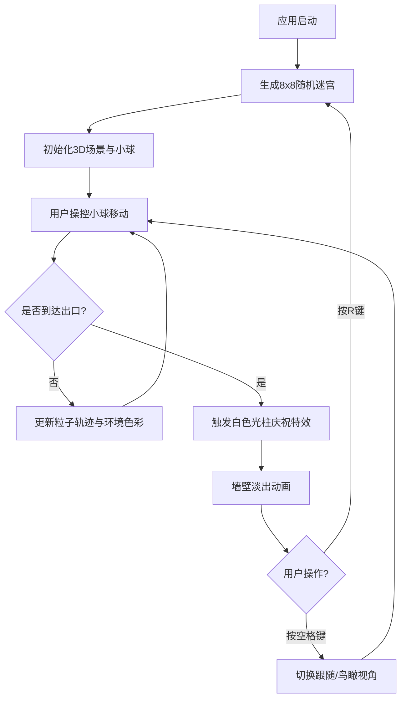

## 1. 产品概述
「光之迷宫」是一个基于Three.js的三维交互式迷宫可视化应用，用户操控发光小球在由半透明彩色玻璃墙构成的迷宫中探索寻找出口。应用通过动态光影、粒子轨迹、色彩渐变等视觉效果营造沉浸式空间体验，解决传统迷宫游戏缺乏动态光影引导和空间沉浸感的问题。

- 核心功能：随机迷宫生成、3D空间探索、动态光影渲染、粒子特效、进度可视化
- 目标用户：对3D交互视觉艺术、迷宫解谜感兴趣的用户
- 产品价值：提供独特的沉浸式空间探索体验，结合艺术化的视觉反馈机制

## 2. 核心功能

### 2.1 功能模块

1. **3D迷宫场景**：随机8x8迷宫生成、半透明玻璃墙渲染、动态聚光灯、地面网格
2. **玩家控制**：发光小球、WASD/方向键移动、呼吸脉动动画、速度驱动色彩渐变
3. **视觉反馈系统**：粒子轨迹残留、探索进度驱动的环境色彩演化、地面网格高亮
4. **通关庆祝**：白色光柱特效、墙壁淡出动画
5. **交互控制**：R键重置迷宫、空格键切换视角（跟随/鸟瞰）
6. **HUD界面**：探索进度百分比、幸存时间、操作提示

### 2.2 功能详情

| 功能模块 | 子功能 | 详细描述 |
|---------|--------|---------|
| 迷宫生成 | 随机迷宫 | 使用递归回溯算法生成8x8二维迷宫数组，每次重置重新生成 |
| 迷宫生成 | 出入口定位 | 入口固定在左上角(0,0)，出口固定在右下角(7,7) |
| 光影渲染 | 玻璃墙材质 | 半透明彩色玻璃质感（透明度0.3-0.6），带漫反射光晕 |
| 光影渲染 | 动态聚光灯 | 顶部投射旋转聚光灯，色温2800K-6500K循环变化 |
| 小球控制 | 移动系统 | WASD/方向键控制小球在通道中移动，碰撞检测防止穿墙 |
| 小球控制 | 呼吸脉动 | 半径在0.25-0.35之间以1Hz频率变化 |
| 小球控制 | 色彩渐变 | 小球颜色随移动速度从蓝色渐变到粉色 |
| 粒子轨迹 | 残留效果 | 每帧生成10个粒子，生命周期3秒，逐渐淡出 |
| 进度演化 | 地面高亮 | 已探索通道网格从暗灰色渐变到亮金色 |
| 进度演化 | 墙壁色移 | 墙壁主色调从靛蓝色(#4A00E0)到橙红色(#FF512F)平滑过渡 |
| 通关特效 | 白色光柱 | 出口位置10单位高白色半透明光柱，100个升腾粒子 |
| 通关特效 | 墙壁淡出 | 所有墙壁瞬间变白并在3秒内淡出 |
| 视角控制 | 跟随视角 | 默认相机跟随小球后方移动 |
| 视角控制 | 鸟瞰视角 | 相机抬升20单位，45度俯视整个迷宫 |
| HUD界面 | 进度显示 | 左上角显示探索进度百分比和幸存时间 |
| HUD界面 | 操作提示 | 右上角显示按键操作说明 |

## 3. 核心流程

用户打开应用 → 系统随机生成迷宫并初始化场景 → 用户操控发光小球开始探索 → 小球移动留下粒子轨迹，环境色彩随进度演化 → 用户找到出口触发光柱庆祝特效 → 用户按R键重置或按空格键切换视角 → 循环进行

## 4. 用户界面设计

### 4.1 设计风格

- **主色调**：深空黑背景(#0B0C10) + 靛蓝色(#4A00E0) → 橙红色(#FF512F)渐变系统
- **辅助色**：蓝紫色环境光、亮金色进度高亮、白色通关特效
- **字体风格**：发光字体效果（text-shadow模拟），现代无衬线字体
- **HUD风格**：深灰半透明底色(rgba(20,20,30,0.7))，圆角8px
- **整体氛围**：神秘、沉浸式、艺术化的赛博奇幻风格

### 4.2 界面布局

| 区域 | 元素 | UI细节 |
|------|------|--------|
| 全屏 | 3D场景 | Three.js渲染，深空黑背景，蓝紫色环境光 |
| 左上角 | 进度HUD | 半透明深灰底，圆角8px，发光文字显示进度%和时间 |
| 右上角 | 操作提示 | 半透明深灰底，圆角8px，发光文字显示按键说明 |
| 场景中心 | 发光小球 | 自发光材质，辉光效果，呼吸脉动动画 |
| 场景通道 | 粒子轨迹 | 小球颜色，淡出效果，辉光叠加 |

### 4.3 响应式设计

- 桌面端（≥768px）：HUD横向布局，标准字号
- 移动端（<768px）：HUD元素字号缩小至12px，纵向堆叠排列
- 场景始终全屏适配，保持正确宽高比

### 4.4 3D场景指导

- **环境与氛围**：深空黑色背景(#0B0C10)，柔和蓝紫色环境光营造神秘氛围
- **光照设置**：
  - 环境光：蓝紫色柔和环境光（强度0.4）
  - 聚光灯：顶部动态旋转聚光灯，色温2800K-6500K循环，带阴影投射
  - 点光源：小球自发光作为移动点光源
- **相机设置**：
  - 跟随视角：位于小球后方约5单位，上方3单位，平滑跟随
  - 鸟瞰视角：迷宫正上方20单位，俯视45度，查看全局
- **构图与焦点**：迷宫居中，入口在左下前方，出口在右上后方，形成对角线探索路径
- **交互与动画**：
  - 小球呼吸脉动（1Hz）
  - 聚光灯缓慢旋转（30秒/圈）
  - 粒子生成与淡出（3秒生命周期）
  - 墙壁颜色平滑过渡
  - 通关光柱升腾动画
- **后期处理**：
  - 辉光效果（Bloom）：用于小球和粒子的发光效果
  - 色调映射：ACESFilmicToneMapping增强视觉效果
- **性能预算**：
  - FPS ≥ 30
  - 粒子总数 ≤ 5000
  - 墙多边形 ≤ 200（每墙2个三角形）
