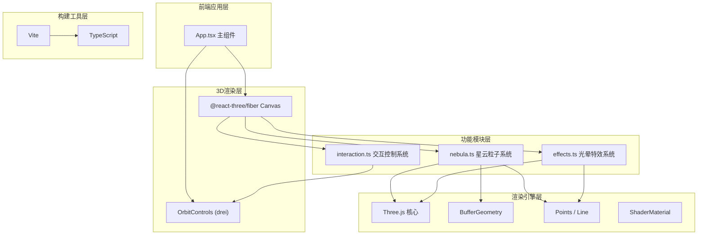

## 1. 架构设计

本项目为纯前端3D可视化应用，采用分层架构：视图层负责3D渲染，业务层负责各功能模块，数据层为程序生成的几何数据。



**模块调用关系与数据流向：

1. **App.tsx → nebula.ts：调用 `createNebulaSystem()` 获取粒子系统对象和流线组，挂载到3D场景

2. **App.tsx → effects.ts：调用 `createGlowSystem()` 获取光晕系统对象组，每帧调用 `updateGlowPositions(time)`

3. **App.tsx → interaction.ts：`setupInteractionHandlers(scene, controls, onParticleClick, onMiddleMouse)` 注册事件监听

4. 数据流向总览：

| 数据项 | 来源模块 | 流向模块 | 说明 |
|-------|----------|----------|------|
| 粒子BufferGeometry | nebula.ts | R3F Canvas | 8000点位置/颜色/大小属性 |
| 流线Line | nebula.ts | R3F Canvas | 200条螺旋线 |
| 光晕Mesh | effects.ts | R3F Canvas | 15-20发光点 |
| 鼠标NDC坐标 | interaction.ts | effects.ts | 更新悬停提示圈位置 |
| 点击粒子索引 | interaction.ts | nebula.ts | 触发粒子高亮波纹 |
| 中键状态 | interaction.ts | nebula.ts | 控制旋转速度倍率 |
| 时间帧 | useFrame(R3F) | 全部模块 | 驱动所有动画更新 |

## 2. 技术描述

- **前端框架**：React@18 + TypeScript@5
- **3D渲染**：Three.js@0.160 + @react-three/fiber@8 + @react-three/drei@9
- **构建工具**：Vite@5 + @vitejs/plugin-react@4
- **状态管理**：纯React hooks (useRef, useState, useEffect)，无需zustand（单页无复杂状态）
- **样式方案**：原生CSS (styles.css)
- **初始化方式**：Vite React+TS模板（react-ts）

## 3. 文件结构与职责

```
auto20/
├── package.json          # 依赖声明与启动脚本
├── vite.config.js      # Vite构建配置（React+TS支持
├── tsconfig.json    # TS严格模式配置
├── index.html      # 入口HTML（全屏，黑色背景
└── src/
    ├── App.tsx          # 主组件：Canvas初始化、场景装配、帧循环
    ├── nebula.ts      # 核心：粒子系统、气体流线、动画逻辑
    ├── effects.ts     # 光晕：漂浮光晕、鼠标悬停提示圈
    ├── interaction.ts # 交互：点击特效、中键加速、光标样式
    └── styles.css     # 全局样式
```

**各文件详细职责：

- **App.tsx**：装配层，无渲染R3F Canvas，配置相机(0,0,500)，引入OrbitControls，加载nebula/effects/interaction三个模块，在useFrame中驱动每帧更新动画

- **nebula.ts**：数据生成层，createParticleGeometry()生成8000粒子BufferGeometry，createGasStreams()生成200流线，返回{ particlesRef.current.rotation.y += 0.005 * speedMul 每帧更新粒子闪烁通过自定义shader或attribute更新透明度

- **effects.ts**：createGlowPoints()生成15-20发光Sprite/Mesh，updateGlowPositions()更新公转，createHoverIndicator()悬停提示

- **interaction.ts**：setupInteraction()注册pointerdown/middleclick/mousemove事件，raycaster拾取粒子，触发波纹动画，管理中键状态标志位

## 4. 核心数据结构

```typescript
// nebula.ts - 粒子系统返回值

type ParticleSystem = {
  points: THREE.Points;          // 8000粒子
  streamGroup: THREE.Group;          // 200流线
  baseRotationSpeed: number;     // = 0.005
  rotationMultiplier: React.MutableRefObject<number>;  // 中键加速时=2，否则=1
  twinkleSpeeds: Float32Array;  // 8000个0.1-0.5Hz的随机值

  // 每帧调用：
  animate: (time: number) => void;

  // 触发粒子高亮：

  highlightParticle: (index: number) => void;  // 点击回调
}

// effects.ts - 光晕系统返回值

type GlowSystem = {
  glowGroup: THREE.Group;     // 15-20发光点
  hoverIndicator: THREE.Mesh;  // 鼠标悬停提示圈
  glowOrbits: Array<{
    radiusX: number;
    radiusZ: number;
    phase: number;
    speed: number;     // rad/s，对应30-60s周期
    inclination: number;  // 轨道倾角
  }>;

  // 每帧更新：
  update: (time: number, mouseNdc: THREE.Vector2, camera: THREE.Camera) => void;
}

// interaction.ts - 交互管理器

type InteractionManager = {
  isMiddleDown: boolean;

  setup: (
    canvas: HTMLCanvasElement,
    particles: THREE.Points,
    onParticleClick: (idx: number, worldPos: THREE.Vector3) => void,
    onMiddleStateChange: (pressed: boolean) => void,
    onMouseMove: (ndc: THREE.Vector2) => void
  ) => void;

  cleanup: () => void;  // 卸载时移除监听
}
```

## 5. 性能优化策略

| 优化项 | 方案 |
|--------|------|
| 几何体 | BufferGeometry + typed数组，直接操作attribute数组避免GC |
| 剔除 | frustumCulled=true（默认），大包围盒 |
| 材质 | ShaderMaterial / PointsMaterial，AdditiveBlending避免深度排序开销 |
| 动画 | 全部在GPU（自定义shader中计算闪烁，CPU仅更新uniform.time |
| 拾取 | raycaster仅pointerdown时触发，非每帧 |
| 波纹 | 一次性创建固定Pool复用Ripple对象池，避免频繁创建销毁 |

## 6. 渲染管线配置

**相机**：
```
PerspectiveCamera {
  fov: 75,
  aspect: window.innerWidth / window.innerHeight,
  near: 0.1,
  far: 5000,
  position: (0, 0, 500)
}
```

**渲染器**：
```
WebGLRenderer {
  antialias: true,
  alpha: false,
  powerPreference: 'high-performance'
}
setPixelRatio(Math.min(window.devicePixelRatio, 2)
```

**OrbitControls**：
```
{
  enableDamping: true,
  dampingFactor: 0.05,
  minDistance: 50,   // ~0.1倍基础距离500
  maxDistance: 2500,   // ~5倍
  enablePan: true,
  screenSpacePanning: false
}
```
