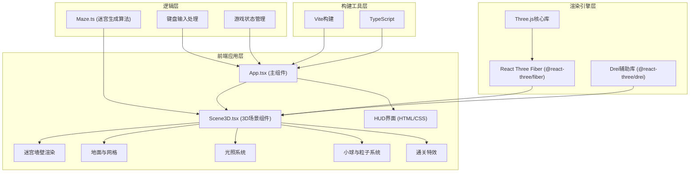

## 1. 架构设计



## 2. 技术说明

- **前端框架**：React@18 + TypeScript
- **构建工具**：Vite@5 + @vitejs/plugin-react
- **3D渲染引擎**：Three.js + @react-three/fiber + @react-three/drei
- **类型定义**：@types/three
- **状态管理**：React Hooks (useState, useRef, useEffect, useFrame)
- **样式方案**：内联CSS + CSS变量，发光文字通过text-shadow实现
- **初始化方式**：Vite react-ts模板

## 3. 模块设计

### 3.1 文件结构

| 文件路径 | 职责说明 |
|---------|---------|
| package.json | 项目依赖与启动脚本配置 |
| vite.config.js | Vite构建配置，React插件支持 |
| tsconfig.json | TypeScript严格模式配置，esnext模块 |
| index.html | 入口HTML页面，全屏容器 |
| src/App.tsx | React主组件：场景初始化、状态管理、HUD渲染、键盘事件 |
| src/Maze.ts | 迷宫生成逻辑：递归回溯算法、出入口计算 |
| src/Scene3D.tsx | 3D场景组件：所有Three.js元素的声明式渲染 |

### 3.2 核心数据类型定义

```typescript
// 迷宫单元格类型
interface Cell {
  x: number;
  y: number;
  walls: { top: boolean; right: boolean; bottom: boolean; left: boolean };
  visited: boolean;
}

// 迷宫数据类型
interface MazeData {
  grid: Cell[][];
  size: number;
  entry: { x: number; y: number };
  exit: { x: number; y: number };
  totalPassages: number;
}

// 粒子类型
interface Particle {
  position: THREE.Vector3;
  color: THREE.Color;
  life: number;
  maxLife: number;
  size: number;
}

// 游戏状态
interface GameState {
  progress: number;        // 探索进度 0-1
  elapsedTime: number;     // 幸存时间（秒）
  isBirdView: boolean;     // 是否鸟瞰视角
  isCompleted: boolean;    // 是否通关
  ballPosition: { x: number; z: number };
  ballColor: string;
  exploredCells: Set<string>;
}
```

### 3.3 关键模块职责

#### Maze.ts - 迷宫生成模块
- `generateMaze(size: number): MazeData` - 递归回溯算法生成迷宫
- `getMazeData(): MazeData` - 导出迷宫数据供场景使用
- `getEntryExit(): { entry: Point; exit: Point }` - 获取出入口坐标

#### Scene3D.tsx - 3D场景渲染模块
- **MazeWalls组件**：渲染迷宫墙壁（半透明玻璃材质），根据进度更新颜色
- **GroundGrid组件**：渲染地面网格，已探索区域高亮
- **LightingSystem组件**：环境光 + 动态旋转聚光灯
- **PlayerBall组件**：发光小球，呼吸脉动，移动碰撞检测
- **TrailParticles组件**：轨迹粒子系统（对象池，上限5000）
- **CelebrationEffect组件**：通关光柱与墙壁淡出特效

#### App.tsx - 主应用组件
- 管理游戏全局状态（进度、时间、视角、通关状态）
- 键盘事件监听（WASD/方向键移动、R重置、空格切换视角）
- HUD界面渲染（进度百分比、时间、操作提示）
- 响应式样式适配

## 4. 关键实现方案

### 4.1 迷宫生成算法（递归回溯）
```
1. 创建8x8网格，所有单元格初始化为四面有墙
2. 从(0,0)开始，标记当前格为已访问
3. 随机选择一个未访问的相邻格
4. 打通两格之间的墙，移动到该格并标记访问
5. 递归继续，若无未访问邻居则回溯
6. 完成后，入口(0,0)开口，出口(7,7)开口
```

### 4.2 小球移动与碰撞检测
- 小球位置 = 连续浮点坐标 (x, z)，对应迷宫格坐标 (floor(x), floor(z))
- 移动时检查目标格与当前格之间是否有墙
- 若墙存在则阻止移动，否则平滑移动
- 每帧最大移动距离 = speed * deltaTime

### 4.3 粒子系统优化
- 使用对象池管理粒子，避免频繁GC
- 轨迹粒子：每帧新增10个，生命周期3秒，超出5000上限则复用最旧粒子
- 庆祝粒子：通关时一次性生成100个升腾粒子
- 粒子使用Points + BufferGeometry批量渲染

### 4.4 进度驱动色彩系统
- 进度值 `progress = exploredCells.size / totalPassages`
- 墙壁颜色：靛蓝(#4A00E0) → 橙红(#FF512F) 线性插值
- 小球颜色：蓝色 → 粉色，基于移动速度插值
- 地面网格：暗灰 → 亮金色，基于是否访问过

### 4.5 性能保障措施
- 墙壁使用InstancedMesh批量渲染（< 200多边形）
- 粒子系统限制总数 ≤ 5000
- useFrame中避免创建新对象，重用向量和颜色对象
- 必要时使用Three.js LOD或距离剔除

## 5. 性能指标

| 指标 | 目标值 | 实现方式 |
|------|--------|---------|
| 帧率 | ≥ 30 FPS | InstancedMesh、粒子池、对象复用 |
| 粒子上限 | ≤ 5000个 | 对象池循环复用 |
| 墙多边形 | ≤ 200 | 每墙2三角形 × 最大100面墙 |
| 响应延迟 | < 50ms | 直接键盘事件驱动，无节流 |
