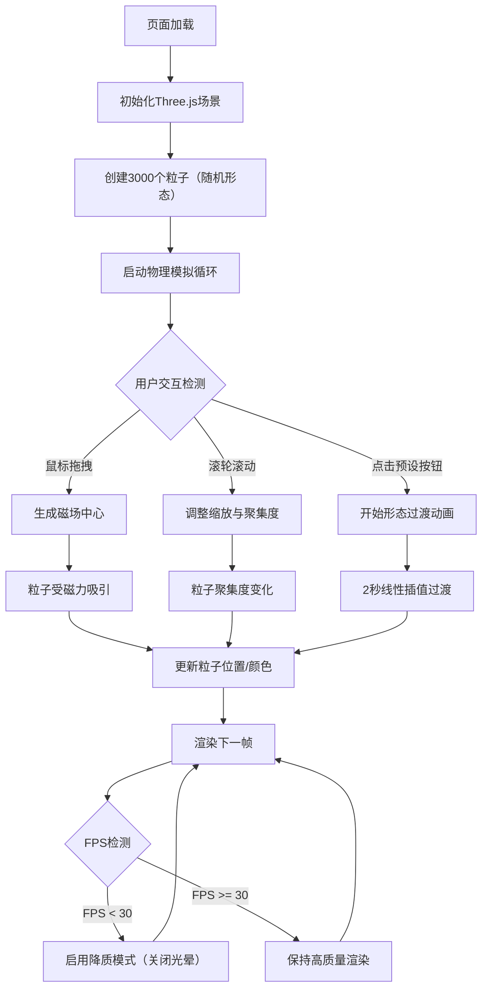

## 1. 产品概述
「磁流体雕塑」是一款基于WebGL的3D交互式可视化应用，让用户在浏览器中操控由数千个磁性粒子构成的动态流体雕塑。目标用户为独立创作者、艺术爱好者和对物理模拟感兴趣的开发者。产品价值在于通过直观的交互体验展现磁力物理模拟的美学魅力。

## 2. 核心功能

### 2.1 用户角色
无多角色区分，所有用户均可使用全部功能。

### 2.2 功能模块
1. **主场景页面**：3D粒子系统渲染、磁力物理模拟、鼠标交互、预设形态切换、性能监控

### 2.3 页面详情
| 页面名称 | 模块名称 | 功能描述 |
|---------|---------|---------|
| 主场景 | 3D粒子系统 | 渲染3000个磁性粒子，实时更新位置与颜色 |
| 主场景 | 磁力物理引擎 | 粒子间吸引/排斥力计算、阻尼衰减、鼠标磁场 |
| 主场景 | 鼠标交互 | 左键拖拽生成磁场、滚轮控制缩放与聚集度 |
| 主场景 | 预设形态切换 | 5种形态（球体、螺旋、波浪、立方体、随机），2秒平滑过渡 |
| 主场景 | 动态颜色映射 | 速度驱动颜色（蓝→红），随形态过渡主题色变化 |
| 主场景 | 性能监控面板 | 实时FPS显示、粒子计数、低帧率自动降质 |
| 主场景 | UI控制面板 | 左侧毛玻璃面板，形态切换按钮 |
| 主场景 | 呼吸动画 | 粒子整体大小周期波动（10秒周期，0.8-1.2倍） |

## 3. 核心流程

用户进入页面后，默认呈现随机形态的粒子云。用户可以通过以下方式交互：
1. 鼠标左键拖拽 → 生成临时磁场 → 粒子被吸引 → 释放鼠标 → 恢复自由运动
2. 滚轮滚动 → 调整相机距离 → 同步调整粒子聚集度
3. 点击左侧预设按钮 → 粒子在2秒内平滑过渡到对应形态 → 颜色同步渐变
4. 系统实时监控FPS → 低于30时自动关闭光晕效果并缩小粒子

## 4. 用户界面设计

### 4.1 设计风格
- **主色调**：纯黑背景 #0a0a0a，粒子为唯一光源
- **辅助色**：蓝色 #0066FF（速度0）→ 红色 #FF3300（速度1）渐变
- **预设形态主题色**：球体（蓝色系）、螺旋（紫色系）、波浪（青绿色系）、立方体（橙色系）、随机（多彩）
- **UI风格**：深色科技感，毛玻璃效果（background: rgba(255,255,255,0.05), blur(12px)）
- **按钮样式**：圆角矩形，悬停缩放1.05，背景变为rgba(255,255,255,0.15)
- **字体**：monospace字体用于性能数据（14px，#66ccff），无衬线字体用于按钮标签

### 4.2 页面设计概述
| 页面名称 | 模块名称 | UI元素 |
|---------|---------|--------|
| 主场景 | 全屏3D画布 | 黑色背景，3000动态粒子，呼吸动画 |
| 主场景 | 左侧控制面板 | 毛玻璃面板，5个预设按钮（竖排），悬停效果 |
| 主场景 | 右下角性能面板 | FPS数值、粒子总数，monospace字体 |
| 主场景 | 移动端适配 | 底部横向工具栏，圆形图标按钮，缩小尺寸 |

### 4.3 响应式设计
- 桌面端（>768px）：左侧浮出控制面板，右下角性能显示
- 移动端（<=768px）：控制面板转为底部横向工具栏，按钮变为圆形图标，字号缩小
- 触摸优化：支持单指拖拽生成磁场，双指缩放

### 4.4 3D场景指导
- **环境**：纯黑色背景（#0a0a0a），无额外光源，粒子自发光
- **光照**：使用PointsMaterial的emissive属性，粒子颜色即为发光颜色
- **相机**：PerspectiveCamera，fov=75，初始距离15，OrbitControls禁用旋转（仅缩放平移）
- **构图**：粒子群居中，周围留足空间，相机角度微俯视（theta=0, phi=50°）
- **交互**：鼠标拖拽生成磁场（NDC坐标→世界坐标），滚轮控制相机距离（同时调整粒子聚集参数）
- **后处理**：微弱的bloom效果增强发光感（可选，性能允许时启用）
- **性能预算**：3000粒子，单Draw Call（BufferGeometry），CPU物理计算每帧≤8ms
