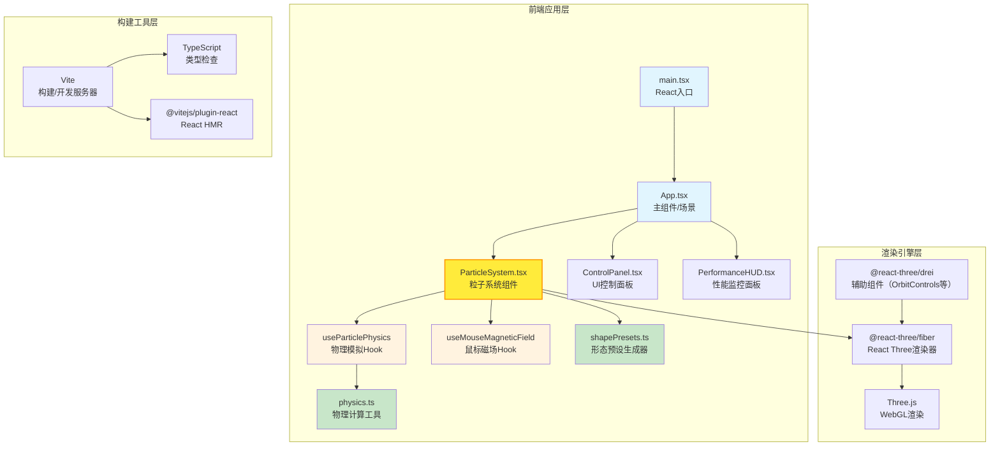

## 1. 架构设计



## 2. 技术描述
- **前端框架**：React@18 + TypeScript@5
- **构建工具**：Vite@5 + @vitejs/plugin-react
- **3D渲染**：Three.js@0.160 + @react-three/fiber@8 + @react-three/drei@9
- **类型定义**：@types/three@0.160
- **状态管理**：React内置useState/useRef/useMemo（无需额外状态库）
- **样式方案**：原生CSS + CSS Modules（或styled-components，优先原生CSS）

## 3. 文件结构与调用关系

```
auto200/
├── package.json              # 项目依赖与脚本
├── vite.config.js            # Vite配置（React插件+路径别名）
├── tsconfig.json             # TS配置（严格模式+esModuleInterop）
├── index.html                # 入口HTML（挂载点#root）
└── src/
    ├── main.tsx              # [入口] ReactDOM.render(<App/>)
    ├── App.tsx               # [主组件] 组合场景+UI+粒子
    ├── index.css             # [全局样式] 深色主题+毛玻璃
    ├── components/
    │   ├── ParticleSystem.tsx    # [核心] 粒子系统（3000粒子渲染+物理更新）
    │   ├── ControlPanel.tsx      # [UI] 左侧预设按钮面板
    │   └── PerformanceHUD.tsx    # [UI] FPS+粒子数显示
    ├── hooks/
    │   ├── useParticlePhysics.ts # [逻辑] 磁力物理模拟主循环
    │   ├── useMouseMagneticField.ts  # [逻辑] 鼠标拖拽磁场处理
    │   └── useFPSMonitor.ts      # [逻辑] FPS统计+降质触发
    ├── utils/
    │   ├── physics.ts            # [工具] 库仑力计算/阻尼/向量运算
    │   ├── shapePresets.ts       # [工具] 5种形态坐标生成器
    │   └── colorUtils.ts         # [工具] 速度→颜色映射+HSL渐变
    └── types/
        └── index.ts              # [类型] Particle/Config/ShapeType等
```

**数据流向**：
1. `App.tsx` → `ParticleSystem.tsx`：传递 `particleCount=3000`、`damping=0.98`、`forceThresholds` 等配置props
2. `ParticleSystem.tsx` → `useParticlePhysics`：传入初始positions/velocities，返回更新后的positions
3. `useParticlePhysics` → `physics.ts`：每帧调用 `calculateForces()` 计算粒子间作用力
4. `useMouseMagneticField` → `useParticlePhysics`：当鼠标按下时，注入外部磁场中心向量
5. `ControlPanel.tsx` → `App.tsx` → `ParticleSystem.tsx`：通过回调切换 `currentShape`，触发形态插值过渡
6. `useFPSMonitor` → `ParticleSystem.tsx`：返回 `lowQuality` 布尔值，控制sizeAttenuation/光晕

## 4. 类型定义

```typescript
// src/types/index.ts

export type ShapeType = 'sphere' | 'spiral' | 'wave' | 'cube' | 'random';

export interface ShapeTheme {
  name: string;
  icon: string;
  baseHue: number;      // 主题色相 (0-360)
  saturation: number;   // 饱和度
  lightness: number;    // 明度
}

export interface ParticleConfig {
  count: number;                    // 粒子总数 (3000)
  repulsionThreshold: number;       // 排斥阈值 (2.0)
  attractionThreshold: number;      // 吸引阈值 (5.0)
  forceStrength: number;            // 磁力强度系数
  damping: number;                  // 阻尼系数 (0.98)
  maxVelocity: number;              // 最大速度限制
  baseSize: number;                 // 粒子基础大小
  sizeVariation: number;            // 大小随机浮动范围
}

export interface MagneticField {
  active: boolean;
  position: { x: number; y: number; z: number };
  strength: number;
  falloff: number;                  // 距离衰减系数
}

export interface TransitionState {
  active: boolean;
  progress: number;                 // 0-1
  startTime: number;
  duration: number;                 // 2000ms
  targetPositions: Float32Array;
  startPositions: Float32Array;
  targetHue: number;
  startHue: number;
}
```

## 5. 核心算法说明

### 5.1 磁力物理模拟（O(n²)简化版）
- 空间网格化：将三维空间划分为5×5×5网格，每个粒子只与同格+相邻格粒子计算（降低至近似O(n)）
- 距离判定：`d < 2` → 排斥力 `F = k * (1/d - 1/2) / d²`；`2 ≤ d < 5` → 吸引力 `F = -k * (d-2) / d²`；`d ≥ 5` → 力为0
- 速度更新：`v[i] = (v[i] + F/m * dt) * damping`，并clamp到maxVelocity
- 位置更新：`p[i] += v[i] * dt`

### 5.2 鼠标磁场
- 使用Three.js Raycaster将屏幕NDC坐标投射到z=0平面，得到磁场世界坐标
- 对每个粒子施加吸引力：`F = -strength * (p - fieldPos) / (d² + falloff)`

### 5.3 颜色映射
- 速度归一化：`speedNorm = clamp(speed / maxVelocity, 0, 1)`
- 色相插值：`hue = lerp(220°(蓝), 0°(红), speedNorm)` + 形态主题色偏移
- HSL转RGB后写入BufferGeometry的color属性

### 5.4 形态过渡
- 点击预设时，调用shapePresets生成目标positions数组
- 使用requestAnimationFrame线性插值：`currentPos = startPos * (1-t) + targetPos * t`，其中 `t = easeInOutQuad(elapsed/duration)`
