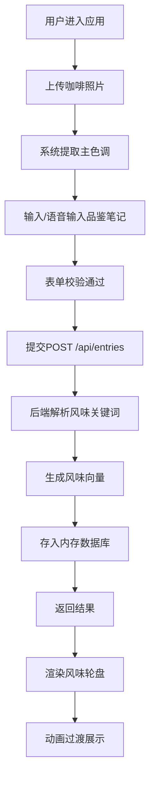
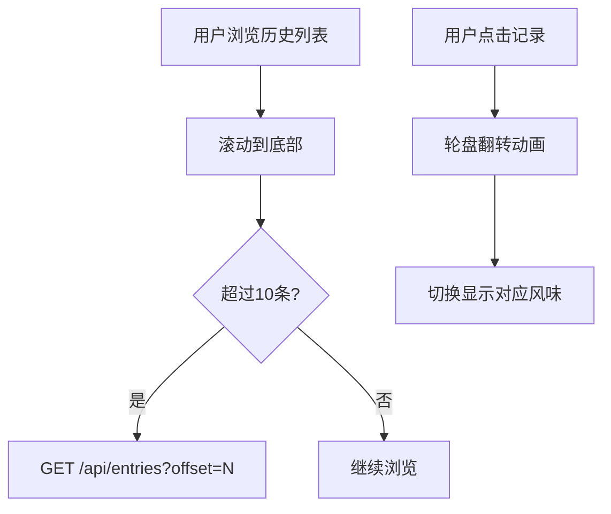

# 风味轮盘·咖啡品鉴日志 - 产品需求文档

## 1. 产品概述

「风味轮盘·咖啡品鉴日志」是一款面向咖啡爱好者与专业品鉴师的可视化品鉴记录工具。用户可通过上传咖啡照片和品鉴笔记，系统自动提取风味关键词并生成交互式风味雷达图，让抽象的味觉体验转化为直观的视觉艺术。

- **目标用户**：咖啡品鉴师、咖啡爱好者、咖啡馆主理人
- **核心价值**：将味觉描述转化为可交互的风味轮盘，实现品鉴记录的可视化与数字化归档

---

## 2. 核心功能

### 2.1 功能模块

1. **主界面**：表单提交区、风味轮盘展示区、历史记录列表

### 2.2 页面详情

| 页面名称 | 模块名称 | 功能描述 |
|---------|---------|---------|
| 主界面 | 品鉴表单 | 照片上传（拖拽/点击）、笔记输入、语音输入、主色调预览 |
| 主界面 | 风味轮盘 | Canvas雷达图、呼吸脉冲动画、拖拽旋转、粒子环绕 |
| 主界面 | 历史列表 | 缩略图展示、风味摘要、时间倒序、点击切换、滚动加载 |

---

## 3. 核心流程

### 3.1 品鉴录入流程

### 3.2 历史记录查看流程

---

## 4. 用户界面设计

### 4.1 设计风格

- **主色调策略：根据咖啡照片动态生成暖色渐变
- **深色背景**：左侧面板 #1A1A2E，右侧轮盘区 #0F0F1A
- **按钮/卡片**：圆角12px，悬停上浮阴影
- **字体**：系统无衬线字体，科技感暖色
- **动画效果**：呼吸脉冲、翻转动画、淡入淡出、粒子漂浮

### 4.2 页面设计概述

| 区域 | 模块 | UI元素 |
|-----|------|--------|
| 左侧面板(320px) | 品鉴表单 | 文件拖拽区、麦克风按钮、图片预览(光晕环绕)、提交按钮 |
| 左侧面板 | 历史列表 | 80x80圆角缩略图、风味标签、日期、滚动加载 |
| 右侧轮盘区 | 风味轮盘 | Canvas雷达图、中心标题、100个漂浮粒子 |

### 4.3 响应式设计

- **桌面端**：左右布局，左侧320px固定，右侧自适应
- **移动端（≤768px）**：上下布局，表单在上，轮盘高度60vh，粒子减少至60个

---

## 5. 风味维度定义

| 维度 | 关键词示例 |
|-----|----------|
| 酸度 | 果酸、明亮、酸、柑橘 |
| 花香 | 花香、茉莉、玫瑰、花香调 |
| 焦糖 | 焦糖、红糖、蜂蜜 |
| 巧克力 | 巧克力、可可、黑巧 |
| 坚果 | 坚果、榛果、杏仁、核桃 |
| 柑橘 | 柑橘、柠檬、橙子 |
| 甜度 | 甜、蜂蜜、糖浆 |
| 醇厚 | 醇厚、饱满、body |
| 余韵 | 余韵、回甘、持久 |
| 平衡 | 平衡、协调、和谐 |
| 干净度 | 干净、清澈、纯粹 |
| 香料 | 香料、肉桂、丁香 |

