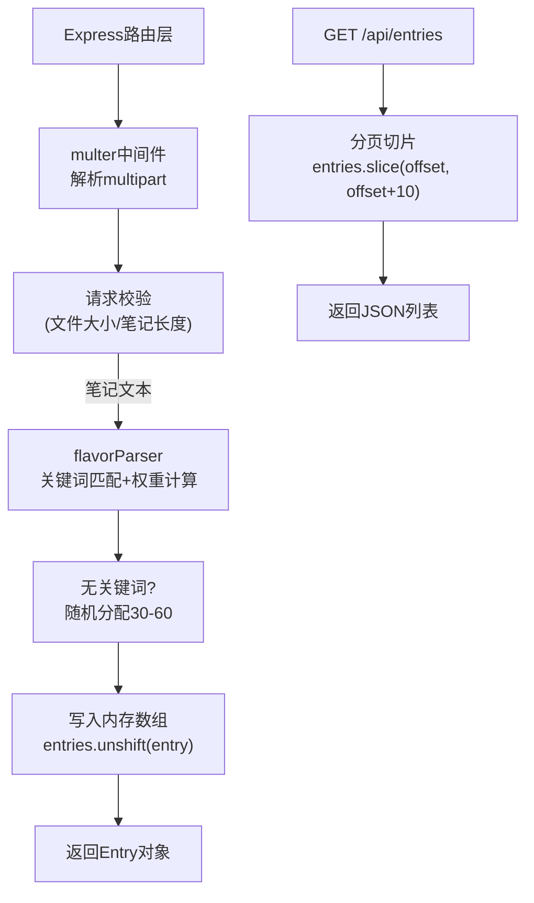

# 风味轮盘·咖啡品鉴日志 - 技术架构文档

## 1. 架构设计

```mermaid
flowchart LR
    subgraph "前端 (React + TypeScript + Vite)"
        A["App.tsx\n(根组件/状态管理)"]
        B["EntryForm.tsx\n(表单组件)"]
        C["FlavorWheel.tsx\n(风味轮盘Canvas)"]
        D["EntryList.tsx\n(历史列表)"]
        E["colorExtractor.ts\n(主色调提取)"]
        F["flavorParser.ts\n(风味解析)"]
    end

    subgraph "后端 (Express + Node.js)"
        G["server/index.ts\n(Express服务器)"]
        H["multer文件解析"]
        I["风味关键词匹配\n权重计算"]
        J["内存数组存储"]
    end

    subgraph "数据流向"
        B -->|POST /api/entries\n(multipart表单)| G
        G -->|multer解析| H
        H -->|文本笔记| I
        I -->|风味向量| J
        J -->|JSON响应| A
        A -->|风味向量+主色调| C
        A -->|entries列表| D
        B -->|图片对象| E
        E -->|hex色值| B
    end
```

## 2. 技术描述

- **前端框架**: React 18 + TypeScript
- **构建工具**: Vite (代理 /api 到 Express 后端)
- **状态管理**: React useState/useEffect (轻量级，无需额外库)
- **后端框架**: Express 4 + TypeScript (ts-node)
- **文件上传**: multer
- **渲染技术**: Canvas 2D API (风味轮盘 + 粒子系统)
- **语音识别**: Web Speech API (SpeechRecognition)
- **动画引擎**: requestAnimationFrame (60fps渲染循环)
- **数据存储**: 内存数组 (entries[])
- **后端类型**: @types/express, @types/multer

## 3. 文件结构

```
项目根目录/
├── package.json              # 依赖与启动脚本
├── vite.config.js            # Vite配置(代理/api)
├── tsconfig.json             # TS严格模式(ES2020)
├── index.html                # HTML入口
├── server/
│   └── index.ts              # Express后端服务
├── src/
│   ├── App.tsx               # 根组件(全局状态管理)
│   ├── components/
│   │   ├── EntryForm.tsx     # 品鉴表单(上传/输入/语音)
│   │   ├── FlavorWheel.tsx   # 风味轮盘(Canvas雷达图)
│   │   └── EntryList.tsx     # 历史记录列表
│   └── utils/
│       ├── colorExtractor.ts # 主色调提取工具
│       └── flavorParser.ts   # 风味关键词解析工具
```

## 4. API 定义

### 4.1 POST /api/entries

**请求**: multipart/form-data
```typescript
interface PostEntryRequest {
  image: File;          // jpg/png, ≤5MB
  note: string;         // 品鉴笔记, ≥10字
  dominantColor: string; // 主色调hex, 前端计算后提交
}
```

**响应**: 200 OK
```typescript
interface Entry {
  id: string;
  imagePath: string;       // 服务器图片URL
  note: string;            // 原始笔记
  dominantColor: string;   // 主色调
  flavors: FlavorVector;   // 风味向量{维度:0-100}
  createdAt: number;       // 时间戳
}

interface FlavorVector {
  酸度: number;
  花香: number;
  焦糖: number;
  巧克力: number;
  坚果: number;
  柑橘: number;
  甜度: number;
  醇厚: number;
  余韵: number;
  平衡: number;
  干净度: number;
  香料: number;
}
```

### 4.2 GET /api/entries

**请求参数**:
- `offset` (可选, number): 分页偏移量, 默认0

**响应**: 200 OK
```typescript
interface GetEntriesResponse {
  entries: Entry[];   // 时间倒序
  hasMore: boolean;   // 是否还有更多
  total: number;      // 总数
}
```

## 5. 服务端架构



## 6. 数据模型

### 6.1 内存数据结构

```typescript
// server/index.ts 中定义
interface MemoryStore {
  entries: Entry[];  // 时间倒序存储
}
```

### 6.2 风味关键词库 (flavorParser.ts)

```typescript
const FLAVOR_KEYWORDS: Record<string, string[]> = {
  酸度: ['果酸', '明亮', '酸', '柑橘', '清爽', '活泼'],
  花香: ['花香', '茉莉', '玫瑰', '花香调', '佛手柑', '橙花'],
  焦糖: ['焦糖', '红糖', '蜂蜜', '枫糖', '太妃糖'],
  巧克力: ['巧克力', '可可', '黑巧', '牛奶巧', '朱古力'],
  坚果: ['坚果', '榛果', '杏仁', '核桃', '花生', '腰果'],
  柑橘: ['柑橘', '柠檬', '橙子', '西柚', '葡萄柚', '桔子'],
  甜度: ['甜', '蜂蜜', '糖浆', '甜蜜', '甘甜'],
  醇厚: ['醇厚', '饱满', 'body', '厚实', '浓稠'],
  余韵: ['余韵', '回甘', '持久', '悠长', '尾韵'],
  平衡: ['平衡', '协调', '和谐', '均衡'],
  干净度: ['干净', '清澈', '纯粹', '纯净'],
  香料: ['香料', '肉桂', '丁香', '豆蔻', '胡椒']
};

const INTENSITY_MODIFIERS: Record<string, number> = {
  '非常': 1.5, '极其': 1.8, '特别': 1.4,
  '略微': 0.7, '稍微': 0.75, '有点': 0.8
};
```

## 7. 核心算法

### 7.1 主色调提取 (colorExtractor.ts)
1. 创建离屏 Canvas, 将图片缩放到 32x32
2. 遍历所有像素累加 RGB
3. 计算平均值并转为 hex 字符串
4. 性能目标: < 300ms

### 7.2 风味权重计算 (flavorParser.ts)
1. 对笔记进行分词/正则匹配
2. 统计每个维度关键词出现次数
3. 检测强度副词调整权重
4. 基础分 = 出现次数 × 40
5. 最终得分 = min(基础分 × 强度系数, 100)
6. 若匹配维度 < 3: 随机补充维度(30-60分)

### 7.3 Canvas渲染循环 (FlavorWheel.tsx)
- 使用 requestAnimationFrame
- 每帧更新: 粒子位置、呼吸透明度、旋转插值
- 性能目标: ≥55fps (@100粒子)

## 8. 性能约束

| 指标 | 目标 |
|-----|------|
| Canvas渲染帧率 | ≥55fps (≤500粒子) |
| 主色调提取耗时 | ≤300ms |
| 风味解析耗时 | ≤100ms |
| 表单提交响应 | ≤500ms |
| 动画帧率 | 60fps (requestAnimationFrame) |

