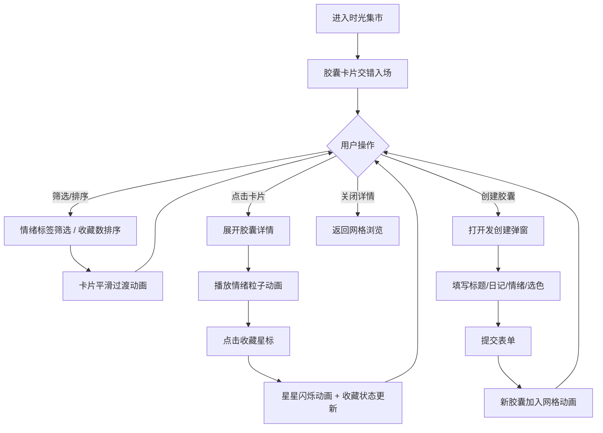

## 1. 产品概述

「时光集市」是一个以"虚拟集市"为概念的时间胶囊 Web 应用，用户可以创建、浏览、收藏承载回忆与情绪的时间胶囊。应用通过复古暖调的视觉风格与丰富的粒子动画，为用户营造温馨怀旧的情感体验。

- 核心目标：为用户提供一个记录情感、保存回忆的沉浸式数字空间
- 目标用户：喜欢记录生活、珍视情感记忆的年轻人群体

## 2. 核心功能

### 2.1 用户角色
| 角色 | 注册方式 | 核心权限 |
|------|----------|----------|
| 普通用户 | 无需注册（本地体验） | 创建胶囊、浏览胶囊、收藏胶囊、筛选排序 |

### 2.2 功能模块
1. **主页（集市大厅）**：胶囊卡片网格展示、顶部标题区域、筛选排序工具栏
2. **胶囊卡片**：缩略展示、情绪色条、收藏星星、悬停动效、点击展开详情
3. **胶囊详情**：完整信息展示、粒子动画播放、关闭交互
4. **创建胶囊**：表单输入（标题、日记、情绪标签、色轮选色）
5. **筛选排序**：情绪标签筛选、收藏数排序、平滑过渡动画

### 2.3 页面详情
| 页面名称 | 模块名称 | 功能描述 |
|----------|----------|----------|
| 主页 | 头部标题区 | 展示应用名称"时光集市"、副标题、创建胶囊按钮 |
| 主页 | 筛选工具栏 | 情绪标签按钮组、排序切换下拉、动画过渡 |
| 主页 | 胶囊网格 | 响应式卡片网格、交错入场动画、淡入淡出过渡 |
| 胶囊卡片 | 缩略展示 | 标题预览、情绪色条、收藏星标、悬停上浮效果 |
| 胶囊卡片 | 详情展开 | 模态层展示完整日记、粒子动画、主色背景渲染 |
| 创建弹窗 | 表单区 | 标题输入、日记文本域、情绪选择、色轮选主色 |
| 创建弹窗 | 交互反馈 | 输入验证、提交成功动画、取消操作 |

## 3. 核心流程

用户进入时光集市 → 浏览胶囊卡片网格（交错入场）→ 按情绪筛选/按收藏数排序 → 点击胶囊卡片 → 查看详情 + 粒子动画播放 → 点击收藏星星（闪烁动画）→ 点击"创建胶囊"→ 填写表单 → 提交成功 → 新胶囊加入网格

## 4. 用户界面设计

### 4.1 设计风格
- **主色调**：暖黄 `#FFB347`、复古红 `#C75146`、鼠尾草绿 `#9CAF88`
- **背景**：米白到淡棕线性渐变 `linear-gradient(135deg, #FDF8F0 0%, #F0E6D3 100%)`
- **卡片**：圆角毛玻璃 `backdrop-filter: blur(12px)`，半透明白底 `rgba(255,255,255,0.75)`，微发光边框 `box-shadow` + `border`
- **按钮风格**：圆角胶囊形、渐变填充、悬停微上浮
- **字体**：标题用「ZCOOL KuaiLe」或「Noto Serif SC」复古衬线体，正文用「Noto Sans SC」
- **图标**：Emoji 风格（⭐🌟✨💛💙💚）配合线性 SVG
- **情绪色条**：卡片左侧 6px 宽竖条，使用胶囊主色

### 4.2 页面设计概述
| 页面名称 | 模块名称 | UI 元素 |
|----------|----------|----------|
| 主页 | 头部标题 | 大字号衬线体标题、渐变文字阴影、描述副标题、创建按钮 |
| 主页 | 筛选栏 | 情绪标签胶囊按钮组（选中态有发光边框）、排序下拉 |
| 主页 | 卡片网格 | CSS Grid 响应式布局、卡片交错入场（animation-delay）、列间距 |
| 胶囊卡片 | 展示态 | 圆角毛玻璃、左侧色条、收藏星标（右上）、标题、情绪标签 |
| 胶囊卡片 | 悬停态 | 轻微上浮 + scale(1.02)、阴影加深、边框发光增强 |
| 胶囊详情 | 模态层 | 半透明毛玻璃背景、主色渐变装饰、完整日记内容 |
| 粒子动画 | 详情层 | 快乐→金色粒子上升、怀念→蓝色粒子飘散、期待→绿色粒子环绕 |
| 收藏星星 | 动效 | 实心↔镂空呼吸闪烁，收藏后 scale 弹跳 |
| 筛选过渡 | 动画 | opacity 淡入淡出 + translateY 交错错峰、transform 平滑重排 |

### 4.3 响应式设计
- **Desktop（≥1200px）**：4 列网格、侧栏式筛选工具栏
- **Tablet（768-1199px）**：3 列网格、顶部横向筛选栏
- **Mobile（<768px）**：1-2 列网格、筛选栏可横向滚动、卡片占满宽度
- 触摸优化：卡片点击区域扩大、按钮最小 44px、禁用 hover 态的替代反馈

### 4.4 动效与性能
- 所有动画采用 CSS transform/opacity 保持 60fps
- 粒子动画使用 Canvas 2D 实现（requestAnimationFrame）
- 卡片列表重排使用 FLIP 技术或 CSS transition
- 长列表采用虚拟滚动（如胶囊 > 100 条时）
