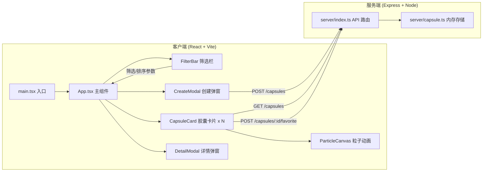
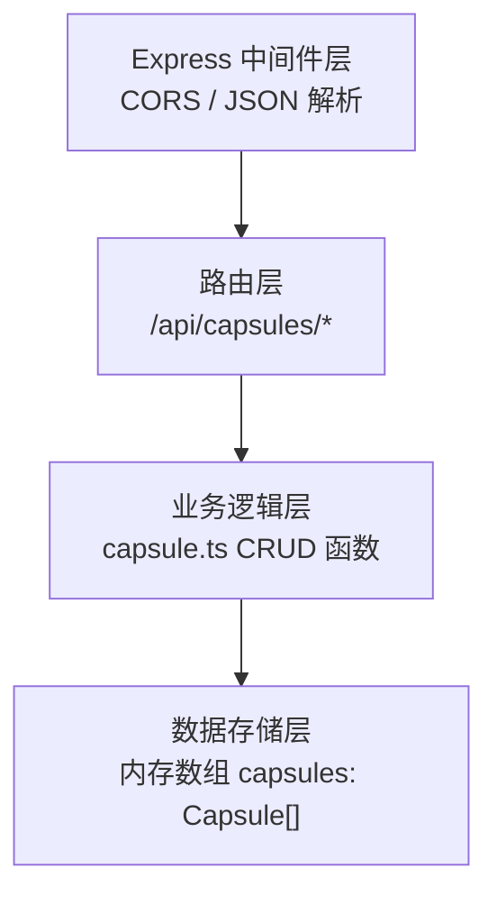
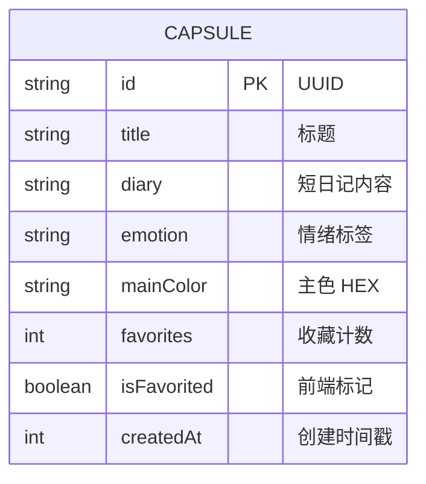

## 1. 架构设计



## 2. 技术描述

- **前端框架**：React 18 + TypeScript
- **构建工具**：Vite 5（HMR 热更新）
- **样式方案**：原生 CSS + CSS Modules（或 styled-components），CSS Variables 管理主题色
- **状态管理**：React Hooks（useState/useReducer/useContext），无额外状态库
- **动画方案**：CSS transition/animation + Canvas 2D 粒子系统
- **后端框架**：Express 4 + TypeScript
- **数据存储**：内存数组（server/capsule.ts）
- **HTTP 客户端**：原生 fetch API
- **开发模式**：concurrently 同时启动 Vite(3000) 和 Express(4000)，Vite 配置代理到 4000

## 3. 路由定义
| 路由 | 用途 |
|------|------|
| / | 主页（胶囊集市）- 展示所有胶囊卡片 |
| - | 详情弹窗通过 React state 控制，非路由切换 |

## 4. API 定义

### 4.1 TypeScript 类型
```typescript
type Emotion = 'happy' | 'nostalgia' | 'hope' | 'sad' | 'peaceful' | 'excited';

interface Capsule {
  id: string;
  title: string;
  diary: string;
  emotion: Emotion;
  mainColor: string;      // HEX 颜色，如 '#FFB347'
  favorites: number;      // 收藏数
  isFavorited: boolean;   // 当前用户是否收藏（前端状态）
  createdAt: number;      // 时间戳
}

interface CreateCapsuleRequest {
  title: string;
  diary: string;
  emotion: Emotion;
  mainColor: string;
}
```

### 4.2 RESTful API
| 方法 | 路径 | 描述 | 请求体 | 响应 |
|------|------|------|--------|------|
| GET | /api/capsules | 获取所有胶囊列表 | - | Capsule[] |
| POST | /api/capsules | 创建新胶囊 | CreateCapsuleRequest | Capsule (含 id) |
| POST | /api/capsules/:id/favorite | 收藏/取消收藏胶囊 | - | `{ favorites: number, isFavorited: boolean }` |
| DELETE | /api/capsules/:id | 删除胶囊（可选） | - | `{ success: boolean }` |

### 4.3 接口响应规范
```typescript
interface ApiResponse<T> {
  code: 0 | number;   // 0 = 成功，非0 = 错误
  message: string;
  data?: T;
}
```

## 5. 服务端架构图



## 6. 数据模型

### 6.1 ER 模型


### 6.2 初始化示例数据
```typescript
const seedCapsules: Capsule[] = [
  {
    id: '1',
    title: '夏日午后的蝉鸣',
    diary: '今天走过老巷，听到熟悉的蝉鸣声，仿佛回到了小时候在外婆家度过的暑假。竹席、蒲扇、还有冰棒的甜味……',
    emotion: 'nostalgia',
    mainColor: '#FFB347',
    favorites: 24,
    isFavorited: false,
    createdAt: Date.now() - 86400000 * 5,
  },
  // ... 更多示例数据
];
```

## 7. 文件结构
```
auto202/
├── package.json              # 根目录：前后端依赖 + 启动脚本
├── tsconfig.json             # 前端 TS 配置
├── tsconfig.server.json      # 后端 TS 配置（可选）
├── vite.config.js            # Vite 配置（代理到 :4000）
├── index.html                # Vite HTML 入口
├── client/
│   ├── main.tsx              # React 入口
│   ├── App.tsx               # 主组件：状态管理 + 布局
│   ├── components/
│   │   ├── CapsuleCard.tsx   # 胶囊卡片 + 粒子动画 Canvas
│   │   ├── FilterBar.tsx     # 筛选排序工具栏
│   │   ├── CreateModal.tsx   # 创建胶囊弹窗
│   │   ├── DetailModal.tsx   # 详情弹窗
│   │   └── ParticleCanvas.tsx# 粒子动画画布（抽离）
│   ├── types/
│   │   └── index.ts          # 共享类型定义
│   ├── styles/
│   │   └── global.css        # 全局样式 + CSS Variables
│   └── utils/
│       └── api.ts            # API 封装
└── server/
    ├── index.ts              # Express 服务 + API 路由
    └── capsule.ts            # 数据模型 + 内存数组 + CRUD 函数
```

## 8. 启动脚本
```json
{
  "scripts": {
    "dev": "concurrently \"npm:dev:server\" \"npm:dev:client\"",
    "dev:server": "tsx watch server/index.ts",
    "dev:client": "vite",
    "build": "tsc && vite build",
    "preview": "vite preview"
  }
}
```
