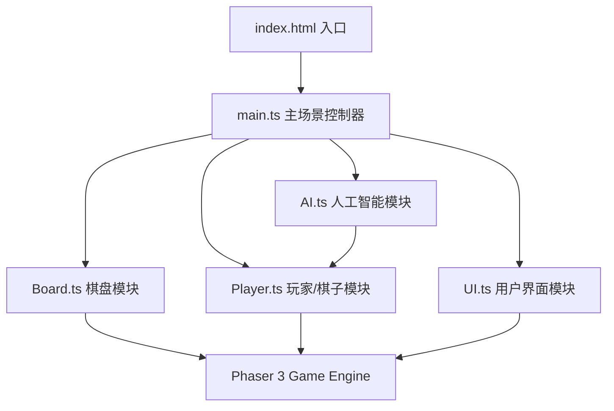

## 1. 架构设计



## 2. 技术描述
- **前端框架**：Phaser 3.70+ (2D游戏引擎)
- **编程语言**：TypeScript 5.0+ (严格模式)
- **构建工具**：Vite 5.0+ (热更新、快速打包)
- **包管理器**：npm
- **无后端**：纯前端单页应用，所有逻辑本地运行
- **性能目标**：稳定60fps，AI决策耗时<100ms

## 3. 文件结构

```
auto206/
├── index.html                    # HTML入口，挂载Canvas
├── package.json                  # 项目依赖与脚本
├── tsconfig.json                 # TypeScript配置
├── vite.config.js                # Vite构建配置
└── src/
    ├── main.ts                   # 游戏入口，场景初始化，游戏循环
    ├── Board.ts                  # 六边形棋盘：生成、渲染、点击事件
    ├── Player.ts                 # 棋子逻辑：移动、路径、胜负判定
    ├── AI.ts                     # AI对手：BFS路径+阻挡策略
    └── UI.ts                     # UI控件：计分、回合、按钮、弹窗
```

## 4. 核心数据模型

### 4.1 六边形坐标系统 (轴向坐标 Axial Coordinates)
```typescript
interface HexCoord {
  q: number;    // 列轴
  r: number;    // 行轴
}

// 相邻方向偏移 (pointy-top 六边形)
const HEX_DIRECTIONS: HexCoord[] = [
  { q: 1, r: 0 },   // 右
  { q: 1, r: -1 },  // 右上
  { q: 0, r: -1 },  // 左上
  { q: -1, r: 0 },  // 左
  { q: -1, r: 1 },  // 左下
  { q: 0, r: 1 },   // 右下
];
```

### 4.2 格子状态
```typescript
enum CellOwner {
  EMPTY = 'empty',
  PLAYER = 'player',   // 暖金
  AI = 'ai',           // 冷蓝
}

interface HexCell {
  coord: HexCoord;
  owner: CellOwner;
  pixelPos: { x: number; y: number };
  isBase: 'player' | 'ai' | null;
  graphics: Phaser.GameObjects.Graphics | null;
  nodeGlow: Phaser.GameObjects.Graphics | null;
}
```

### 4.3 游戏状态
```typescript
enum Turn {
  PLAYER = 'player',
  AI = 'ai',
}

interface GameState {
  turn: Turn;
  playerPath: HexCoord[];
  aiPath: HexCoord[];
  playerPos: HexCoord;
  aiPos: HexCoord;
  winner: Turn | null;
  scores: { player: number; ai: number };
  isPaused: boolean;
}
```

## 5. 核心算法

### 5.1 六边形像素换算 (Pointy-Top)
```
size = 格子半径
x = size * sqrt(3) * (q + r/2)
y = size * 3/2 * r
```

### 5.2 胜负判定 (BFS连通性检测)
- 从当前棋子位置出发，使用BFS遍历己方所有已占格子
- 若能到达对方基地所在格，则判定获胜

### 5.3 AI决策算法
1. **评估函数权重**：
   - 己方最短路径长度（越低越好，权重0.6）
   - 对方最短路径长度（越高越好，权重0.4）
2. **候选动作**：当前AI棋子的所有相邻空格
3. **决策逻辑**：
   - 模拟每个候选移动
   - 重新计算双方最短路径
   - 选择加权得分最高的移动
   - 若对方一步即胜，优先阻挡（特殊规则）

### 5.4 最短路径 (A* / BFS)
- 六边形网格上的寻路，使用曼哈顿距离作为启发
- 己方已占格子可自由通过，空格可通行，对方已占格子为障碍

## 6. 性能优化
- **对象池**：粒子系统对象复用，避免频繁GC
- **渲染批处理**：棋盘格子使用单个Graphics批量绘制，减少draw call
- **AI防抖**：AI决策使用setTimeout 400~600ms模拟思考，非阻塞主线程
- **脏标记**：仅当格子状态改变时重绘该格子，非每帧全量重绘
- **requestAnimationFrame**：Phaser自动管理渲染循环，保持与屏幕同步
